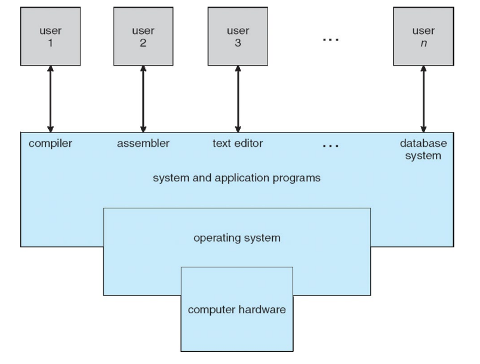
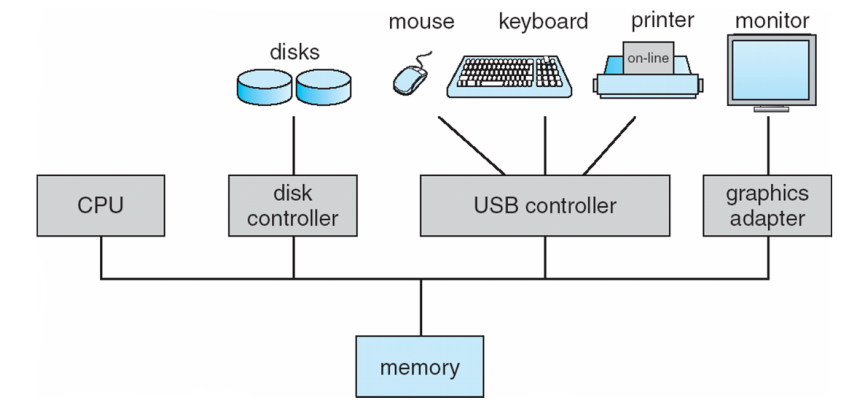
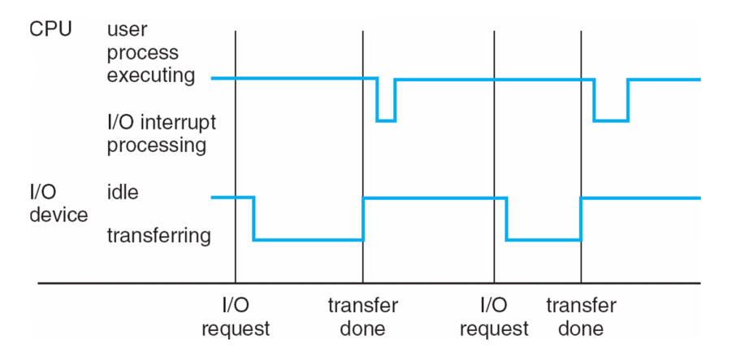

## 1. 운영체제의 정의 및 목적

운영체제는 컴퓨터 사용자와 하드웨어 사이에서 중재자 역할을 하는 프로그램이다.

- **실행 지원**: 사용자 프로그램을 실행하고 사용자의 문제를 더 쉽게 해결할 수 있도록 돕는다.
    
- **편의성 제공**: 컴퓨터 시스템을 사용하기 편리하게 만든다.
    
- **효율성 추구**: 컴퓨터 하드웨어를 효율적인 방식으로 사용하도록 관리한다. 이는 한정된 자원을 최적화하여 시스템의 전체 성능(Performance)을 높이기 위함이다.
    

## 2. 컴퓨터 시스템의 구성 요소 

컴퓨터 시스템은 크게 네 가지 구성 요소로 나뉜다.

- **하드웨어(Hardware)**: CPU, 메모리(Memory), I/O 장치 등 기본적인 컴퓨팅 자원을 제공한다.
    
- **운영체제(Operating System)**: 다양한 응용 프로그램과 사용자들 사이에서 하드웨어 사용을 제어하고 조정한다.
    
- **응용 프로그램(Application Programs)**: 사용자의 컴퓨팅 문제를 해결하기 위해 시스템 자원이 사용되는 방식을 정의한다. 워드 프로세서, 컴파일러, 웹 브라우저, 게임 등이 여기에 해당한다.
    
- **사용자(Users)**: 사람, 기계, 혹은 다른 컴퓨터가 될 수 있다
	

하드웨어라는 물리적 기반 위에 운영체제가 소프트웨어 계층의 중심이 되고, 그 위에서 응용 프로그램이 사용자의 요구를 처리하는 계층적 구조를 보여준다

## 3. 운영체제의 주요 기능: 자원 할당과 제어

사용자 관점에서 사용자는 편리함, 사용의 용이성, 그리고 좋은 성능을 원하며 자원의 활용도에는 큰 관심을 두지 않는다.

- **자원 할당자(Resource Allocator)**: 모든 자원을 관리하며, 충돌하는 요청들 사이에서 효율적이고 공정한 자원 사용을 결정한다. 
    
- **제어 프로그램(Control Program)**: 프로그램의 실행을 제어하여 오류나 부적절한 컴퓨터 사용을 방지한다.
    
- **커널(Kernel)**: 컴퓨터에서 항상 실행되고 있는 단 하나의 프로그램을 커널이라고 부르며, 그 외의 것들은 시스템 프로그램이나 응용 프로그램으로 분류된다
    

## 4. 컴퓨터 시스템의 시작과 동작 

컴퓨터가 켜지거나 재부팅될 때 시스템을 초기화하는 과정이 필요하다.

- **부트스트랩 프로그램(Bootstrap Program)**: 전원이 켜질 때 로드되는 초기화 프로그램으로, 보통 ROM이나 EPROM에 저장되며 이를 펌웨어(Firmware)라고 부른다. 시스템의 모든 측면을 초기화하고 운영체제 커널을 로드하여 실행을 시작한다.
    
- **시스템 조직**: 하나 이상의 CPU와 장치 컨트롤러(Device controllers)들이 공통 버스(Common bus)를 통해 연결되어 공유 메모리(Shared memory)에 접근한다

CPU와 디스크 컨트롤러, USB 컨트롤러 등이 하나의 통로(Bus)를 통해 메모리를 공유하며 동시에 실행(Concurrent execution)되는 복합적인 구조다.

## 5. 인터럽트 시스템과 성능

현대 운영체제는 **인터럽트 주도형(Interrupt Driven)**으로 설계되어 있다. 이는 CPU가 I/O 작업의 완료를 마냥 기다리지 않고 다른 업무를 처리할 수 있게 하여 시스템 성능을 극대화하기 위함이다.

- **원리**: I/O 장치와 CPU는 동시에 실행될 수 있으며, 각 장치 컨트롤러는 특정 유형의 장치를 담당하고 Local buffer를 가진다.
    
- **동작**: 장치 컨트롤러가 작업을 완료하면 인터럽트를 발생시켜 CPU에 이를 알린다. 인터럽트가 발생하면 CPU는 수행 중이던 명령의 주소를 저장하고 인터럽트 서비스 루틴으로 제어권을 넘긴다.
    
- **Trap/Exception**: 소프트웨어 오류나 사용자 요청에 의해 발생하는 소프트웨어 생성 인터럽트다.
    
- **상태 보존**: 운영체제는 레지스터와 프로그램 카운터를 저장하여 CPU의 이전 상태를 유지하며, 인터럽트 처리 후 원래 작업으로 정확히 복귀한다.

CPU가 사용자 프로세스를 실행하다가 I/O 요청이 발생하면 장치가 데이터를 전송하는 동안 CPU는 다른 일을 하거나 대기할 수 있으며, 전송이 완료된 시점에 인터럽트를 통해 다시 제어권을 가져오는 과정을 시간 순으로 나타낸다