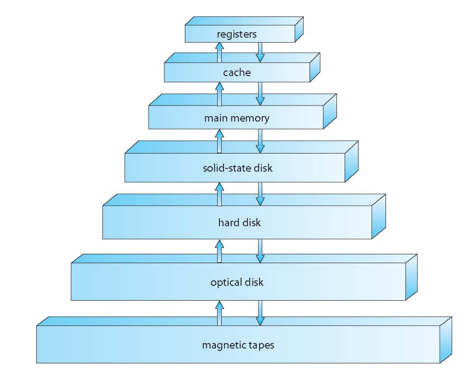
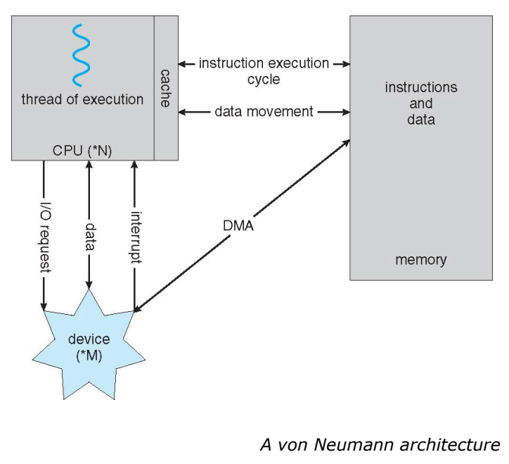
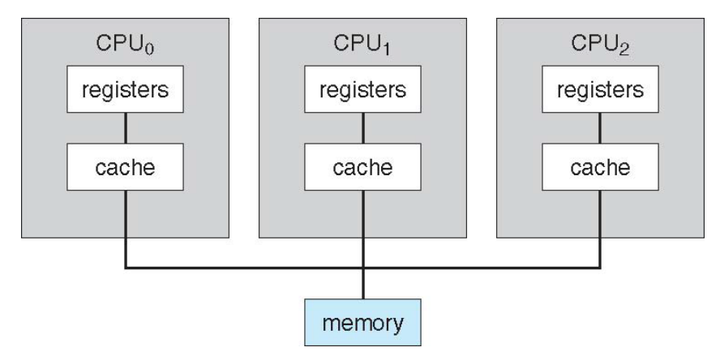
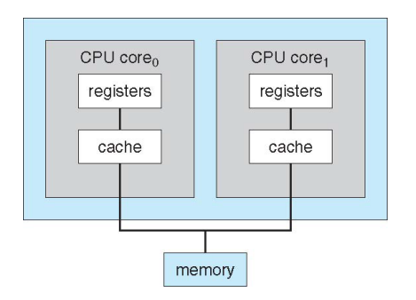
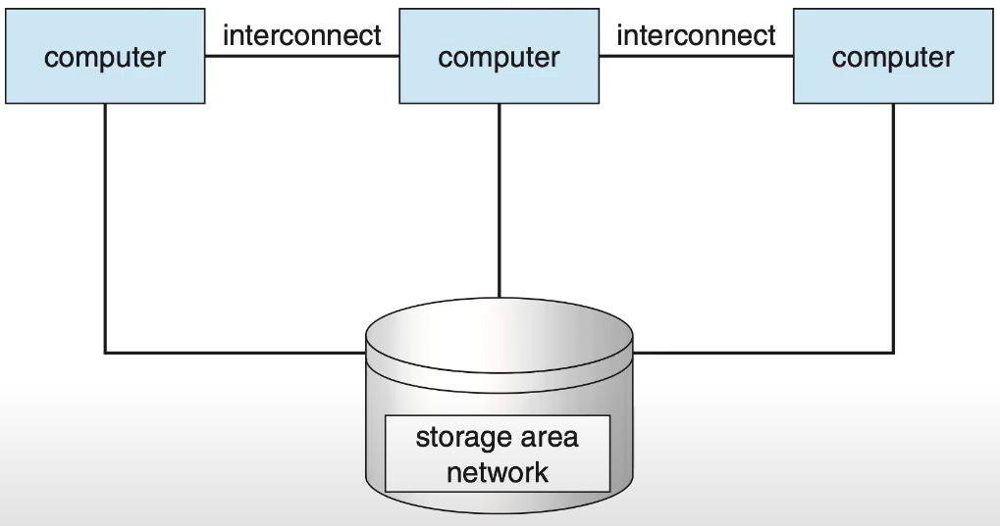
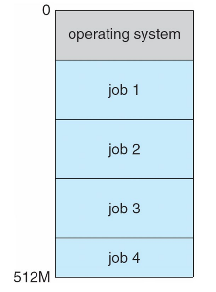
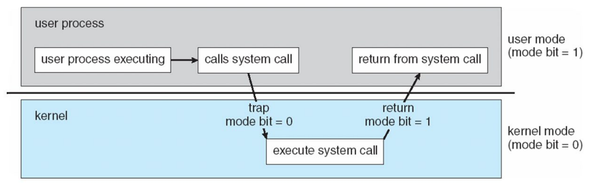
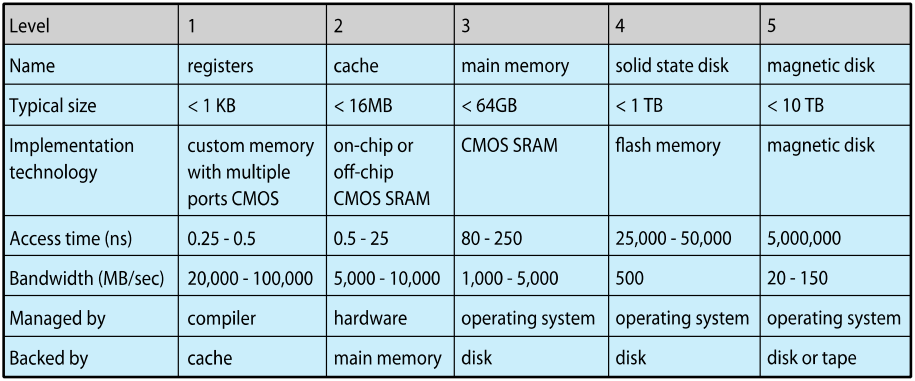
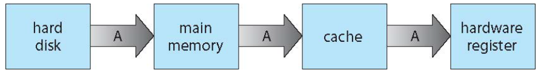

## 1. 저장장치의 정의와 구조 

컴퓨터의 저장 단위는 Bit를 기본으로 하며, 데이터의 성격과 용도에 따라 여러 계층으로 나뉜다.

- **기본 단위**: Bit는 0과 1을 가지는 최소 단위이며, 8비트가 모여 바이트(Byte)를 이룬다. 컴퓨터 아키텍처의 기본 데이터 단위인 워드(Word)는 하나 이상의 바이트로 구성된다.
    
- **주기억장치(Main Memory)**: CPU가 직접 접근할 수 있는 유일한 대량 저장 매체로, 일반적으로 휘발성(Volatile) 특징을 가진다.
    
- **보조기억장치(Secondary Storage)**: 주기억장치의 확장으로 대용량 비휘발성 저장 능력을 제공하며, 하드디스크(HDD)와 SSD가 대표적이다

## 2. 저장장치 계층 구조 및 캐싱 

저장장치는 속도, 비용, 휘발성에 따라 계층적으로 조직된다. CPU와 물리적 저장장치 사이의 속도 차이를 극복하는 것이 성능 최적화의 핵심이다.

- **계층 구조**: 상위(레지스터, 캐시)로 갈수록 속도가 빠르고 비용이 높으며, 하위(자기 테이프, 광학 디스크)로 갈수록 용량이 크고 저렴하다.
    
- **캐싱(Caching)의 원리**: 정보를 느린 저장 장치에서 빠른 저장 장치로 일시적으로 복사하여 사용한다. 데이터 요청 시 캐시를 먼저 확인하여 성능을 향상시킨다.
    
- **성능적 이점**: CPU가 상대적으로 느린 메인 메모리나 디스크를 직접 기다리지 않게 함으로써 시스템의 전체적인 **응답 속도**를 높인다.

상위 계층의 빠른 메모리가 하위 계층의 데이터를 캐싱하여 속도 차이를 보완하는 구조를 나타낸다.

## 3. DMA (Direct Memory Access)

고속 I/O 장치가 CPU의 개입 없이 직접 메모리와 데이터를 주고받는 방식이다.

- **작동 방식**: 장치 컨트롤러(Device Controller)가 버퍼 저장소의 데이터 블록을 메인 메모리로 직접 전송한다.
    
- **성능적 분석**: 
	 (1) **CPU 오버헤드 감소:** 
	- 바이트 단위가 아닌 **데이터 블록(Block)** 단위로 단 한 번의 인터럽트를 발생시키므로 CPU의 Overhead를 획기적으로 줄여준다.
	- CPU가 데이터 전송과 같은 단순 반복 작업에서 해방되어, 사용자 프로그램과 같은 더 복잡한 계산에 집중 가능하다.
	
	(2) **병렬 실행:** 
	- CPU가 다른 작업을 수행하는 동안 I/O 장치가 독립적으로 데이터를 전송할 수 있어 시스템의 처리량이 향상된다. 
    

폰 노이만 아키텍처에서 DMA가 CPU를 거치지 않고 메모리에 접근하는 경로를 시각화한 그림이다.

## 4. 시스템 아키텍처의 유형 

### **- Multiprocessor Systems**

멀티프로세서 시스템은 두 개 이상의 프로세서를 갖춘 시스템으로, 오늘날 컴퓨팅 환경에서 그 중요성이 매우 높다. 이를 병렬 시스템(Parallel systems) 또는 강결합 시스템(Tightly-coupled systems)이라고도 부른다.

- **성능적 이점**:
    
    - **처리량 증가(Increased throughput)**: 프로세서 수가 늘어남에 따라 더 짧은 시간에 더 많은 작업을 완료할 수 있다.
        
    - **규모의 경제(Economy of scale)**: 여러 개의 단일 프로세서 시스템을 구축하는 것보다 주변 장치, 대용량 저장장치, 전원 공급 장치를 공유하므로 비용 면에서 효율적이다.
        
    - **신뢰성 향상(Increased reliability)**: 특정 프로세서에 장애가 발생해도 시스템이 완전히 멈추지 않고 남은 프로세서들이 작업을 나누어 수행하는 결함 허용(Fault tolerance)이 가능하다.
        
- **Asymmetric Multiprocessing**: 각 프로세서에 특정 태스크(Specie task)가 할당되어 운영되는 방식이다.
	
- **Symmetric Multiprocessing; SMP**: 가장 일반적인 형태로, 모든 프로세서가 대등하게 모든 작업을 수행하며 메인 메모리를 공유한다

### **- Multicore Design**

멀티코어 디자인은 물리적으로 분리된 여러 개의 칩을 사용하는 대신, 하나의 하드웨어 칩내부에 여러 개의 실행 코어를 집적하는 방식이다.

- **구조적 특징**:
    
    - 각 코어는 독립적인 **Registers**와 **Cache**를 보유한다.
        
    - 하나의 칩 내부에서 메인 메모리로 연결되는 경로를 공유한다.
        
- **성능적 이점**:
    
    - **통신 효율성**: 프로세서 간 통신이 칩 내부에서 이루어지므로, 별개의 칩으로 구성된 멀티프로세서보다 데이터 전송 속도가 훨씬 빠르다.
        
    - **전력 효율성**: 여러 개의 물리적 CPU 칩을 장착하는 것보다 전력 소모가 적고 발열 관리에 유리하다.

###  **- Clustered Systems**: 

여러 독립적인 시스템이 네트워크를 통해 저장 장치를 공유(SAN)하여 하나의 시스템처럼 동작하게 만드는 도구이다. 

- **Asymmetric clusting:** 
	- 한 노드는 실행중인 서버를 감시하며 대기(hoy-standby mode)하다가 고장나면 대체하여 실행한다.
	  
- **Symmetric clusting:** 
	- 두 개 이상의 노드가 동시에 애플리케이션을 실행하며 서로감시한다. 
	- 하드웨어를 더 효율적으로 사용하지만, 여러 작업을 동시에 관리해야 하므로 구조가 더 복잡하다.
	  
- 성능 및 구조적 이점: 
	- **높은 가용성:** 시스템 내의 한 노드가 고장나더라도 다른 노드가 서비스를 즉시 인계받아 중단 없는 서비스를 제공한다.
		  
	- **결함 허용:** 서비스 중단 시간을 최소화해야하는 환경에서 필수적이다.
		
	- **확장성:** 더 많은 처리 능력이 필요할 때 새로운 노드를 네트워크에 추가하는 것만으로 성능을 확장할 수 있다.

#### 멀티프로세서, 멀티코어, 클러스터 시스템 비교 분석
| **구분**     | **멀티프로세서 시스템**                 | **멀티코어 디자인**                     | **클러스터 시스템**                      |
| ---------- | ------------------------------ | -------------------------------- | --------------------------------- |
| **정의**     | 두 개 이상의 프로세서가 물리적으로 결합된 시스템이다. | 단일 물리적 칩 내부에 여러 개의 코어를 포함하는 설계다. | 여러 독립적인 노드가 네트워크로 연결된 구조다.        |
| **물리적 위치** | 여러 개의 물리적 CPU 칩이 별도로 존재한다.     | 모든 코어가 하나의 칩 내부에 실장된다.           | 각각 독립된 본체를 가진 컴퓨터들이 네트워크로 결합된다.   |
| **통신 방식**  | 공통 버스를 통해 데이터를 교환한다.           | 칩 내부 통신을 사용하여 데이터 전송 속도가 매우 빠르다. | 고속 네트워크를 통해 노드 간 통신한다.            |
| **자원 공유**  | 메인 메모리와 주변 장치를 공유한다.           | 칩 내의 자원과 메인 메모리를 공유한다.           | 저장 장치 영역 네트워크(SAN)를 통해 저장소를 공유한다. |
| **핵심 목적**  | Throughput 증대 및 경제적 효율성을 추구한다. | 전력 효율을 높이고 프로세서 간 통신 지연을 최소화한다.  | High Availability 및 결함 허용을 보장한다.  |

## 5. 운영체제 구조: 효율성과 상호작용

운영체제는 자원 활용도를 높이기 위해 멀티프로그래밍과 시분할 방식을 사용한다.

- **멀티프로그래밍(Multiprogramming)**: CPU가 항상 실행할 작업을 가질 수 있도록 여러 작업을 메모리에 유지한다. 한 작업이 대기할 때 다른 작업으로 전환하여 CPU 효율을 높인다.
    
- **시분할(Timesharing)**: CPU가 작업을 매우 빈번하게 전환하여 사용자가 각 프로그램과 즉각적으로 상호작용할 수 있게 한다.
    
- **인터럽트 주도 운영**: 운영체제는 하드웨어나 소프트웨어(트랩/예외)에 의해 발생하는 인터럽트에 의해 구동된다.
    

하나의 메모리 내에 운영체제와 여러 작업이 공존하며 CPU를 효율적으로 나누어 쓰는 구조를 보여준다.

## Operating-System Operations

운영체제는 시스템 구성 요소와 사용자 프로그램을 보호하기 위해 **Dual-mode operation**을 지원한다. 이는 특정 프로그램의 오류가 전체 시스템에 영향을 미치는 것을 방지하기 위한 필수적인 설계이다.

- **User mode**와 **Kernel mode**: 하드웨어는 Mode bit를 제공하여 현재 실행 중인 코드가 운영체제 코드인지 사용자 코드인지 구분한다. 커널 모드는 모든 하드웨어 제어 권한을 가지며, 사용자 모드는 제한된 권한만을 가진다.
    
- **Privileged instructions**: 시스템에 치명적인 영향을 줄 수 있는 명령은 오직 커널 모드에서만 실행 가능하다. 만약 사용자 모드에서 이를 실행하려 하면 하드웨어는 이를 트랩(Trap)이라는 소프트웨어 인터럽트를 이용하하여 운영체제에 제어권을 넘긴다.
    
- **모드 전환 과정**: 사용자 프로세스가 운영체제 서비스를 필요로 할 때 **System call**을 호출한다. 이때 트랩이 발생하며 모드 비트가 0(커널 모드)으로 변경되어 운영체제가 요청을 수행하고, 완료 후 다시 1(사용자 모드)로 복구하여 제어권을 반환한다.
    

- **System Call의 요청 시점 및 과정**

사용자 프로세스가 실행되는 동안 운영체제의 서비스가 필요한 상황이 발생하면 **System Call**을 요청하게 된다.

### 시스템 콜이 요청되는 주요 상황

- **하드웨어 자원 접근**: 디스크에 파일을 쓰거나 읽을 때, 혹은 네트워크를 통해 데이터를 주고받는 등 하드웨어 장치 제어가 필요할 때 요청한다.
    
- **프로세스 관리**: 새로운 프로세스를 생성하거나 종료할 때, 또는 프로세스 간의 통신(IPC)이 필요할 때 발생한다.
    
- **메모리 및 저장장치 관리**: 메모리 할당을 요청하거나 파일 및 디렉토리를 생성, 삭제, 수정하는 논리적 저장 구조를 조작할 때 요청한다.
	

- 사용자 프로세스가 실행 중에 시스템 콜을 호출하여 커널 모드로 진입하고, 서비스를 수행한 뒤 다시 사용자 모드로 돌아오는 흐름을 보여준다.

- **타이머(Timer)**: 특정 사용자 프로그램이 CPU를 **독점하거나 무한 루프에 빠지는 것을 방지**하기 위해 사용한다. 운영체제는 프로세스를 스케줄링하기 전 타이머를 설정하며, 지정된 시간이 지나 인터럽트가 발생하면 운영체제가 다시 CPU 제어권을 강제로 회수한다. 이는 시스템의 **가용성**과 **공정성**을 보장하는 핵심 장치다.
    

## 프로세스 관리(Process Management)

운영체제에서 가장 역동적인 단위인 프로세스는 실행 중인 프로그램(Program in execution)을 의미한다. 프로그램이 수동적 존재(Passive entity)라면, 프로세스는 CPU, 메모리 등의 자원을 할당받아 활동하는 능동적 존재(Active entity)다.

- **프로세스 자원 할당**: 프로세스는 작업을 완수하기 위해 CPU 시간, 메모리, 파일, I/O 장치 등의 자원이 필요하다. 프로세스가 종료되면 운영체제는 **재사용 가능한 모든 자원**을 회수한다.
    
- **스레드(Thread)**: 단일 스레드 프로세스는 하나의 Program Counter를 가지며 명령을 순차적으로 실행한다. 반면, **멀티 스레드(Multi-threaded)** 프로세스는 스레드마다 별도의 프로그램 카운터를 가져 여러 실행 흐름을 동시에 관리할 수 있다. 이는 병렬 처리를 통해 성능을 극대화하기 위함이다.
    
- **운영체제의 주요 활동**:
    
    - 사용자 및 시스템 프로세스의 생성과 삭제.
        
    - 프로세스의 일시 중지(Suspending)와 재개(Resuming).
        
    - **동기화(Synchronization)** 및 **통신(Communication)** 메커니즘 제공: 프로세스 간 통신(IPC)을 위해 공유 메모리(Shared Memory), 메시지 큐(Message Queue), 파이프(Pipe) 등을 활용한다.
        
    - **교착 상태(Deadlock)** 처리: 두 개 이상의 프로세스가 서로 상대방이 가진 자원을 기다리며 무한히 대기하는 상황을 방지하고 해결한다.
        

## 메모리 관리(Memory Management)

프로그램이 실행되려면 해당 명령과 데이터의 전부 또는 일부가 반드시 물리 메모리에 적재되어야 한다. CPU는 오직 메모리로부터 명령을 가져올 수 있기 때문이다.

- **메모리 관리의 목적**: CPU 사용률을 최적화하고 사용자에게 빠른 응답 시간을 제공하기 위해 메모리에 어떤 데이터를 언제 적재할지 결정한다.
    
- **주요 활동**:
    
    - 메모리의 어느 부분이 현재 사용되고 있으며 누구에 의해 사용되는지 추적한다.
        
    - 메모리 공간이 필요할 때 프로세스나 데이터를 메모리로 이동시키거나 제거하는 결정을 내린다.
        
    - 필요에 따라 메모리 공간을 할당하고 해제한한다.
        

## 저장장치 및 I/O 관리

운영체제는 물리적 저장장치의 복잡한 특성을 추상화하여 **파일**이라는 논리적인 저장 단위로 사용자에게 제공한다.

- **파일 시스템 관리**: 파일 및 디렉터리의 생성/삭제, 보조 저장장치로의 매핑, 비휘발성 매체로의 백업 등을 수행한다.
    
- **대용량 저장장치 관리(Mass-Storage Management)**: 메모리에 수용하지 못하는 데이터나 영구 보존이 필요한 데이터를 관리한다. 디스크 스케줄링과 빈 공간 관리(Free-space management)는 전체 시스템 성능에 결정적인 영향을 미친다.
    
- **저장장치 계층 구조**: 속도, 비용, 휘발성에 따라 레지스터, 캐시, 주 메모리, SSD, HDD 등으로 구분된다. 상위 계층으로 갈수록 속도는 빠르지만 비용이 높고 용량이 작다.
    

데이터가 하위 저장장치인 디스크에서 상위 계층인 레지스터로 이동하며 캐싱되는 과정을 보여준다다.

- **Caching & Coherency**: 성능 향상을 위해 느린 저장장치의 데이터를 빠른 캐시에 복사하여 사용한다. 멀티프로세서 환경에서는 여러 CPU가 동일한 데이터의 복사본을 가질 수 있으므로, 모든 CPU가 최신 값을 보게 하는 **캐시 일관성** 보장이 필수적이다.
    
- **I/O Subsystem**: 하드웨어 장치의 특이성을 사용자에게 숨기는 역할을 한다.
    
    - **Buffering**: 데이터 전송 시 속도 차이를 극복하기 위해 임시로 데이터를 저장한다. 송신단은 buffer에 data를 적재하고, 수신단은 자신의 속도에 맞추어 buffer에서 data를 가져온다.
        
    - **Caching**: 성능을 위해 데이터 일부를 빠른 저장소에 보관한다.
        
    - **Spooling**: 한 작업의 출력을 다른 작업의 입력과 겹치게 하여 효율을 높인다.
        
    - **Device Driver**: 하드웨어 장치와 커널 사이의 공통된 인터페이스를 제공한다.
        

 

## 핵심 개념 비교 분석

| **구분** | **멀티프로그래밍(Multiprogramming)** | **시분할(Timesharing/Multitasking)** |
| ------ | ----------------------------- | --------------------------------- |
| **목적** | CPU 사용률 극대화                   | 사용자 응답 시간 최소화                     |
| **방식** | CPU가 쉴 때 다른 작업으로 전환           | 매우 짧은 주기로 작업을 교체하여 상호작용 제공        |
| **특징** | 배치 시스템(Batch system)에서 중요     | 현대의 대화형 컴퓨팅 환경의 근간                |

운영체제는 이러한 관리 기능을 통해 하드웨어의 복잡성을 은폐하고, 자원을 공정하고 효율적으로 할당하여 시스템 전체의 성능과 안정성을 확보한다.