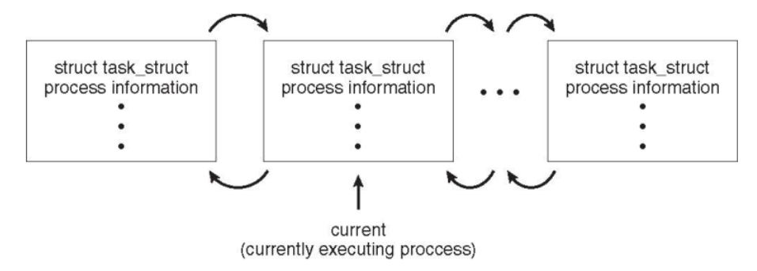
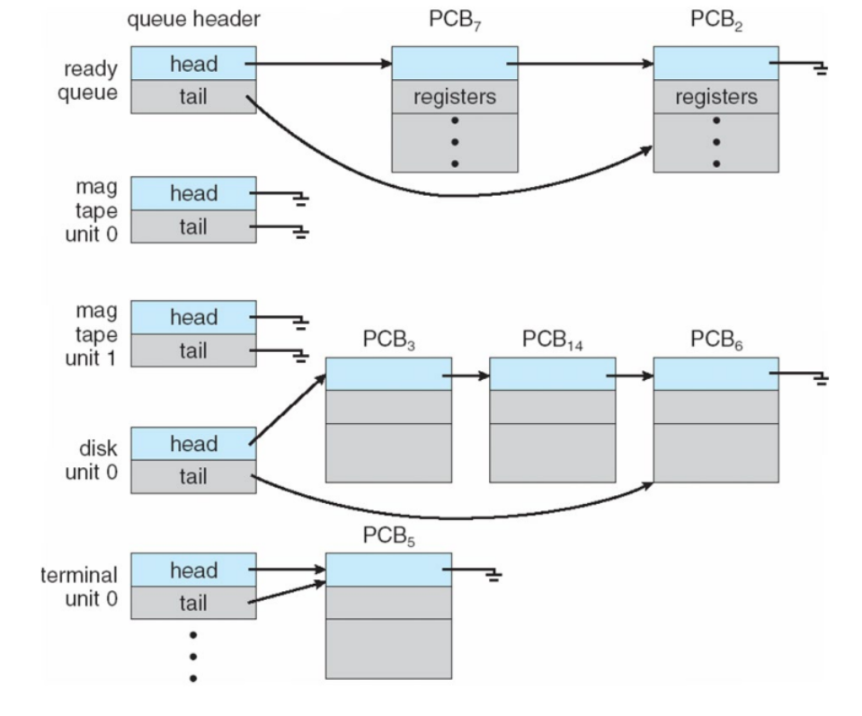
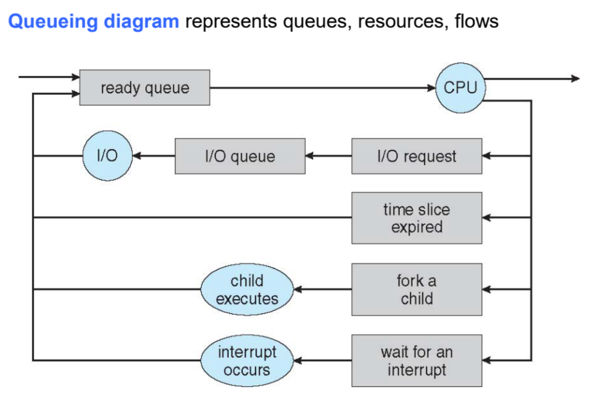
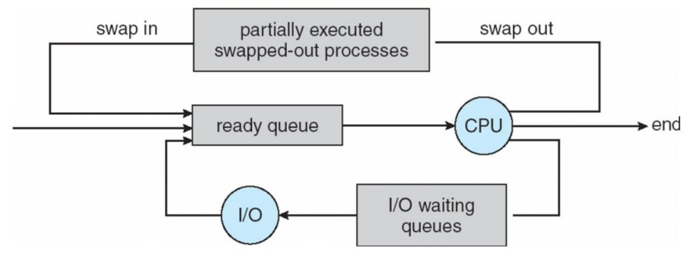
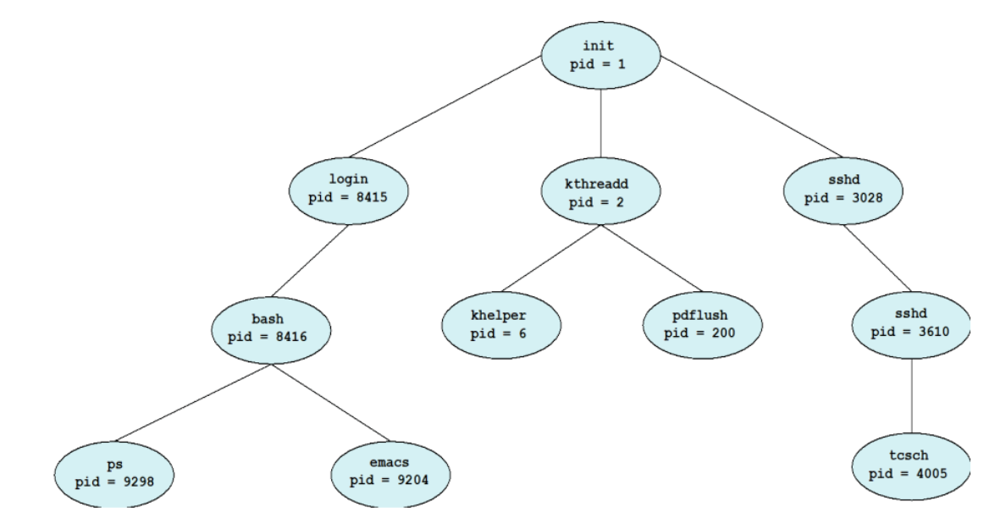
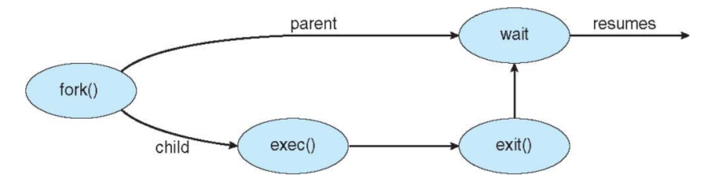
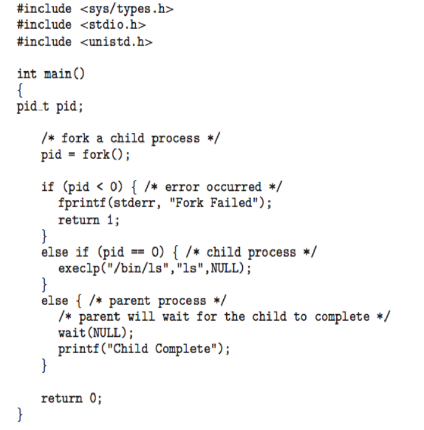
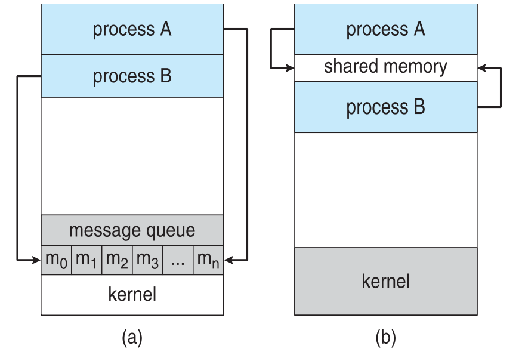

## 프로세스의 개념 (Process Concept)

**프로세스는 실행 중인 프로그램**을 의미하며, 운영체제에서 수행되는 모든 작업의 기본 단위가 된다. 
현대의 운영체제는 Batch system에서는 **Job**, 시분할 시스템에서는 **User program** 또는 **Task** 등으로 부르지만, 용어를 거의 혼용하여 사용한다.

- **능동적인 존재로서의 프로세스**: 프로그램은 디스크에 저장된 **실행 파일 형태**의 수동적인 존재인 반면, 프로세스는 이 파일이 메모리에 로드되어 실행되는 능동적인 존재다.
    
- **프로세스의 다중성**: 하나의 프로그램이 여러 사용자에 의해 실행되거나 여러 번 호출될 경우, 각각 별개의 프로세스가 될 수 있다.
    

## 프로세스의 메모리 구조

프로세스는 단순히 프로그램 코드만을 의미하지 않으며, 실행에 필요한 다양한 정보를 포함하는 여러 섹션으로 나뉘어 메모리에 배치된다.

- **Text section:** 프로그램 코드가 저장되는 영역이다.
    
- **Data section**: 전역 변수, static variable이 저장되는 공간이다.
    
- **Stack**: 함수 파라미터, 반환 주소, 지역 변수와 같은 임시 데이터를 저장하며, 함수 호출 시 동적으로 크기가 변한다.
    
- **Heap**: 프로그램 실행 중에 동적으로 할당되는 메모리 영역이다.
    
- **현재 활동 상태 기록**: **Program counter**와 프로세서 레지스터의 내용을 통해 현재 어느 지점이 실행되고 있는지 추적한다.
    

 프로세스가 메모리에 상주할 때 텍스트, 데이터, 힙, 스택 섹션이 하위 주소(0)부터 상위 주소(max)까지 어떻게 배치되는지 보여주는 도표다. 특히 힙과 스택은 서로 빈 공간을 향해 확장되는 구조를 취하여 메모리를 효율적으로 사용한다.

## 프로세스 상태 (Process State)

프로세스는 실행됨에 따라 그 상태가 지속적으로 변한다. 운영체제는 이러한 상태 변화를 관리하여 자원 할당의 효율성을 높인다.

- **생성(New)**: 프로세스가 생성되고 있는 단계다.
    
- **실행(Running)**: CPU를 점유하여 명령어가 실제로 실행되고 있는 상태다.
    
- **대기(Waiting)**: I/O 완료나 신호 수신 등 특정 이벤트가 발생하기를 기다리며 휴식하는 상태다. -> waiting queue에서 대기
    
- **준비(Ready)**: 실행에 필요한 모든 준비를 마치고 CPU에 할당(Dispatch)되기를 기다리는 상태다. -> ready queue에서 대기
    
- **종료(Terminated)**: 실행을 완전히 마친 상태다.
    

 프로세스가 각 상태 사이를 이동하는 과정을 나타낸 다이어그램이다. 예를 들어 실행 중인 프로세스가 인터럽트(Interrupt)를 받으면 다시 준비 상태로 돌아가며, I/O 요청을 하면 대기 상태로 이동했다가 작업이 완료되면 다시 준비 상태가 되어 순서를 기다린다.

## 프로세스 제어 블록 (Process Control Block, PCB)

운영체제는 각 프로세스를 관리하기 위해 프로세스별로 **프로세스 제어 블록(PCB)** 또는 **태스크 제어 블록(Task control block)** 이라 불리는 데이터 구조를 유지한다.

### PCB 상세 구성 요소

- **프로세스 상태 (Process state)**: 해당 프로세스가 현재 어떤 활동을 하고 있는지를 나타낸다. 여기에는 생성(new), 실행(running), 대기(waiting), 준비(ready), 종료(terminated) 등의 상태 값이 포함된다.
    
- **프로그램 카운터 (Program counter)**: 이 프로세스가 다음에 실행할 **Address**를 가리킨다. 프로세스가 CPU를 반납할 때 이 값을 저장해 두어야 나중에 다시 CPU를 할당받았을 때 멈췄던 지점부터 명령어를 이어 나갈 수 있다.
    
- **CPU 레지스터 (CPU registers)**: 누산기(Accumulator), 인덱스 레지스터(Index register), 스택 포인터(Stack pointer), 범용 레지스터 등 CPU 내부의 모든 프로세스 중심적인 레지스터 내용을 포함한다. 프로그램 카운터와 함께 이 정보들을 저장하는 것을 **문맥(Context)** 저장이라고 한다.
    
- **CPU 스케줄링 정보 (CPU scheduling information)**: 운영체제가 어떤 프로세스를 먼저 실행할지 결정할 때 사용하는 정보로, 프로세스의 **Priority**와 스케줄링 큐를 관리하기 위한 포인터 등이 들어있다.
    
- **메모리 관리 정보 (Memory-management information)**: 해당 프로세스에 할당된 메모리의 범위를 정의하는 **하한 및 상한 경계 레지스터(Base and limit registers)** 값이나 페이지 테이블(Page tables) 정보를 포함하여 메모리 보호를 수행한다.
    
- **회계 정보 (Accounting information)**: 시스템 운영을 위해 기록하는 데이터로, 실제 사용된 **CPU 시간**, 프로세스 시작 후 경과된 시간, 할당된 시간 제한(Time limits) 등이 포함된다.
    
- **입출력 상태 정보 (I/O status information)**: 프로세스 실행 중 필요한 외부 자원 관리 정보로, 프로세스에 할당된 **입출력 장치 목록**과 현재 프로세스가 열어두고 작업 중인 **파일 목록** 등이 포함된다.
    

### Process Switch

 CPU가 프로세스 $P_0$에서 $P_1$으로 전환되는 과정을 보여준다.
$P_0$의 현재 상태를 $PCB_0$에 저장하고, 이전에 중단되었던 $P_1$의 상태를 $PCB_1$에서 복구하는 과정을 거친다. 이 전환 기간 동안 CPU는 실제 작업을 수행하지 못하는 Idle 상태가 되는데, 이를 **문맥 교환**이라고 한다. -> 이러한 동작이 굉장히 빠르게 일어나기 때문에 사용자는 여러 프로세스가 동시에 동작하는것처럼 인식하게 된다.

-------

## Threads

지금까지의 프로세스는 단일 실행 스레드(Single thread of execution)만을 가졌으나, 현대 운영체제는 하나의 프로세스 내에서 여러 실행 위치를 동시에 가질 수 있는 다중 스레드(Multiple threads of control)를 지원한다.

- **목적**: 프로세스 내에서 여러 작업을 동시에 수행하여 응답성을 높이고 자원을 효율적으로 공유하기 위해 사용한다.
    
- **특징**: 다중 스레드를 사용할 경우 프로세스 제어 블록(PCB)에는 각 스레드의 상태를 저장하기 위해 여러 개의 프로그램 카운터(Program Counter)와 저장 공간이 필요하다.
    

## 리눅스에서의 프로세스 표현

리눅스 시스템은 프로세스를 `task_struct`라는 C 언어 구조체로 표현하며, 이는 프로세스 제어 블록(PCB)의 역할을 수행한다.

- **주요 구성 요소**:
    
    - **pid_t pid**: 프로세스를 식별하기 위한 고유 번호인 프로세스 식별자(Process Identifier)다.
        
    - **long state**: 프로세스의 현재 실행 상태를 나타낸다.
        
    - *_struct task_struct _parent__: 해당 프로세스의 부모 프로세스 정보를 담고 있다.
        
    - **struct list_head children**: 해당 프로세스가 생성한 자식 프로세스들의 목록을 관리한다.
        
    - *_struct files_struct _files__: 프로세스가 열어놓은 파일들의 목록을 포함한다.
        
    - *_struct mm_struct _mm__: 프로세스의 주소 공간(Address Space) 정보를 관리한다.
        

 리눅스 커널 내에서 여러 `task_struct`가 연결 리스트 형태로 존재하며, 현재 실행 중인 프로세스를 `current` 포인터가 가리키고 있는 구조를 보여준다.

## 프로세스 스케줄링(Process Scheduling)

운영체제는 CPU 이용률을 극대화하기 위해 프로세스들을 신속하게 교체하며 실행하는데, 이를 위해 스케줄링 큐(Scheduling Queues)를 유지 관리한다.

- **스케줄링 큐의 종류**:
    
    - **준비 큐(Ready Queue)**: 메인 메모리에 상주하며 실행을 위해 대기 중인 모든 프로세스의 집합이다.
        
    - **장치 큐(Device Queues)**: 입출력(I/O) 장치를 사용하기 위해 대기 중인 프로세스들의 집합이다.
        
- **원리**: 프로세스들은 실행 상태나 필요 자원에 따라 이 다양한 큐 사이를 이동(Migrate)하며 관리된다.
    

 Ready queue와 자기 테이프, 디스크, 터미널 등 각 장치별로 할당된 Queue Header와 그 뒤에 연결된 프로세스 제어 블록(PCB)들의 연결 구조를 나타낸다.
- PCB7,2는 바로 시작할 수 있는 Ready State
- PCB3,14,6은 I/O가 끝나길 기다리는 Waiting State

프로세스가 준비 큐에서 CPU를 할당받아 실행되다가 입출력 요청, 시간 할당량 만료(Time slice expired), 자식 프로세스 생성, 인터럽트 대기 등의 이벤트에 따라 각기 다른 큐로 유입되는 흐름을 시각화한 도표다.
- time slice: 프로세스가 할당 받은 시간이 만료된 건 직접 반납이 아니라 강제 종료 당한 것이다. 즉, 아직 작업이 완료되지 않았기 때문에 다시 실행되기 위하여 Ready Queue로 들어간다.
- fork: 자식 프로세스를 생성한 후 바로 실행되거나 Ready queue로 갈 수 도 있지만, wait()함수를 실행하게 되면 자식이 종료될 때 까지 Waiting queue에 대기하다가 자식이 종료되면 Ready queue로 들어가 실행을 대기한다.

## 스케줄러(Schedulers)의 분류 및 특징

스케줄러는 프로세스를 선택하는 시점과 목적에 따라 세 가지로 구분된다.

- **단기 스케줄러(Short-term scheduler / CPU scheduler)**:
    
    - **원리**: 실행 준비가 된 프로세스 중 하나를 선택하여 CPU를 할당한다.
        
    - **성능 이점**: 밀리초(ms) 단위로 매우 빈번하게 호출되므로, 시스템 전체의 체감 성능을 위해 매우 빨라야 한다.
        
- **장기 스케줄러(Long-term scheduler / Job scheduler)**:
    
    - **원리**: 디스크의 풀(Pool)에서 프로세스를 가져와 준비 큐에 넣을 대상을 결정한다.
        
    - **특징**: 다중 프로그래밍의 정도(Degree of multiprogramming)를 제어하며, 입출력 중심(I/O-bound) 프로세스와 CPU 중심(CPU-bound) 프로세스를 적절히 혼합하여 시스템 효율을 높인다.
        
    - Degree of multiprogramming: Ready queue에 존재하는 프로세스들은 단기 스케줄러에 의해 빠르게 switch되면서 동시에 실행되는 것처럼 보이는데, 이 Ready queue에 들어갈 프로세스의 개수를 정하는 것이 장기 스케줄러이다.
        
- **중기 스케줄러(Medium-term scheduler)**:
    
    - **원리**: 메모리가 부족할 때 프로세스를 일시적으로 메모리에서 제거(Swap out)하여 디스크에 저장했다가, 나중에 다시 불러와(Swap in) 실행을 재개하는 **스와핑(Swapping)** 기법을 사용한다.
        

 Ready queue와 CPU 사이의 흐름에 '부분적으로 실행된 스왑 아웃된 프로세스들'이라는 저장 공간(하드 디스크)이 추가되어 메모리 부하를 조절하는 과정을 보여준다.

## 초기 모바일 시스템의 멀티태스킹 (Multitasking in Mobile Systems)

초기 모바일 환경은 제한된 화면 크기와 하드웨어 자원(배터리, 메모리 등)으로 인해 데스크톱 운영체제와는 다른 멀티태스킹 방식을 채택하였다. 운영체제는 시스템의 응답성을 유지하고 자원 소모를 최소화하기 위해 프로세스의 실행을 엄격하게 제어한다.

- **초기 iOS의 방식**: 초기 버전의 iOS는 사용자 인터페이스(UI) 한계로 인해 단 하나의 프로세스만 **Foreground**에서 실행되도록 허용하고, 나머지 프로세스는 **Suspended** 상태로 두었다.
    
- **iOS의 백그라운드 제한**: 백그라운드 프로세스는 메모리에는 남아있으나 디스플레이에는 나타나지 않으며, 실행에 엄격한 제한을 받는다. 허용되는 작업은 짧은 작업 수행, 이벤트 알림 수신, 또는 오디오 재생과 같이 특정 목적을 가진 장기 실행 작업으로 국한된다.
    
- **Android의 방식**: Android는 iOS에 비해 상대적으로 적은 제한을 두어 포그라운드와 백그라운드 프로세스를 동시에 실행할 수 있도록 설계되었다.
    
- **서비스 활용**: Android는 백그라운드에서 작업을 수행하기 위해 별도의 서비스 개념을 사용한다. 서비스는 사용자 인터페이스가 없고 메모리 사용량이 적으며, 해당 백그라운드 프로세스가 중단된 상태에서도 독립적으로 계속 실행될 수 있는 특징을 가진다.
    

### 성능 및 설계 측면의 분석

이러한 설계는 모바일 기기의 특성상 **배터리 수명 연장**과 **사용자 경험(UX) 최적화**를 목적으로 한다. 모든 앱이 데스크톱처럼 자유롭게 백그라운드에서 CPU를 점유하게 되면 전력 소모가 극심해지므로, 운영체제가 개입하여 활성화된 앱에 자원을 집중시키는 전략을 취한 것이다. 특히 서비스(Service)와 같은 구조는 UI 구성 요소 없이 필요한 로직만 실행하게 함으로써 메모리 효율성을 극대화한다.

## 문맥 교환(Context Switch)

CPU가 다른 프로세스로 실행을 전환할 때, 이전 프로세스의 상태를 저장하고 새로운 프로세스의 상태를 복구하는 과정을 말한다.

- **원리**: 프로세스의 Context는 PCB에 저장되며, 운영체제는 이 정보를 바탕으로 중단된 지점부터 다시 실행할 수 있게 한다.
	  
- **오버헤드 발생:** CPU가 현재 실행 중인 프로세스 $P_{0}$에서 다른 프로세스 $P_{1}$으로 전환될 때, 운영체제는 다음과 같은 작업을 수행해야 한다.
		
	- **1. Save State**: 현재 CPU 레지스터에 있는 $P_{0}$의 프로그램 카운터, 데이터, 상태 정보 등을 $PCB_{0}$(메모리 영역)에 저장한다.
	    
	- **2. Load State**: 다음에 실행할 $P_{1}$의 상태 정보를 $PCB_{1}$에서 읽어와 CPU 레지스터에 덮어쓴다.
	    
	- 이 과정은 메모리 접근을 수반하므로 시간이 소요되며, 이 동안 CPU는 실제 사용자 프로그램을 실행하지 못하는 순수한 Overhead가 발생한다.
    
    
### 최적화 방법

- 일반적인 CPU는 하나의 실행 흐름을 담을 수 있는 한 세트의 레지스터만 가지고 있다. 하지만 일부 고성능 하드웨어는 **다중 레지스터 세트**를 제공하여 이 문제를 해결한다.

- **하드웨어 구조**: CPU 내부에 물리적인 레지스터 뭉치(Bank)를 여러 개(예: Set 0, Set 1, Set 2 등) 배치한다.
	
- **작동 방식**:
	
- 각 레지스터 세트에 서로 다른 프로세스의 Context를 미리 로드해 둔다.
	
- 문맥 교환이 필요할 때, 데이터를 메모리로 옮기는 대신 **현재 사용 중인 레지스터 세트를 가리키는 포인터**만 변경한다.
	

### 성능 측면에서의 이점

이 기술은 문맥 교환 시간을 획기적으로 단축하여 시스템의 전체적인 처리량을 높인다.

- **메모리 접근 배제**: 데이터를 메모리(RAM)나 캐시로 복사하고 다시 읽어오는 과정이 생략된다. 단순히 전기적인 스위칭(포인터 변경)만으로 전환이 완료되므로, 수백~수천 사이클이 걸리던 작업이 단 몇 사이클 만에 끝난다.
    
- **실시간성 보장**: 문맥 교환 시간이 하드웨어적으로 고정되고 매우 짧아지므로, 빠른 응답성이 요구되는 실시간 시스템(Real-time System)에서 매우 유리하다.
    
- **오버헤드 최소화**: OS가 복잡하고 PCB가 클수록 문맥 교환 시간이 길어지는데, 하드웨어 레지스터 세트는 이러한 소프트웨어적 복잡도와 상관없이 일정한 고속 전환을 보장한다.
    
****

## 프로세스 생성(Process Creation)

프로세스는 실행 중에 `fork()`와 같은 시스템 호출을 통해 새로운 프로세스를 생성할 수 있으며, 이 과정에서 부모와 자식 관계가 형성되어 **Tree 구조**를 이룬다.

- **식별**: 각 프로세스는 **프로세스 식별자(pid)를 통해 관리**된다.
    
- **자원 공유 방식**: 부모와 자식이 모든 자원을 공유하거나, 자식이 부모 자원의 일부만을 공유하거나, 혹은 전혀 공유하지 않는 세 가지 방식이 있다.
    
- **실행 방식**: 부모와 자식이 **동시에 실행**되거나, 부모가 **자식의 종료를 기다리는 방식**이 있다.
    

최초의 프로세스인 `init`을 뿌리로 하여 `login`, `kthreadd`, `sshd` 등이 자식 프로세스로 뻗어 나가는 계층 구조를 나타낸다.

- `fork()`를 통해 자식 프로세스가 복제되고, `exec()`를 통해 자식의 메모리 공간이 새로운 프로그램으로 교체되며, `exit()`로 종료된 후 부모가 `wait()`를 통해 이를 감지하고 재개되는 일련의 과정을 설명한다.
	이것으로 shell(`ls,cp`)의 동작 방식을 설명할 수 있다.
	- shell: 사용자가 입력한 명령어를 해석하여 실행해주는 프로그램
	- 동작 방식: shell이 사용자의 명령을 실행할 때, shell 자체가 그 기능을 직접 수행하는 것이 아니라 별도의 프로세스를 만들어 일을 시키는 구조이다.
	  예시 1
      
	
## 운영체제별 프로세스 생성 예시 비교

| 구분        | UNIX / Linux                                  | Windows API                                      |
| --------- | --------------------------------------------- | ------------------------------------------------ |
| **핵심 함수** | `fork()`, `exec()`                            | `CreateProcess()`                                |
| **특징**    | `fork()`로 부모를 그대로 복제한 뒤 `exec()`로 프로그램을 덮어쓴다. | 함수 호출 시점에 실행할 프로그램 이름과 매개변수를 명시적으로 전달한다.         |
| **대기 방식** | `wait()` 함수를 호출하여 자식의 종료를 기다린다.               | `WaitForSingleObject()`를 사용하여 프로세스 핸들의 신호를 기다린다. |

--------

## 프로세스 종료(Process Termination)

- 프로세스는 마지막 문장을 실행한 후 `exit()` 시스템 콜을 사용하여 운영체제에 자신을 삭제해 달라고 요청하며 정상적으로 종료된다.
    
- 종료 시 부모 프로세스는 `wait()` 시스템 콜을 통해 자식 프로세스로부터 상태 데이터(+ 자식의 pid)를 반환받으며, 이후 운영체제는 종료된 프로세스가 사용하던 모든 자원을 할당 해제한다.
    
- 부모 프로세스는 특정 상황에서 자식 프로세스의 실행을 강제로 종료시킬 수 있다.
    
    - 자식이 할당된 자원의 한계를 초과하여 사용한 경우.
        
    - 자식에게 할당된 작업이 더 이상 필요하지 않은 경우.
        
    - 부모 프로세스가 먼저 종료되는데, 운영체제 정책상 부모 없는 자식 프로세스의 실행을 허용하지 않는 경우.
        
- 특정 운영체제에서는 부모가 종료되면 자식도 계속 존재할 수 없도록 설계되어 있어, 부모가 종료될 때 모든 자식과 손자 프로세스까지 연쇄적으로 시스템에 의해 강제 종료되는 **연쇄 종료(Cascading termination)가 발생**한다.
    
- **좀비 프로세스(Zombie process)**: 자식 프로세스는 이미 종료되었지만, 부모 프로세스가 `wait()` 시스템 콜을 호출하지 않아 종료 상태 정보가 메모리에 계속 남아있는 프로세스를 의미한다. 비유하자면, 업무를 마치고 퇴근해야 하는데 보고를 받을 상사가 나타나지 않아 껍데기만 남은 채 퇴근을 못하고 있는 상태와 같다.
    
- **고아 프로세스(Orphan process)**: 부모 프로세스가 `wait()`를 호출하지 않은 채 먼저 종료되어 버려 홀로 남겨진 자식 프로세스를 의미한다. -> 리눅스는 고아 프로세스를 보통 init process(PID 1)에 의해 입양되어 계속 실행된다. 따라서 연쇄 종료 방식을 사용하지 않음을 알 수 있다.
    

## 다중 프로세스 아키텍처(Multiprocess Architecture)

- 과거의 웹 브라우저들은 하나의 단일 프로세스 내에서 동작했기 때문에, 웹사이트 하나에 무한 루프나 오류가 생기면 브라우저 전체가 멈추거나 충돌하는 심각한 성능 및 안정성 문제가 있었다.
    
- 이를 해결하기 위해 구글 크롬 브라우저는 서로 다른 역할을 하는 3가지 유형의 프로세스로 분리하는 다중 프로세스 구조를 도입했다.
    
    - **Browser process**: 전반적인 사용자 인터페이스(UI)와 디스크 및 네트워크 입출력(I/O)을 총괄하여 관리한다.
        
    - **Renderer process**: 웹 페이지를 화면에 렌더링하고 HTML과 자바스크립트(Javascript)를 실행한다. 사용자가 탭을 열어 새로운 웹사이트에 접속할 때마다 새로운 렌더러가 독립적으로 생성되며, 보안 위협을 최소화하기 위해 디스크 및 네트워크 I/O 접근이 제한되는 Sandbox 환경에서 안전하게 실행된다.
        
    - **Plug-in process**: 각 유형의 브라우저 플러그인마다 개별적으로 할당되어 동작한다.
        

 브라우저의 각 탭이 별도의 독립적인 프로세스로 동작하는 모습을 시각적으로 보여준다. 특정 탭에 문제가 발생해도 다른 탭에 영향을 주지 않아 쾌적한 사용 환경을 유지할 수 있다.

## 프로세스 간 통신(Interprocess Communication, IPC)

- 시스템 내에서 실행되는 프로세스들은 다른 프로세스의 영향을 받지 않는 독립적인 프로세스와, 서로 데이터를 공유하며 영향을 주고받는 협력적인 프로세스로 나뉜다.
    
- 여러 프로세스가 **협력하는 이유**는 다양한 이점을 얻기 위해서다. 여러 응용프로그램이 동일한 정보에 접근할 수 있게 하는 정보 공유, 작업을 나누어 병렬로 처리함으로써 얻는 연산 속도 향상, 시스템 기능을 독립적인 단위로 나누는 모듈성, 사용자의 편의성을 도모할 수 있다.
    
- 이러한 협력을 위해 프로세스들은 데이터를 주고받는 **프로세스 간 통신(IPC)** 메커니즘을 필요로 하며, 주로 두 가지 통신 모델을 사용한다.
    
    1. **공유 메모리(Shared memory)**
        
    2. **메시지 전달(Message passing)**
        

 
- 그림 (a)는 운영체제 커널에 있는 메시지 큐를 매개체로 프로세스 A와 B가 통신하는 'Message passing' 모델이다. 
- 그림 (b)는 프로세스 A와 B 사이에 공통으로 접근할 수 있는 'Shared memory' 영역을 두어 커널의 개입 없이 직접 데이터를 주고받는 모델을 보여준다.

## 생산자-소비자 문제(Producer-Consumer Problem)

- 프로세스 협력의 대표적인 패러다임으로, 정보를 만들어내는 **생산자 프로세스**와 그 정보를 가져다 쓰는 **소비자 프로세스** 사이의 관계를 나타낸다. 주방장(생산자)이 요리를 만들어 배식대(버퍼)에 두면, 손님(소비자)이 가져가는 원리와 같다.
    
- **무한 버퍼(Unbounded-buffer)**: 배식대의 크기에 실질적인 제한이 없어 생산자는 소비자 상태와 무관하게 계속해서 항목을 생성할 수 있다.
    
- **유한 버퍼(Bounded-buffer)**: 배식대의 크기가 고정되어 있어 버퍼가 꽉 차면 생산자는 대기해야 하고, 버퍼가 텅 비어있으면 소비자가 대기해야 한다.
    

## 공유 메모리(Shared Memory) 통신

- 데이터를 교환하려는 프로세스들이 함께 접근할 수 있는 공통 메모리 영역을 설정하여 통신하는 방식이다.
    
- 통신 과정이 운영체제의 통제가 아닌 온전히 사용자 프로세스의 통제하에 이루어지므로, 시스템 호출이 발생하지 않아 속도가 매우 빠르다는 장점이 있다.
    
- **핵심 과제**: 여러 프로세스가 동시에 공유 메모리 영역에 접근해 데이터를 읽거나 쓸 때 충돌이 발생하지 않도록, 사용자 프로세스 스스로 행위를 조율하는 **동기화** 메커니즘을 책임지고 구현해야 한다.
    

## 메시지 전달(Message Passing) 통신

- 프로세스들이 별도의 공유 변수를 사용하지 않고, 메시지를 송수신하며 동작을 동기화하고 통신할 수 있게 돕는 메커니즘이다.
    
- 운영체제의 IPC 설비는 기본적으로 메시지를 보내는 `send(message)`와 메시지를 받는 `receive(message)` 두 가지 연산을 제공한다. (전송되는 메시지 크기는 고정적일 수도, 가변적일 수도 있다. )
    
- 프로세스 P와 Q가 통신을 원하면 둘 사이에 먼저 통신 링크를 구축하고, `send`와 `receive`를 통해 서로 메시지를 교환한다. 통신 링크는 논리적으로 **직접 통신**과 **간접 통신** 방식으로 나뉜다.
    
- **직접 통신(Direct Communication)**
    
    - 통신하려는 상대방의 이름을 명시적으로 지정해야 한다. `send(P, message)`는 P에게 메시지를 보내고, `receive(Q, message)`는 Q로부터 메시지를 받는 방식이다.
        
    - 통신 링크가 두 프로세스 사이에 자동으로 하나만 설정되며, 이 링크는 오직 두 통신 프로세스 쌍에만 연관된다. 통신 링크는 보통 양방향(Bi-directional)으로 통신이 가능하다.
        
- **간접 통신(Indirect Communication)**
    
    - 직접 상대를 지정하지 않고 고유한 ID를 가진 **메일박스(Mailbox, 또는 포트)** 로 메시지를 지향하여 송수신한다. 프로세스들은 공통 메일박스를 공유할 때만 통신이 가능하다.
        
    - 하나의 통신 링크(메일박스)가 여러 프로세스와 연결될 수 있으며, 두 프로세스 사이에도 여러 개의 통신 링크가 존재할 수 있다.
        
    - 기본 연산으로는 메일박스 생성, `send(A, message)`, `receive(A, message)`, 메일박스 삭제 기능이 있다. (A: mail box ID)
        
    - 여러 프로세스(P1, P2, P3)가 메일박스 A를 공유할 때, P1이 메시지를 보내면 누가 그 메시지를 수신할 것인가의 문제가 발생한다. 이를 해결하기 위해 링크를 **최대 두 프로세스**만 쓰도록 제한하거나, **한 번에 하나**의 프로세스만 `receive`를 실행하게 하거나, 시스템이 수신자를 **임의로 지정**해 송신자에게 통보해 주는 방식 등을 사용한다.
        

**공유 메모리와 메시지 전달 방식 비교**: 공유 메모리는 커널의 개입 없이 메모리에 직접 접근하여 대량의 데이터를 매우 빠르게 주고받을 수 있지만 개발자가 직접 복잡한 동기화를 처리해야 한다. 반면, 메시지 전달 방식은 운영체제(커널)가 중재하여 통신하므로 동기화 관리가 훨씬 쉽고 안전하지만 적은 양의 데이터를 주고받을 때 더 적합하다.

## Synchronization

메시지 전달 방식에서 성능과 직결되는 아주 중요한 개념으로, 프로세스의 대기 여부에 따라 **Blocking**과 **Non-blocking**으로 나뉜다.

- **동기적 처리 방식인 Blocking**
    
    - **Blocking send**: 송신자는 보낸 메시지가 상대방에 의해 성공적으로 수신될 때까지 자신의 모든 작업을 멈추고 대기한다. 택배 기사가 수취인을 만날 때까지 문 앞에서 기다리는 것과 같다.
        
    - **Blocking receive**: 수신자는 읽을 수 있는 유효한 메시지가 도착할 때까지 대기 상태를 유지한다.
        
- **비동기적 처리 방식인 Non-blocking(try)**
    
    - **Non-blocking send**: 송신자는 메시지를 운영체제나 버퍼에 던져두고, 수신 여부와 상관없이 즉시 다음 자기 작업을 계속 진행한다. 우체통에 편지를 넣고 바로 제 갈 길을 가는 것과 같다. 
        
    - **Non-blocking receive**: 수신자는 큐에 유효한 메시지가 있다면 그 메시지를 받아오고, 없다면 기다리지 않고 빈 메시지(Null message)를 반환받은 후 다음 작업을 진행한다.
        

만약 송수신 프로세스 모두 블로킹 방식을 사용하면, 양쪽 모두 메시지 교환 지점에서 멈춰서 완벽하게 일치하는 순간에 통신이 성립되는데 이를 **랑데부(Rendezvous)** 라고 부른다.