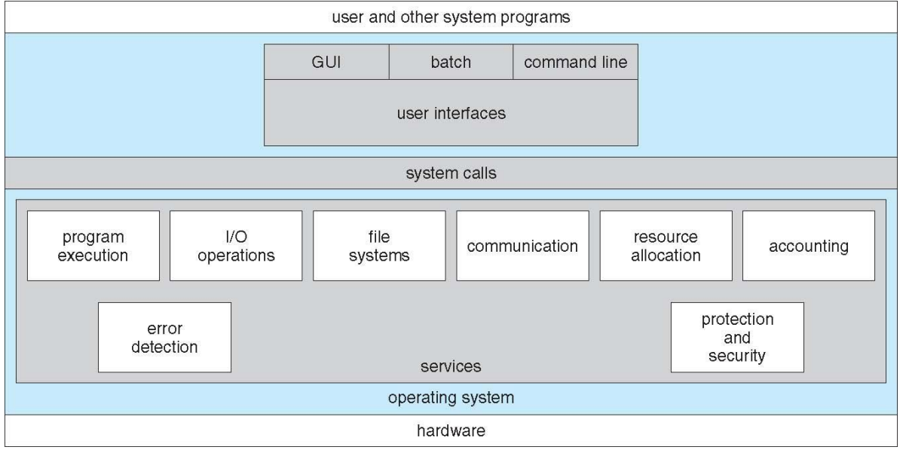
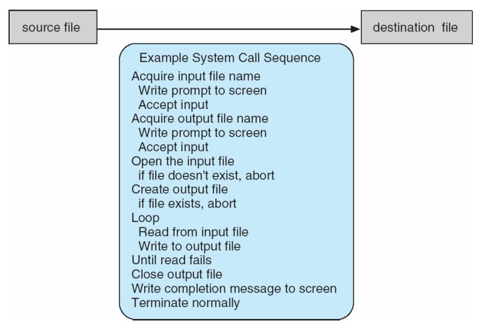
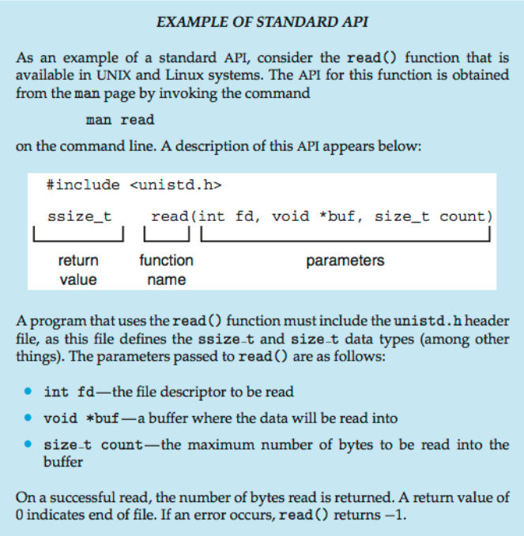
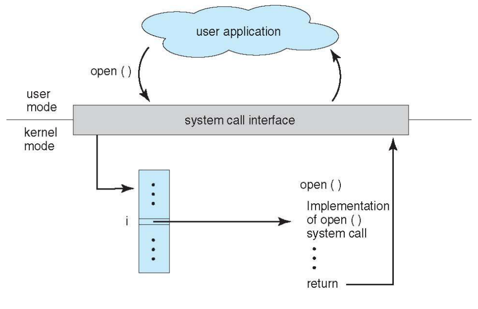
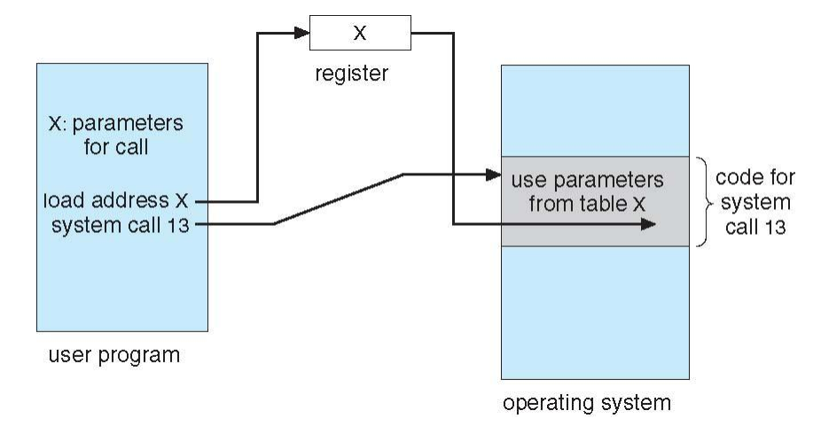
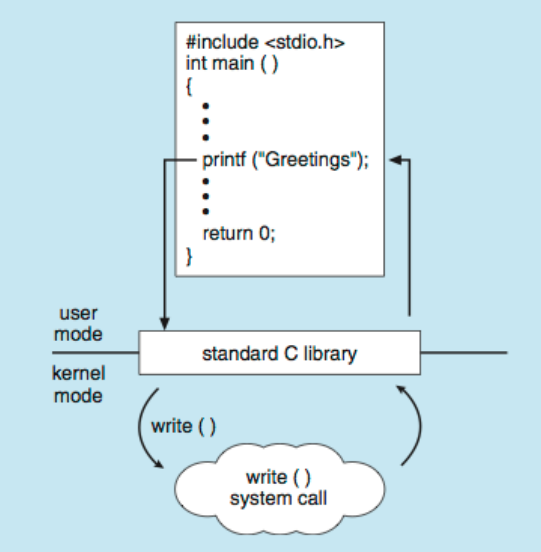
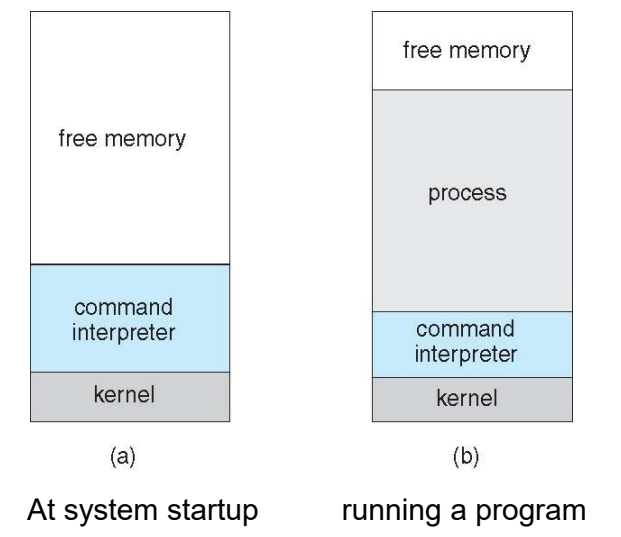
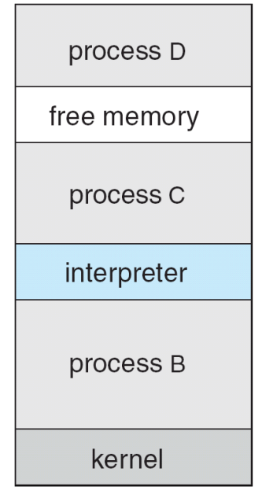

## 운영체제 서비스 (Operating System Services)

운영체제는 크게 사용자에게 도움을 주는 서비스와 시스템 자체의 효율적인 운영을 위한 서비스로 나뉜다.

### 1. **사용자 편의**를 위한 서비스

- **사용자 인터페이스 (User Interface)**: 거의 모든 운영체제는 사용자가 시스템과 소통할 수 있는 접점을 제공한다. 이는 **명령줄 인터페이스(CLI), 그래픽 사용자 인터페이스(GUI), 일괄 처리(Batch) 방식**으로 구분된다.
    
- **프로그램 실행 (Program Execution)**: 시스템은 **프로그램을 메모리에 로드하고 실행**할 수 있어야 하며, 정상적이든 비정상적이든 실행을 종료하는 기능을 제공한다.
	- 정상적 종료: 모든 프로그램을 수행 후 종료.
	- 비정상적 종료: 내부적으로 프로세스를 실행하다가 에러 발생하여 종료, 외부적인 이유로 강제로 종료 시
    
- **입출력 작업 (I/O Operations)**: 실행 중인 프로그램은 **파일이나 입출력 장치와 관련된 작업**이 필요할 수 있으며, 운영체제는 이를 제어한다.
    
- **파일 시스템 조작 (File-system Manipulation)**: 프로그램은 **파일을 읽고 쓰고, 디렉토리를 생성하거나 삭제하며, 권한 관리 및 정보 열람 등의 작업**을 수행한다.
    
- **통신 (Communications)**: 동일 컴퓨터 내의 프로세스 간 또는 네트워크로 연결된 다른 컴퓨터의 **프로세스 간에 정보를 교환하는 기능**을 제공한다. 이는 공유 메모리(Shared Memory)나 메시지 전달(Message Passing) 방식을 통해 이루어진다.
    
- **오류 탐지 (Error Detection)**: 하드웨어(CPU, 메모리, 입출력 장치)나 사용자 프로그램에서 발생할 수 있는 잠재적인 **오류를 끊임없이 감지**하고 적절한 조치를 취해 **계산의 일관성**을 유지한다. 또한, **디버깅 기능**은 사용자와 프로그래머가 시스템을 효율적으로 사용하는 능력을 크게 향상시킬 수 있다.
    

### 2. **시스템 효율성**을 위한 서비스

- **자원 할당 (Resource Allocation)**: **여러 사용자나 작업이 동시에 실행**될 때 CPU 사이클, 메인 메모리, 파일 저장소 등의 **자원을 각 작업에 적절히 배분**한다.
    
- **계정 (Accounting)**: 어떤 사용자가 어떤 종류의 자원을 얼마나 사용하는지 **추적하고 기록**한다.
    
- **보호 및 보안 (Protection and Security)**: 다중 사용자 시스템에서 정보에 대한 접근을 제어하고, 외부의 부적절한 접근으로부터 시스템을 방어하며 사용자 인증을 수행한다.
    

- 하드웨어 위에서 운영체제가 제공하는 각종 서비스와 시스템 콜, 그리고 최종 사용자가 마주하는 인터페이스 간의 계층적 관계를 나타낸 도표.
- 플랫폼: 하드웨어라는 물리적 자원 위에 운영체제라는 소프트웨어 계층이 올라가서 응용 프로그램이 돌아갈 수 있는 플랫폼이 완성된다.

---

## 사용자 운영체제 인터페이스 (User Operating System Interface)

### 명령줄 인터페이스 (CLI - Command Line Interface)

- 커널에 내장되거나 별도의 시스템 프로그램(Shell)으로 구현되어 **사용자가 직접 명령어를 입력**할 수 있게 한다.
    
- 사용자가 입력한 명령어를 가져와서 실행하는 것이 주된 역할이며, 새로운 기능을 추가할 때 쉘(Shell) 자체를 수정할 필요가 없다는 장점이 있다. 쉘은 OS에 사용자 요청을 단순히 전달하는 역할!
	
- 쉘의 명령어 처리 방식
	1. 내장 명령어: 쉘 프로그램 코드 내에 직접 구현된 기능
	2. 외부 프로그램 실행: 명령어의 이름을 가진 별도의 프로그램파일을 찾아 실행하는 방식
- 새로운 기능을 추가할 때 쉘 수정할 필요 없는 이유:
	명령어 처리 방식 (2) 덕분에 새로운 기능이 필요하면 쉘의 소스코드를 고치는게 아니라, 그 기능을 수행하는 새로운 실행 파일을 마늘면 된다. 새로운 프로그램이 설치되면 쉘은 그 파일의 경로만 알면 바로 실행할 수 있기 때문이다.
    

### 그래픽 사용자 인터페이스 (GUI - Graphical User Interface)

- 마우스, 키보드, 모니터를 활용하여 데스크톱 메타포를 제공한다.
    
- 아이콘은 파일이나 프로그램, 동작을 나타내며 마우스 버튼 클릭을 통해 정보를 확인하거나 프로그램을 실행한다.
    
- 현대의 많은 시스템(Windows, Mac OS X, Linux 등)은 CLI와 GUI를 모두 포함하고 있다.
    

### 터치스크린 인터페이스 (Touchscreen Interfaces)

- 마우스를 사용할 수 없는 환경에서 제스처를 기반으로 동작한다.
    
- 가상 키보드나 음성 명령을 통해 입력을 수행한다.
    

---

## 시스템 콜 (System Calls)

### 정의 및 특징

- 운영체제가 제공하는 서비스에 접근하기 위한 프로그래밍(시스템) 인터페이스다.
    
- 주로 C나 C++ 같은 상위 수준 언어로 작성된다.
    
- 프로그래머는 시스템 콜을 직접 호출하기보다는 **API**를 통해 **간접적으로 접근**한다.
    
- 가장 일반적인 API로는 Windows의 Win32 API, 유닉스/리눅스/Mac OS X의 POSIX API, 자바 가상 머신의 Java API가 있다.
    

- 파일 복사 시의 시스템 콜 시퀀스: 하나의 파일을 다른 파일로 복사하는 단순한 작업에서도 입력 파일 이름 획득, 출력 파일 생성, 읽기/쓰기 루프, 파일 닫기 등 수많은 시스템 콜이 순차적으로 발생한다.

### 시스템 콜 구현 (System Call Implementation)

- 각 시스템 콜에는 고유한 번호가 할당되어 있다.
    
- **시스템 콜 인터페이스 (System-call Interface)**는 이 번호에 따라 인덱싱된 테이블을 유지 관리한다.
    
- 사용자는 시스템 콜이 어떻게 구현되었는지 알 필요 없이, API를 준수하고 운영체제가 결과로 무엇을 반환하는지만 이해하면 된다. 실제 운영체제 인터페이스의 상세한 내용은 API에 의해 숨겨진다.
    
- 표준 API 예시
 
- 개발자가 시스템 콜을 직접 호출하는 대신 표준 라이브러리 인터페이스를 사용하면 다음과 같은 이점이 있다.
	1. 추상화: 프로그래머는 커널 내부에서 디스크 인터럽트가 어떻게 발생하는지 알 필요 없이, 이 함수 구조에 맞춰 인자만 넘겨주면 된다.
	2. 이식성: 동일한 `read()` API를 사용하면 유닉스 계열의 다양한 운영체제에서 코드를 거의 수정하지 않고도 실행할 수 있다.
		
- API - System Call - OS의 관계
	 

### 매개변수 전달 방식 (Parameter Passing)

시스템 콜을 호출할 때 단순히 어떤 호출인지를 식별하는 것 외에, **작업 수행에 필요한 추가 정보**를 운영체제에 전달해야 한다. 운영체제에 매개변수(Parameters)를 전달하는 방식은 크게 세 가지로 나뉜다.

- **Register 방식**: 가장 간단한 방법으로, 매개변수를 CPU 레지스터에 직접 담아 전달한다.
    
- **Block/Table 방식**: 전달할 매개변수가 레지스터 수보다 많을 경우, **매개변수들을 메모리의 특정 Block이나 Table에 저장**하고, **해당 블록의 메모리 주소를 레지스터에 담아 전달**한다. Linux와 Solaris가 이 방식을 사용한다
    
- **Stack 방식**: 프로그램이 매개변수를 스택에 밀어 넣고(Push), 운영체제가 이를 꺼내어(Pop) 사용한다. 
	
- 블록 방식과 스택 방식은 전달하는 매개변수의 개수나 길이에 제한이 없다는 성능적 이점이 있다.
    

- Block/Table 방식: 사용자 프로그램이 매개변수 블록의 주소를 레지스터에 담아 운영체제에 전달하고, 운영체제가 해당 주소를 참조하여 작업을 수행하는 과정을 나타낸다.

## 시스템 콜의 유형 (Types of System Calls)

운영체제가 제공하는 시스템 콜은 기능에 따라 다음과 같이 분류할 수 있다.

### 프로세스 제어 (Process Control)

- 프로세스 생성(Create Process) 및 종료(Terminate Process).
    
- 프로그램 로드(Load) 및 실행(Execute).
    
- 프로세스 속성 획득(Get Attributes) 및 설정(Set Attributes).
    
- 시간 대기(Wait for Time) 및 이벤트 신호 대기/송신(Wait/Signal Event).
    
- 메모리 할당 및 해제(Allocate and Free Memory).
    
- 오류 발생 시 메모리 상태를 덤프 파일로 저장(Dump memory if error)
	- 에러가 발생한 시점의 변수 값, 호출 스택 등을 분석할 수 있게 하여 문제의 원인을 정확히 파악하도록 돕는다.
		
- 버그 확인을 위한 debugger와 single step(한 줄씩 실행)
	- 하드웨어가 지원하는 Trap 메커니즘을 활용하여 프로그래머가 코드의 논리적 오류를 세밀하게 검증할 수 있게 한다.
		
- 공유 데이터 접근 관리를 위한 락(Mutex, Semaphre)
	- 두 프로세스가 동시에 데이터를 수정하여 결과가 꼬이는 Race Condition을 방지한다. 시스템의 데이터 일관성과 보호를 위해 매우 중요한 기능이다.
		  

### 파일 및 장치 관리 (File and Device Management)

- **파일 관리**: 파일 생성(Create), 삭제(Delete), 열기(Open), 닫기(Close), 읽기(Read), 쓰기(Write), 위치 재조정(Reposition) 등을 수행한다.
    
- **장치 관리**: 장치 요청(Request), 해제(Release), 읽기, 쓰기 작업을 수행하며, 장치를 논리적으로 부착(Attach)하거나 분리(Detach)한다.
	
- **Attach:** HW 장치를 OS가 제어할 수 있도록 논리적으로 연결하는 과정. 
  Device Driver를 로드하고, 해당 장치에 접근할 수 있는 경로(예: /dev/sda)를 생성하여 프로그램이 장치를 사용할 수 있게 한다.
	
- **Detach:** 장치 사용이 끝나고 OS와 논리적 연결을 끊는 과정.
  장치에 남아있는 데이터를 저장(flush)하고 driver를 unload하여, 장치를 물리적으로 제거해도 시스템에 오류가 생기지 않도록 안전한 상태를 만든다.   
	  

### 정보 유지 및 통신 (Information Maintenance and Communications)

- **정보 유지**: 현재 시간/날짜 설정 및 획득, 시스템 데이터 및 프로세스/파일 속성 관리를 담당한다.
    
- **통신**: 연결 생성 및 삭제, 메시지 전달 모델(Message Passing Model)을 통한 패킷 교환, 공유 메모리 모델(Shared-memory Model)을 통한 메모리 영역 접근 권한 관리, 상태 정보 전달, 원격 장치 attach 및 detach 동작을 수행한다.
    
- Message passing model: 메시지 전달 모델을 사용하는 경우, 호스트 이름(IP 주소, 도메인 이름 등)이나 프로세스 이름을 지정하여 메시지를 주고 받는다.
  OS는 프로세스 사이에서 중재자 역할을 한다.

### 보호 (Protection)

- 자원에 대한 접근 제어(Control Access) 및 권한 설정(Permissions)을 통해 사용자 접근을 허용하거나 거부한다.
    

- 사용자 프로그램이 `printf()` 함수를 호출했을 때, 표준 C 라이브러리를 거쳐 커널 모드의 `write()` 시스템 콜로 이어지는 계층적 구조를 보여준다.
	
- 동작 방식: 커널이 `write()` 시스템 콜 요청을 받으면 해당 장치를 담당하는 디바이스 드라이버에게 "Greetings"를 출력하라는 명령을 전달 한다. -> 디바이스 드라이버는 하드웨어인 device controller의 local buffer에 data를 집어넣는다. -> device controller가 하드웨어를 작동시켜 화면에 "Greetings"가 나타나게 된다.

---

## 운영체제별 실행 환경 비교

시스템 콜을 사용하여 프로그램을 실행하는 방식은 운영체제의 설계 구조에 따라 차이가 난다.

- **MS-DOS (단일 태스킹)**: 시스템 부팅 시 쉘(Shell)이 호출되며, 프로그램을 메모리에 로드할 때 커널을 제외한 거의 모든 메모리 공간을 덮어쓴다. 프로그램이 종료되면 쉘이 다시 로드된다.
  메모리 공간이 부족하여 한 번에 하나의 task만 실행가능하다.
   
	
- **FreeBSD (멀티태스킹)**: 사용자가 로그인하면 선택한 쉘이 실행된다. 새로운 프로세스를 생성하기 위해 `fork()` 시스템 콜을 호출하고, 해당 프로세스에 프로그램을 로드하기 위해 `exec()`을 실행한다.
     
	

---

## 시스템 프로그램 (System Programs)

시스템 프로그램은 프로그램 개발과 실행을 위한 편리한 환경을 제공하며, 대부분의 사용자가 인식하는 운영체제의 모습은 시스템 콜 자체가 아닌 이러한 시스템 프로그램들에 의해 정의된다.

### 주요 기능별 분류

- **파일 관리 (File Management)**: 파일과 디렉터리를 생성, 삭제, 복사, 이름 변경, 인쇄, 덤프, 목록 표시 및 조작하는 기능을 담당한다.
    
- **상태 정보 (Status Information)**: 날짜, 시간, 가용 메모리 및 디스크 공간량, 사용자 수 등 시스템 정보를 요청하여 제공한다. 일부 시스템은 구성 정보를 저장하고 검색하기 위해 **Registry**를 구현하여 사용한다.
	- **Registry:** 시스템 설정정보나 HW 및 SW의 구성 데이터를 통합해서 관리하는 거대한 데이터 베이스.
    
- **파일 수정 (File Modification)**: 파일을 생성하고 수정하기 위한 텍스트 에디터나 파일 내용 검색 및 텍스트 변환을 위한 특수 명령어를 포함한다.
    
- **프로그래밍 언어 지원 (Programming-language Support)**: 컴파일러, 어셈블러, 디버거 및 인터프리터가 제공된다.
    
- **프로그램 로딩 및 실행 (Program Loading and Execution)**: Absolute loaders, Relocatable loaders, Linkage editors 및 디버깅 시스템을 제공한다.
	- **Linkage Editors:** 여러 개로 분리되어 컴파일된 코드 파일들을 하나로 묶어, 실행 가능한 하나의 프로그램 파일로 만드는 역할을 한다.
		
	- **Absolute Loaders:** 프로그램을 메모리의 지정된 특정 주소에만 올리는 로더이다.
	  프로그램이 올라갈 자리가 미리 정해져 있어야 해서 유연성이 떨어진다. 과거의 단순한 시스템에서 주로 사용되었다.
		  
	- **Relocatable Loaders:** 프로그램을 메모리의 어느 빈 공간에나 올릴 수 있게 해주는 로더이다. 
	  실행 시점에 빈 공간을 찾아 주소를 조정해 주는 기능이 성능과 효율적 면에서 좋다. 현대 운영체제에서 쓰인다. 
	    
	
- **통신 (Communications)**: 프로세스, 사용자 및 컴퓨터 시스템 간의 가상 연결을 생성하는 메커니즘을 제공한다. 사용자가 서로 메시지를 보내거나 웹 페이지 브라우징, 전자우편 전송, 원격 로그인, 파일 전송 등을 가능하게 한다.
    

### 백그라운드 서비스 (Background Services)

- 부팅 시 시작되어 시스템 가동 중에 상주하는 서비스다.
    
- 디스크 체크, 프로세스 스케줄링, 에러 로깅, 인쇄 등의 시설을 제공한다.
    
- 커널 컨텍스트가 아닌 사용자 컨텍스트에서 실행되며, **서비스**, **서브시스템**, 또는 **데몬**으로 불린다.

---

## 운영체제 설계 및 구현 (Design and Implementation)

운영체제를 설계할 때는 사용자 목표와 시스템 목표를 동시에 고려해야 한다.

- **사용자 목표**: 운영체제는 사용하기 편리하고, 배우기 쉬우며, 신뢰할 수 있고, 안전하며, 빨라야 한다.
    
- **시스템 목표**: 운영체제는 설계 및 구현, 유지보수가 쉬워야 하며, 유연하고 효율적이어야 한다.
    

### 정책과 메커니즘의 분리 (Policy and Mechanism)

운영체제 설계의 가장 중요한 원칙 중 하나는 **Policy**과 **Mechanism**을 분리하는 것이다.

- **Policy**: **무엇을 할 것인가?**를 결정한다. (예: 타이머를 얼마나 오래 유지할 것인가?)
    
- **Mechanism**: **어떻게 할 것인가?**를 결정한다. 이러한 분리는 향후 정책 결정이 변경되더라도 메커니즘을 수정할 필요 없이 유연하게 대응할 수 있게 하여 시스템의 확장성을 높인다.