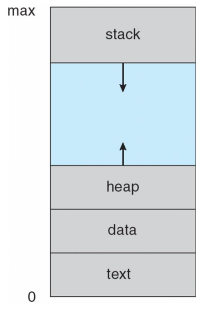
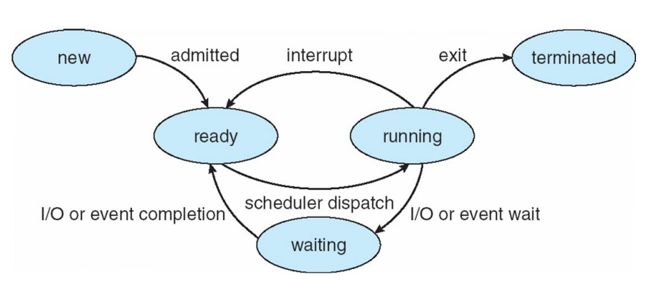
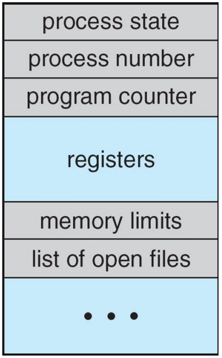
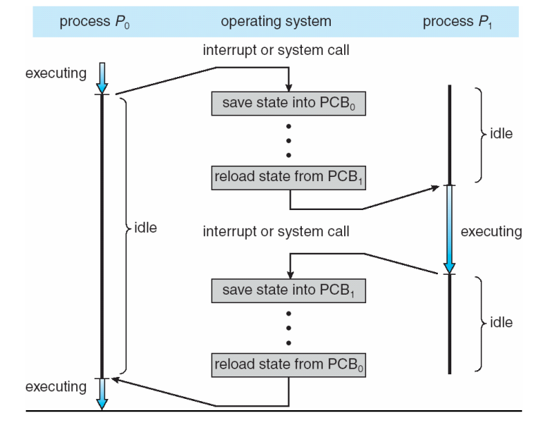

## 프로세스의 개념 (Process Concept)

**프로세스는 실행 중인 프로그램**을 의미하며, 운영체제에서 수행되는 모든 작업의 기본 단위가 된다. 
현대의 운영체제는 Batch system에서는 **Job**, 시분할 시스템에서는 **User program** 또는 **Task** 등으로 부르지만, 용어를 거의 혼용하여 사용한다.

- **능동적인 존재로서의 프로세스**: 프로그램은 디스크에 저장된 **실행 파일 형태**의 수동적인 존재인 반면, 프로세스는 이 파일이 메모리에 로드되어 실행되는 능동적인 존재다.
    
- **프로세스의 다중성**: 하나의 프로그램이 여러 사용자에 의해 실행되거나 여러 번 호출될 경우, 각각 별개의 프로세스가 될 수 있다.
    

## 프로세스의 메모리 구조

프로세스는 단순히 프로그램 코드만을 의미하지 않으며, 실행에 필요한 다양한 정보를 포함하는 여러 섹션으로 나뉘어 메모리에 배치된다.

- **Text section:** 프로그램 코드가 저장되는 영역이다.
    
- **Data section**: 전역 변수, static variable이 저장되는 공간이다.
    
- **Stack**: 함수 파라미터, 반환 주소, 지역 변수와 같은 임시 데이터를 저장하며, 함수 호출 시 동적으로 크기가 변한다.
    
- **Heap**: 프로그램 실행 중에 동적으로 할당되는 메모리 영역이다.
    
- **현재 활동 상태 기록**: **Program counter**와 프로세서 레지스터의 내용을 통해 현재 어느 지점이 실행되고 있는지 추적한다.
    

프로세스가 메모리에 상주할 때 텍스트, 데이터, 힙, 스택 섹션이 하위 주소(0)부터 상위 주소(max)까지 어떻게 배치되는지 보여주는 도표다. 특히 힙과 스택은 서로 빈 공간을 향해 확장되는 구조를 취하여 메모리를 효율적으로 사용한다.

## 프로세스 상태 (Process State)

프로세스는 실행됨에 따라 그 상태가 지속적으로 변한다. 운영체제는 이러한 상태 변화를 관리하여 자원 할당의 효율성을 높인다.

- **생성(New)**: 프로세스가 생성되고 있는 단계다.
    
- **실행(Running)**: CPU를 점유하여 명령어가 실제로 실행되고 있는 상태다.
    
- **대기(Waiting)**: I/O 완료나 신호 수신 등 특정 이벤트가 발생하기를 기다리며 휴식하는 상태다. -> waiting queue에서 대기
    
- **준비(Ready)**: 실행에 필요한 모든 준비를 마치고 CPU에 할당(Dispatch)되기를 기다리는 상태다. -> ready queue에서 대기
    
- **종료(Terminated)**: 실행을 완전히 마친 상태다.
    

프로세스가 각 상태 사이를 이동하는 과정을 나타낸 다이어그램이다. 예를 들어 실행 중인 프로세스가 인터럽트(Interrupt)를 받으면 다시 준비 상태로 돌아가며, I/O 요청을 하면 대기 상태로 이동했다가 작업이 완료되면 다시 준비 상태가 되어 순서를 기다린다.

## 프로세스 제어 블록 (Process Control Block, PCB)

운영체제는 각 프로세스를 관리하기 위해 프로세스별로 **프로세스 제어 블록(PCB)** 또는 **태스크 제어 블록(Task control block)**이라 불리는 데이터 구조를 유지한다.

### PCB 상세 구성 요소

- **프로세스 상태 (Process state)**: 해당 프로세스가 현재 어떤 활동을 하고 있는지를 나타낸다. 여기에는 생성(new), 실행(running), 대기(waiting), 준비(ready), 종료(terminated) 등의 상태 값이 포함된다.
    
- **프로그램 카운터 (Program counter)**: 이 프로세스가 다음에 실행할 **명령어의 주소(Address)**를 가리킨다. 프로세스가 CPU를 반납할 때 이 값을 저장해 두어야 나중에 다시 CPU를 할당받았을 때 멈췄던 지점부터 명령어를 이어 나갈 수 있다.
    
- **CPU 레지스터 (CPU registers)**: 누산기(Accumulator), 인덱스 레지스터(Index register), 스택 포인터(Stack pointer), 범용 레지스터 등 CPU 내부의 모든 프로세스 중심적인 레지스터 내용을 포함한다. 프로그램 카운터와 함께 이 정보들을 저장하는 것을 **문맥(Context)** 저장이라고 한다.
    
- **CPU 스케줄링 정보 (CPU scheduling information)**: 운영체제가 어떤 프로세스를 먼저 실행할지 결정할 때 사용하는 정보로, 프로세스의 **우선순위(Priority)**와 스케줄링 큐를 관리하기 위한 포인터 등이 들어있다.
    
- **메모리 관리 정보 (Memory-management information)**: 해당 프로세스에 할당된 메모리의 범위를 정의하는 **하한 및 상한 경계 레지스터(Base and limit registers)** 값이나 페이지 테이블(Page tables) 정보를 포함하여 메모리 보호를 수행한다.
    
- **회계 정보 (Accounting information)**: 시스템 운영을 위해 기록하는 데이터로, 실제 사용된 **CPU 시간**, 프로세스 시작 후 경과된 시간, 할당된 시간 제한(Time limits) 등이 포함된다.
    
- **입출력 상태 정보 (I/O status information)**: 프로세스 실행 중 필요한 외부 자원 관리 정보로, 프로세스에 할당된 **입출력 장치 목록**과 현재 프로세스가 열어두고 작업 중인 **파일 목록** 등이 포함된다.
    

### Process Switch

CPU가 프로세스 $P_0$에서 $P_1$으로 전환되는 과정을 보여준다.
$P_0$의 현재 상태를 $PCB_0$에 저장하고, 이전에 중단되었던 $P_1$의 상태를 $PCB_1$에서 복구하는 과정을 거친다. 이 전환 기간 동안 CPU는 실제 작업을 수행하지 못하는 Idle 상태가 되는데, 이를 **문맥 교환**이라고 한다. -> 이러한 동작이 굉장히 빠르게 일어나기 때문에 사용자는 여러 프로세스가 동시에 동작하는것처럼 인식하게 된다.