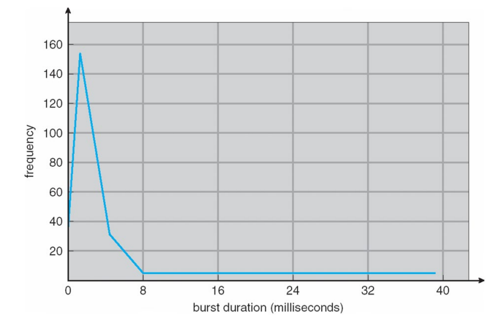
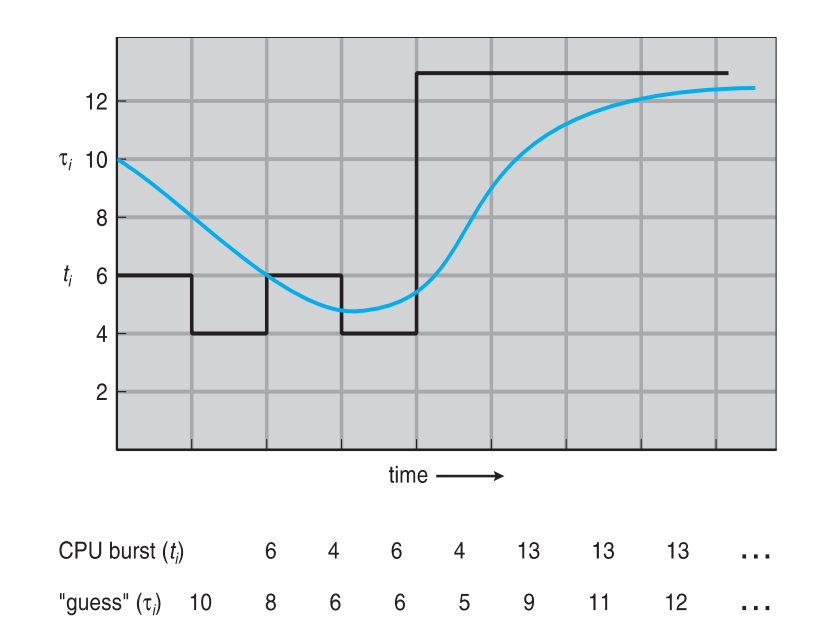
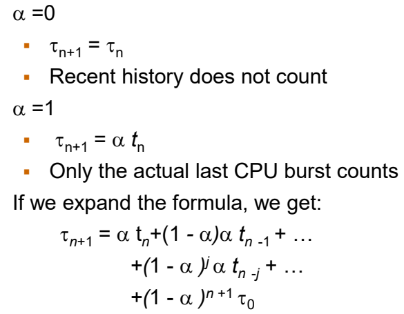
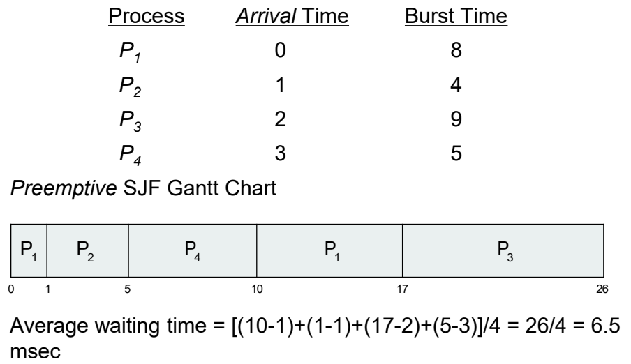
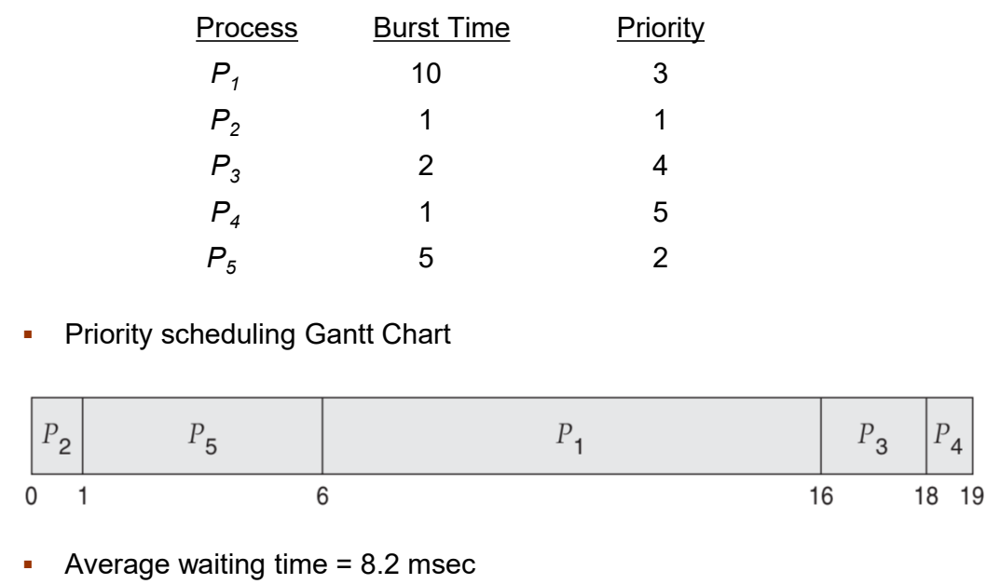
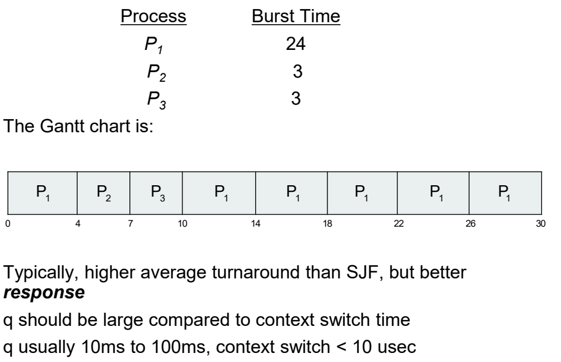
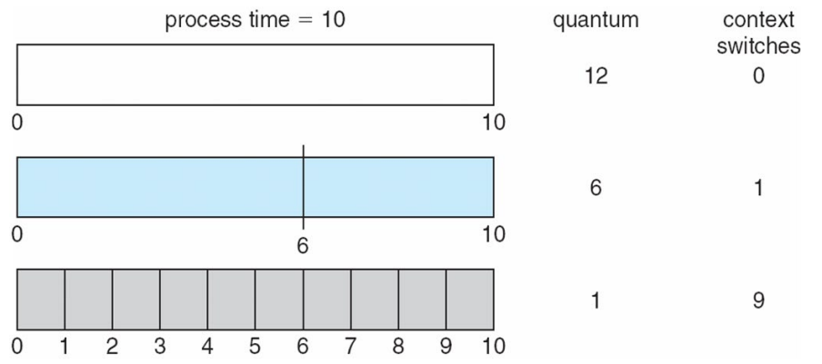
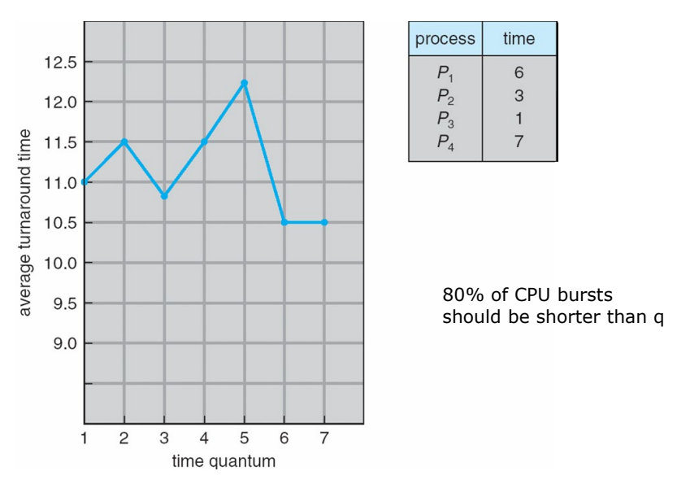
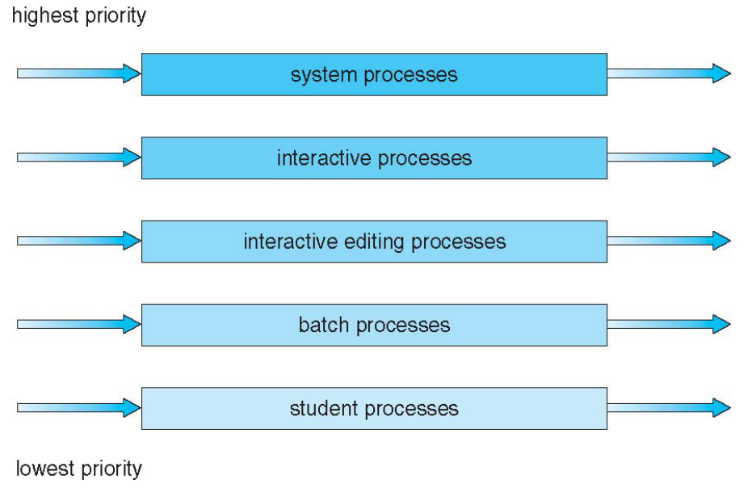
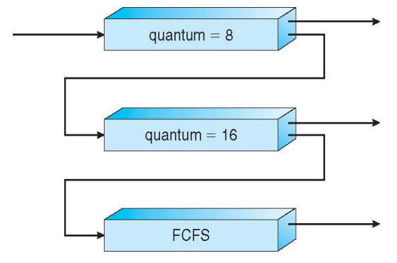

## CPU 스케줄링의 기본 개념 

- **Multiprogramming의 목적:** CPU utilization을 최대화하는 것.
    
- **CPU-I/O Burst Cycle:** 프로세스의 실행은 CPU 실행(CPU burst)과 I/O 대기(I/O burst)의 주기로 구성된다.
    
    - **비유:** 식당에서 요리사(CPU)가 요리하는 시간(CPU burst)과 재료가 오기를 기다리는 시간(I/O burst)이 번갈아 나타나는 것과 같다. 성능 측면에서 요리사가 쉬지 않고 계속 요리를 하도록 스케줄을 짜는 것이 중요하다.
        
- CPU 버스트 분포를 보면 짧은 CPU 버스트가 매우 많고, 긴 CPU 버스트는 적게 분포하는 특징을 가진다.
    
-  
  가로축은 버스트 지속 시간(burst duration)을, 세로축은 빈도를 나타내는 그래프다. 대부분의 프로세스는 짧은 시간 동안만 CPU를 강하게 사용하고 곧바로 I/O 작업으로 넘어간다는 것을 명확히 보여준다. -> 40ms에 가까운 프로세스는 연산 중심의 CPU-bound 작업으로 간주된다.
    

## CPU Scheduler

- **Short-term scheduler:** 메모리에 있는 ready queue의 프로세스 중 하나를 선택하여 CPU를 할당한다.
    
- CPU 스케줄링 결정이 발생하는 4가지 핵심 상황:
    
    - running 상태에서 waiting 상태로 전환될 때 (예: I/O 요청 발생)
        
    - running 상태에서 ready 상태로 전환될 때 (예: 타이머 인터럽트 발생)
        
    - waiting 상태에서 ready 상태로 전환될 때 (예: I/O 작업 완료)
        
    - 프로세스가 종료될 때
        
- **비선점형(Nonpreemptive) 스케줄링:** 위 상황 중 1번과 4번의 경우에만 적용된다. 프로세스가 **스스로 CPU를 반납**할 때까지 다른 프로세스가 CPU를 강제로 빼앗을 수 없다.
    
- **선점형(Preemptive) 스케줄링:** 그 외의 모든 상황에서 발생한다. 운영체제가 강제로 프로세스에서 **CPU를 빼앗아 다른 프로세스에게 줄 수 있다.** 이때 공유 데이터 접근이나 커널 모드에서의 선점 등 데이터 일관성과 관련된 복잡한 문제를 신중하게 처리해야 한다.
    

## Dispatcher

- 디스패처는 Short-term scheduler가 선택한 프로세스에게 **실질적으로 CPU의 제어권을 넘겨주는 모듈**이다.
    
- 디스패처의 주요 역할:
    
    - **context switching:** 이전 프로세스의 상태를 저장하고 새 프로세스의 상태를 적재한다.
        
    - 사용자 모드로의 전환을 수행한다.
        
    - 프로그램을 재시작하기 위해 사용자 프로그램의 적절한 위치로 점프한다.
        
- **Dispatch latency:** 디스패처가 하나의 프로세스를 정지시키고 다른 프로세스를 실행시키는 데 걸리는 시간이다. 성능 측면에서 이 지연 시간이 짧을수록 문맥 교환 오버헤드가 줄어들어 전체 시스템의 반응성이 향상된다.
    

## Scheduling Criteria

어떤 스케줄링 알고리즘이 좋은지 평가하고 최적화하기 위한 지표들이다.

- **CPU utilization:** CPU를 가능한 한 바쁘게 유지해야 한다. (최대화 목표)
    
- **Throughput:** 단위 시간당 실행을 완료하는 프로세스의 수이다. (최대화 목표)
    
- **총처리 시간(Turnaround time):** 특정 프로세스가 시스템에 들어와서 실행을 마치고 나갈 때까지 걸린 전체 시간이다. (최소화 목표)
    
- **Waiting time:** 프로세스가 ready queue에서 대기한 시간의 총합이다. (최소화 목표) 스케줄링 알고리즘은 CPU 연산 시간 자체를 바꿀 수 없으므로, 주로 이 대기 시간을 줄이는 데 초점을 맞춘다.
    
- **Response time:** 요청이 제출된 후 첫 번째 응답이 실행될 때까지 걸리는 시간이다. (최소화 목표) 특히 시분할 환경에서 사용자가 느끼는 체감 성능과 직결된다.

## 선입선처리 스케줄링 (FCFS Scheduling)

- **원리:** 준비 큐에 도착한 순서대로 CPU를 먼저 할당받는 가장 단순한 형태의 알고리즘이다.
    
- **성능 특징:** 프로세스의 **도착 순서에 따라 평균 waiting time의 편차가 매우 크게 나타난다.**
    
- **호위 효과 (Convoy effect):** 실행 시간이 매우 긴 프로세스가 먼저 도착하여 CPU를 차지하면, 실행 시간이 짧은 뒤의 프로세스들이 하염없이 기다려야 하는 현상이다. 
    
- 특히 하나의 CPU 중심(CPU-bound) 프로세스와 여러 개의 I/O 중심(I/O-bound) 프로세스가 혼재되어 있을 때 이 문제가 두드러지며, 시스템 전체의 효율을 크게 떨어뜨린다.
    

## 최단 작업 우선 스케줄링 (SJF Scheduling)

- **원리:** 각 프로세스가 다음에 요구할 CPU 버스트(CPU burst) 길이를 기준으로, 가장 짧은 시간을 요구하는 프로세스에게 먼저 CPU를 할당한다.
    
- **성능 이점:** 주어진 프로세스 집합에 대해 최소의 평균 대기 시간을 보장하므로 수학적으로 최적인 알고리즘이다.
    
- **한계점:** **다음 CPU 버스트의 길이를 정확히 알 수 없다는 실질적인 모순**이 존재한다. -> 미래 예측 불가!
    
- **해결책 (지수 평균을 통한 예측):**
    
    - 운영체제는 과거의 CPU 버스트 길이를 바탕으로 다음 버스트 길이를 예측하기 위해 지수 평균 공식을 사용한다.
        
    - 수식: $τ_{n+1} = α t_n + (1 - α)τ_n$
        
    - 여기서 $t_n$은 실제 이전 버스트 길이, $τ_n$은 예측값, $α$는 가중치를 의미한다.
        
    - 최근의 실제 기록($t_n$)과 과거의 예측 기록($τ_n$)에 각각 어느 정도의 가중치를 둘 것인지 α를 통해 결정하며, 과거 기록의 영향력은 기하급수적으로 줄어든다. 
	
	시간의 흐름에 따른 실제 CPU 버스트 길이(검은 선)와 예측된 길이(파란 선)의 추이를 비교하여 보여주는 도표다. 지수 평균을 통해 예측값이 실제 버스트 시간의 급격한 변화를 부드럽게 추적하며 적응해 나가는 모습을 확인할 수 있다.
	
        
	-  **α = 0 인 경우:** 최근에 프로세스가 CPU를 얼마나 오래 썼는지(실제 데이터)는 완전히 무시하고, **초기에 설정해 둔 예측값만 끝까지 고집**한다. 시스템의 변화를 전혀 반영하지 못하므로 성능상 쓰이지 않는다.  
	- **α = 1 인 경우:** 과거는 모조리 무시하고 **오직 직전에 실행했던 실제 CPU 시간 딱 하나만** 믿고 다음 시간을 예측한다. 최근의 급격한 변화에 가장 민감하게 반응한다.
    - **0< α <1 인 경우:** 이전까지 모든 예측값에 영향을 받지만, 최근의 정보일수록 다음 결과를 예측하는 데 더 큰 영향을 미치고, 오래된 과거의 정보일수록 영향력이 기하급수적으로 감소한다.
    
- **최단 잔여 시간 우선 (Shortest-Remaining-Time-First)**
	
	
	SJF의 preemptive 버전이다. 도착 시간의 영향을 받는다. 새로운 프로세스가 도착했을 때, 그 프로세스의 실행 요구 시간이 현재 실행 중인 프로세스의 **'남은 시간'보다** 더 짧다면 즉시 CPU를 빼앗아 할당한다.
    

## Priority Scheduling

- **원리:** 각 프로세스에 우선순위를 나타내는 정수 번호를 부여하고, 가장 높은 우선순위(보통 가장 작은 정수값)를 가진 프로세스에게 CPU를 할당한다.
    
- 앞서 배운 SJF 스케줄링 역시 예측된 다음 **CPU 버스트 시간의 역수를 우선순위로 삼는** 일종의 우선순위 스케줄링에 속한다.
    
- **문제점 - 기아 상태(starvation):** 우선순위가 높은 프로세스들이 시스템에 계속 들어올 경우, 우선순위가 낮은 프로세스는 영원히 CPU를 할당받지 못하고 무한정 대기하게 되는 심각한 문제가 발생한다.
    
- **해결책- 에이징(aging):** 시스템에서 대기하는 시간이 길어질수록 해당 프로세스의 우선순위를 점진적으로 높여주는 방식이다.
        

## Round Robin Scheduling

- **원리:** 각 프로세스에게 동일한 크기의 아주 작은 CPU 할당 시간(time quantum, 보통 10~100 밀리초)을 부여하고, 순서대로 돌아가며 공평하게 실행한다.
    
- 주어진 할당 시간이 지나면 프로세스는 강제로 선점(preempted)당하고 준비 큐의 맨 뒤로 이동한다. 이를 위해 **타이머 인터럽트가 매 할당 시간마다 발생**하여 다음 프로세스를 스케줄링한다.
    
- **성능 특징:** 어떤 프로세스도 자신이 CPU를 잡기 위해 오래 기다리지 않으므로 응답 시간이 매우 빠르며 대화형 시스템에 적합하다.
    
- **할당 시간(q)에 따른 성능 변화:**
    
    - **q가 너무 클 때:** 사실상 먼저 들어온 순서대로 끝날 때까지 처리하는 FCFS 알고리즘과 똑같이 동작하게 된다.
        
    - **q가 너무 작을 때:** 프로세스 간 전환이 너무 빈번하게 일어나 문맥 교환에 소모되는 오버헤드가 비정상적으로 커지며 시스템 성능이 급락한다.
        
    - 따라서 적절한 할당 시간(q)은 문맥 교환에 걸리는 시간보다는 충분히 커야 성능 하락을 막을 수 있다.

## 라운드 로빈의 성능 최적화: 할당 시간과 문맥 교환

Round Robin 스케줄링의 효율성은 Time Quantum의 크기에 의해 결정된다.

- **Context Switch 오버헤드** 
  
  할당 시간이 너무 작으면 문맥 교환이 빈번하게 발생하여 시스템의 부하가 커진다. 예를 들어, 프로세스 시간이 10일 때 할당 시간이 1이면 9번의 문맥 교환이 발생하지만, 할당 시간이 10이면 문맥 교환은 0번 발생한다.(마치 FCFS처럼 동작한다.)
    
- **Turnaround Time과의 관계** 
  
  **반환 시간은 할당 시간이 증가한다고 해서 반드시 개선되지는 않는다.** 일반적으로 대부분의 프로세스가 한 번의 할당 시간 내에 자신의 CPU burst를 마칠 수 있을 때 성능이 좋아진다.
    
- **설정 원칙**: 성능  측면에서 **CPU 버스트의 80%는 할당 시간(q)보다 짧아야 한다**는 것이 일반적인 규칙이다.
    

## 다단계 큐(Multilevel Queue) 스케줄링

Ready queue를 여러 개의 개별적인 큐로 분할하여 관리하는 방식이다.

- **큐의 분리**: 프로세스의 성격에 따라foreground(대화형)와 background(일괄 처리) 등으로 큐를 나눈다.
    
- **개별 알고리즘**: 각 큐는 독자적인 스케줄링 알고리즘을 가질 수 있다. 보통 응답 시간이 중요한 포그라운드는 **Round robin**을, 효율성이 중요한 백그라운드는 **FCFS**를 사용한다.
    
- **큐 간 스케줄링**:
    
    - **고정 우선순위(Fixed priority)**: 높은 우선순위 큐가 비어있어야 낮은 우선순위 큐를 서비스한다. 이 경우 **starvation**이 발생할 수 있다.
        
    - **시분할(Time slice)**: 각 큐에 CPU 시간의 일정 비율을 할당한다 (예: 포그라운드 80%, 백그라운드 20%).
        

시스템 프로세스, 대화형 프로세스, 배치 프로세스 순으로 우선순위가 낮아지는 다단 구조를 나타낸 그림이다.

## 다단계 피드백 큐(Multilevel Feedback Queue)

다단계 큐와 달리 프로세스가 큐 사이를 이동할 수 있는 방식이다.

- **동작 원리**: CPU 버스트가 긴 프로세스는 낮은 우선순위 큐로 강등시키고, 낮은 우선순위에서 너무 오래 대기한 프로세스는 높은 우선순위 큐로 격상(Aging)시킨다.
    
- **MLFQ의 매개변수**: 큐의 개수, 각 큐의 스케줄링 알고리즘, 프로세스를 격상/강등시키는 기준, 처음에 프로세스를 어떤 큐에 넣을지가 포함된다.
    
- **동작 예시**:
     
    - 신규 작업은 8ms 할당 시간의 $Q_0$에 진입한다.
        
    - 8ms 내에 끝나지 않으면 16ms 할당 시간의 $Q_1$(다음 레벨)로 이동한다.
        
    - 여전히 끝나지 않으면 FCFS 방식의 $Q_2$로 이동한다. 점점 우선순위가 낮아진다.
        

## Thread Scheduling

운영체제가 프로세스가 아닌 스레드를 스케줄링할 때 고려되는 범위(Scope)에 대한 개념이다.

- **경쟁 범위(Contention Scope)**:
    
    - **PCS (Process-contention scope)**: 사용자 수준 스레드 라이브러리가 동일한 프로세스 내의 스레드들 중에서 스케줄링한다. user thread는 물리적인 CPU를 직접 할당받을 수 없기 때문에, 운영체제가 제공하는 가상 프로세서 역할을 하는 LWP 위에 올라타야만 실행될 수 있다. 이때 어떤 스레드를 언제 LWP에 올릴지 결정하는 작업이 바로 PCS이며, 이는 전적으로 thread library가 담당한다. 프로그래머가 코드 상에서 설정한 priority에 따라 스케줄링이 이루어지는 것이 일반적이다.
        
    - **SCS (System-contention scope)**: 커널이 시스템 내의 모든 스레드들 중에서 스케줄링한다. kernel thread를 CPU에 직접 할당하여 실행시킨다.
        
- **Pthread API**: `PTHREAD_SCOPE_PROCESS`와 `PTHREAD_SCOPE_SYSTEM`을 통해 범위를 설정할 수 있으나, 리눅스와 Mac OS X는 오직 **SCS**만 지원한다