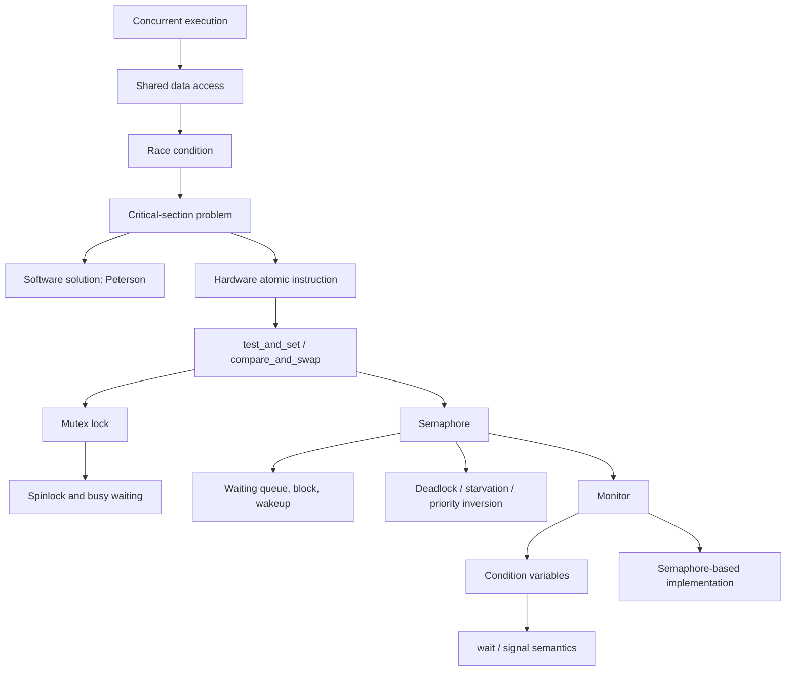

# Chapter 6: Synchronization 정리본

## 개념도



## 1. 배경: 왜 동기화가 필요한가

운영체제에서 여러 프로세스는 **동시에 실행(concurrently execute)**될 수 있다. 실행 중인 프로세스는 언제든 인터럽트되어 일부 명령만 수행한 상태에서 멈출 수 있고, 다른 프로세스가 이어서 실행될 수 있다. 이때 여러 프로세스가 **공유 데이터(shared data)**에 동시에 접근하면 데이터 불일치(data inconsistency)가 발생할 수 있다.

동기화의 목적은 협력하는 프로세스들이 공유 데이터를 다룰 때 **질서 있는 실행(orderly execution)**을 보장하여 데이터 일관성(data consistency)을 유지하는 것이다.

### Producer-Consumer 문제의 counter 예시

생산자-소비자 문제에서 모든 버퍼를 사용할 수 있도록 하려면, 현재 가득 찬 버퍼 수를 나타내는 정수형 변수 `counter`를 둘 수 있다.

- 초기값: `counter = 0`
- Producer: 새 버퍼를 생산한 뒤 `counter++`
- Consumer: 버퍼를 소비한 뒤 `counter--`

Producer의 핵심 구조는 다음과 같다.

```c
while (true) {
    /* produce an item in next_produced */

    while (counter == BUFFER_SIZE)
        ; /* do nothing */

    buffer[in] = next_produced;
    in = (in + 1) % BUFFER_SIZE;
    counter++;
}
```

Consumer의 핵심 구조는 다음과 같다.

```c
while (true) {
    while (counter == 0)
        ; /* do nothing */

    next_consumed = buffer[out];
    out = (out + 1) % BUFFER_SIZE;
    counter--;

    /* consume the item in next_consumed */
}
```

개별 코드만 보면 논리적으로 맞지만, `counter++`와 `counter--`가 동시에 실행되면 문제가 생긴다. 고급 언어의 한 줄 연산은 실제 기계 수준에서 여러 명령으로 나뉠 수 있기 때문이다.

## 2. Race Condition

`counter++`는 다음처럼 구현될 수 있다.

```text
register1 = counter
register1 = register1 + 1
counter = register1
```

`counter--`는 다음처럼 구현될 수 있다.

```text
register2 = counter
register2 = register2 - 1
counter = register2
```

초기 `counter = 5`일 때 다음 순서로 interleaving되면 최종 결과가 잘못된다.

| 단계 | 실행 내용 | 결과 |
|---|---|---|
| S0 | producer: `register1 = counter` | `register1 = 5` |
| S1 | producer: `register1 = register1 + 1` | `register1 = 6` |
| S2 | consumer: `register2 = counter` | `register2 = 5` |
| S3 | consumer: `register2 = register2 - 1` | `register2 = 4` |
| S4 | producer: `counter = register1` | `counter = 6` |
| S5 | consumer: `counter = register2` | `counter = 4` |

정상적으로는 생산 1회와 소비 1회가 상쇄되어 `counter = 5`가 되어야 한다. 하지만 실제 결과는 마지막으로 저장한 consumer의 값 때문에 `counter = 4`가 된다. 이처럼 **여러 프로세스가 공유 데이터에 동시에 접근하고, 실행 순서에 따라 결과가 달라지는 상황**을 **race condition**이라고 한다.

## 3. Critical-Section Problem

시스템에 `n`개의 프로세스 `{P0, P1, ..., Pn-1}`가 있다고 하자. 각 프로세스는 공유 변수 변경, 테이블 갱신, 파일 쓰기처럼 공유 자원을 다루는 코드 구간을 가진다. 이 구간을 **critical section**이라고 한다.

핵심 규칙은 간단하다. **어떤 프로세스가 critical section에 있으면 다른 프로세스는 자기 critical section에 들어가면 안 된다.**

프로세스 `Pi`의 일반 구조는 다음과 같다.

```text
do {
    entry section
    critical section
    exit section
    remainder section
} while (true);
```

- **entry section**: critical section에 들어가기 전에 허가를 요청하고 lock을 획득하는 부분
- **critical section**: 공유 데이터나 공유 자원을 실제로 접근하는 부분
- **exit section**: critical section 사용이 끝났음을 알리고 lock을 반납하는 부분
- **remainder section**: 공유 자원과 무관한 나머지 코드

이미지 참고:

- [PDF p.9: Process `Pi`의 일반 구조와 entry/exit section 손필기 설명](../../필기본/os-ch6_30p까지_필기본.pdf#page=9)

## 4. Critical-Section Solution의 세 조건

Critical-section problem의 해결책은 다음 세 조건을 만족해야 한다.

| 조건 | 의미 | 시험 포인트 |
|---|---|---|
| **Mutual Exclusion** | `Pi`가 critical section에서 실행 중이면 다른 프로세스는 critical section에서 실행될 수 없다. | 가장 기본 조건이다. 동시에 들어가면 실패다. |
| **Progress** | 아무도 critical section에 없고 들어가려는 프로세스가 있다면, 다음 진입자를 고르는 일이 무한히 미뤄지면 안 된다. | critical section에 들어갈 의사가 없는 프로세스가 결정에 끼어들면 안 된다. |
| **Bounded Waiting** | 어떤 프로세스가 critical section 진입을 요청한 뒤, 다른 프로세스들이 먼저 들어갈 수 있는 횟수에 한계가 있어야 한다. | starvation 방지 조건이다. |

추가 전제는 다음과 같다.

- 각 프로세스는 **0이 아닌 속도(nonzero speed)**로 실행된다.
- `n`개 프로세스 사이의 상대 속도에 대해서는 어떤 가정도 하지 않는다.

## 5. OS 커널에서 Critical Section 처리

커널이 preemptive인지 non-preemptive인지에 따라 critical-section handling 방식이 달라진다.

| 방식 | 의미 | 동기화 관점 |
|---|---|---|
| **Preemptive kernel** | kernel mode에서 실행 중인 프로세스도 선점될 수 있다. | 커널 자료구조 보호를 위한 동기화가 더 중요하다. |
| **Non-preemptive kernel** | kernel mode를 빠져나가거나, block되거나, 자발적으로 CPU를 양보할 때까지 계속 실행된다. | kernel mode에서는 사실상 race condition에서 자유롭다. |

Non-preemptive kernel은 커널 모드에서 중간에 선점되지 않으므로 단순해 보이지만, 현대 시스템에서는 응답성과 확장성 때문에 preemptive kernel도 중요하다.

## 6. Peterson's Solution

Peterson's solution은 두 프로세스에 대한 software solution이다. 실제 현대 하드웨어에서는 메모리 순서 문제 때문에 그대로 쓰기 어렵지만, critical section 해결 조건을 설명하기 좋은 알고리즘이다.

전제는 다음과 같다.

- 두 프로세스만 대상으로 한다.
- `load`와 `store` 기계어 명령이 **atomic**, 즉 중간에 인터럽트되지 않는다고 가정한다.
- 두 프로세스는 다음 변수를 공유한다.

```c
int turn;
boolean flag[2];
```

변수의 의미는 다음과 같다.

- `turn`: 누가 critical section에 들어갈 차례인지 나타낸다.
- `flag[i]`: `Pi`가 critical section에 들어갈 준비가 되었는지 나타낸다. `flag[i] = true`이면 `Pi`가 들어가고 싶다는 뜻이다.

`Pi`의 알고리즘은 다음과 같다. 여기서 `j`는 다른 프로세스이다.

```c
do {
    flag[i] = true;
    turn = j;
    while (flag[j] && turn == j)
        ;

    /* critical section */

    flag[i] = false;

    /* remainder section */
} while (true);
```

핵심 해석:

- `flag[i] = true`: 나는 critical section에 들어가고 싶다고 표시한다.
- `turn = j`: 동시에 들어가고 싶다면 상대에게 우선권을 준다.
- `while (flag[j] && turn == j)`: 상대도 들어가고 싶고, 차례도 상대라면 기다린다.
- critical section이 끝나면 `flag[i] = false`로 더 이상 진입 의사가 없음을 표시한다.

Peterson's solution은 다음을 만족한다고 증명할 수 있다.

1. **Mutual exclusion**: `Pi`는 `flag[j] = false`이거나 `turn = i`일 때만 들어간다.
2. **Progress**: critical section이 비었고 진입 희망자가 있으면 결정이 무한히 미뤄지지 않는다.
3. **Bounded waiting**: 양쪽이 동시에 요구해도 `turn`이 양보 구조를 만들기 때문에 무한 대기가 발생하지 않는다.

이미지 참고:

- [PDF p.10: `turn`만 쓰는 단순 알고리즘과 한계 손필기](../../필기본/os-ch6_30p까지_필기본.pdf#page=10)
- [PDF p.14: Peterson's solution에서 `flag`, `turn`, 대기 조건 손필기](../../필기본/os-ch6_30p까지_필기본.pdf#page=14)

## 7. Synchronization Hardware

현대 시스템은 critical section 구현을 위해 하드웨어 지원을 제공한다. 기본 아이디어는 **locking**이다. 공유 자원에 들어가기 전에 lock을 얻고, critical section을 빠져나온 뒤 lock을 반납한다.

단일 프로세서에서는 interrupt를 disable하여 현재 실행 중인 코드가 선점되지 않게 만들 수 있다. 그러나 이 방식은 다중 프로세서에서 비효율적이다. 모든 CPU의 동시 실행을 제대로 제어하기 어렵고, 확장성이 떨어진다.

현대 기계는 대신 **atomic hardware instruction**을 제공한다.

- Atomic: 실행 도중 끊기지 않는 연산
- 대표 유형:
  - 메모리 word를 검사하고 값을 설정한다.
  - 두 메모리 word의 내용을 교환한다.

Lock을 사용한 일반 구조는 다음과 같다.

```text
do {
    acquire lock
    critical section
    release lock
    remainder section
} while (true);
```

## 8. `test_and_set` Instruction

`test_and_set`은 전달된 boolean 값을 읽은 뒤, 그 값을 `TRUE`로 바꾸고, 원래 값을 반환한다. 이 전체 과정은 atomic하게 실행된다.

```c
boolean test_and_set(boolean *target) {
    boolean rv = *target;
    *target = TRUE;
    return rv;
}
```

특징:

1. Atomic하게 실행된다.
2. 전달된 값의 **원래 값(original value)**을 반환한다.
3. 전달된 값을 새로 `TRUE`로 설정한다.

`lock`을 `FALSE`로 초기화한 뒤 다음처럼 critical section을 보호할 수 있다.

```c
do {
    while (test_and_set(&lock))
        ; /* do nothing */

    /* critical section */

    lock = false;

    /* remainder section */
} while (true);
```

해석:

- `lock = false`: 아무도 lock을 잡고 있지 않다.
- 첫 프로세스는 `test_and_set(&lock)`이 `false`를 반환하고, 동시에 `lock`을 `true`로 바꾼다.
- 이후 프로세스는 `test_and_set(&lock)`이 `true`를 반환하므로 while에서 계속 기다린다.
- critical section이 끝나면 `lock = false`로 반납한다.

## 9. `compare_and_swap` Instruction

`compare_and_swap`은 현재 값이 기대값과 같을 때만 새 값으로 바꾼다. 이 과정 역시 atomic하다.

```c
int compare_and_swap(int *value, int expected, int new_value) {
    int temp = *value;
    if (*value == expected)
        *value = new_value;
    return temp;
}
```

특징:

1. Atomic하게 실행된다.
2. `value`의 **원래 값**을 반환한다.
3. `*value == expected`일 때만 `*value = new_value`로 바꾼다.

`lock`을 정수 `0`으로 초기화한 뒤 다음처럼 사용할 수 있다.

```c
do {
    while (compare_and_swap(&lock, 0, 1) != 0)
        ; /* do nothing */

    /* critical section */

    lock = 0;

    /* remainder section */
} while (true);
```

해석:

- `lock = 0`: lock이 비어 있다.
- `compare_and_swap(&lock, 0, 1)`이 `0`을 반환하면 lock 획득에 성공한다.
- 이미 누군가 lock을 잡고 있으면 원래 값이 `1`이므로 while에서 계속 기다린다.

## 10. `test_and_set`으로 Bounded Waiting 보장하기

단순 `test_and_set` lock은 mutual exclusion은 보장하지만, bounded waiting을 자동으로 보장하지는 않는다. 특정 프로세스가 계속 밀려날 수 있기 때문이다. 이를 보완하려면 각 프로세스의 대기 여부를 `waiting[i]`로 관리하고, 다음 차례 프로세스를 순환적으로 찾아 넘겨준다.

핵심 변수:

- `waiting[i]`: `Pi`가 critical section에 들어가려고 기다리는지 표시한다.
- `key`: 현재 프로세스가 lock 획득을 계속 시도해야 하는지 나타낸다.
- `lock`: 실제 상호 배제를 위한 공유 lock이다.

핵심 흐름:

```c
do {
    waiting[i] = true;
    key = true;
    while (waiting[i] && key)
        key = test_and_set(&lock);
    waiting[i] = false;

    /* critical section */

    j = (i + 1) % n;
    while ((j != i) && !waiting[j])
        j = (j + 1) % n;

    if (j == i)
        lock = false;
    else
        waiting[j] = false;

    /* remainder section */
} while (true);
```

시험에서 중요한 흐름은 exit section이다.

- 다음 대기 프로세스 `j`를 `(i + 1) % n`부터 순환 탐색한다.
- 기다리는 프로세스가 없으면 `lock = false`로 lock을 완전히 반납한다.
- 기다리는 프로세스가 있으면 `waiting[j] = false`로 만들어 그 프로세스가 while문을 빠져나오게 한다.

이미지 참고:

- [PDF p.22: bounded-waiting test_and_set 코드의 entry/exit 손필기 설명](../../필기본/os-ch6_30p까지_필기본.pdf#page=22)

## 11. Mutex Locks

앞의 hardware solution들은 복잡하고 일반 application programmer가 직접 쓰기 어렵다. 그래서 운영체제 설계자는 critical-section problem을 해결하기 위한 software tool을 제공한다. 가장 단순한 도구가 **mutex lock**이다.

Mutex lock의 기본 사용법:

```text
acquire lock
critical section
release lock
```

핵심 특징:

- critical section에 들어가기 전에 `acquire()`로 lock을 획득한다.
- critical section이 끝나면 `release()`로 lock을 반납한다.
- lock이 사용 가능한지 여부를 boolean 변수로 나타낸다.
- `acquire()`와 `release()`는 반드시 atomic하게 실행되어야 한다.
- 보통 hardware atomic instruction으로 구현한다.

가장 단순한 `acquire()`와 `release()`는 다음과 같다.

```c
acquire() {
    while (!available)
        ; /* busy wait */
    available = false;
}

release() {
    available = true;
}
```

이 방식은 lock이 풀릴 때까지 CPU를 잡고 while문을 계속 돈다. 이를 **busy waiting**이라고 하며, 이런 lock을 **spinlock**이라고 한다.

Spinlock은 critical section이 매우 짧고 곧 lock이 풀릴 때는 context switch 비용을 줄일 수 있다. 하지만 오래 기다려야 하면 CPU 시간을 낭비한다.

## 12. Semaphores

Semaphore는 mutex lock보다 더 정교한 동기화 도구이다. Semaphore `S`는 정수형 변수이며, 오직 두 atomic operation으로만 접근한다.

- `wait(S)`: 원래 P()
- `signal(S)`: 원래 V()

기본 정의는 다음과 같다.

```c
wait(S) {
    while (S <= 0)
        ; /* busy wait */
    S--;
}

signal(S) {
    S++;
}
```

해석:

- `wait(S)`는 자원이 없으면 기다리고, 있으면 `S`를 1 감소시켜 자원을 획득한다.
- `signal(S)`는 작업이 끝난 뒤 `S`를 1 증가시켜 자원을 반납하거나 사건 발생을 알린다.

### Counting semaphore와 Binary semaphore

| 종류 | 값 범위 | 용도 |
|---|---|---|
| **Counting semaphore** | 제한 없는 정수 범위 | 여러 개의 동일 자원 개수를 표현 |
| **Binary semaphore** | 0 또는 1 | mutex lock과 같은 상호 배제 표현 |

Binary semaphore는 값이 0/1만 가능하므로 lock이 비었는지/차 있는지를 나타낼 수 있다. 그래서 mutex lock과 같은 역할을 할 수 있다.

### 실행 순서 제어 예시

`P1`의 `S1`이 반드시 `P2`의 `S2`보다 먼저 실행되어야 한다고 하자. `synch`를 0으로 초기화한 semaphore로 만들면 다음처럼 순서를 강제할 수 있다.

```c
/* P1 */
S1;
signal(synch);

/* P2 */
wait(synch);
S2;
```

`P2`는 `wait(synch)`에서 기다리다가, `P1`이 `S1`을 끝내고 `signal(synch)`를 호출한 뒤에야 `S2`를 실행한다.

## 13. Semaphore Implementation

Semaphore 구현은 중요한 조건을 만족해야 한다. **같은 semaphore에 대한 `wait()`와 `signal()`을 두 프로세스가 동시에 실행하면 안 된다.** 따라서 `wait`와 `signal` 코드 자체가 critical section이 된다.

단순 구현에서는 이 critical section을 보호하기 위해 busy waiting이 생길 수 있다. 다만 구현 코드가 짧고 critical section이 거의 점유되지 않는다면 busy waiting이 짧을 수 있다. 그러나 application이 긴 critical section에서 많은 시간을 보내는 경우에는 좋은 해결책이 아니다.

## 14. Busy Waiting 없는 Semaphore

Busy waiting을 없애기 위해 semaphore마다 waiting queue를 둔다. 각 queue entry는 다음 두 정보를 가진다.

- 정수형 `value`
- 다음 record를 가리키는 pointer

추가 operation:

- **block**: operation을 호출한 프로세스를 적절한 waiting queue에 넣는다.
- **wakeup**: waiting queue에서 프로세스 하나를 제거하여 ready queue에 넣는다.

Semaphore 구조체는 다음과 같이 표현된다.

```c
typedef struct {
    int value;
    struct process *list;
} semaphore;
```

Busy waiting 없는 구현은 다음과 같다.

```c
wait(semaphore *S) {
    S->value--;
    if (S->value < 0) {
        add this process to S->list;
        block();
    }
}

signal(semaphore *S) {
    S->value++;
    if (S->value <= 0) {
        remove a process P from S->list;
        wakeup(P);
    }
}
```

해석:

- `wait`: 먼저 `value`를 감소시킨다. 감소 후 음수면 이미 기다리는 프로세스가 필요하다는 뜻이므로 자신을 waiting queue에 넣고 block된다.
- `signal`: 먼저 `value`를 증가시킨다. 증가 후에도 `0 이하`이면 기다리는 프로세스가 있다는 뜻이므로 하나를 깨워 ready queue로 보낸다.

## 15. Deadlock, Starvation, Priority Inversion

### Deadlock

**Deadlock**은 둘 이상의 프로세스가 서로가 발생시킬 수 있는 event를 무한히 기다리는 상태이다. 예를 들어 semaphore `S`와 `Q`가 모두 1로 초기화되어 있을 때 다음 순서가 가능하다.

```text
P0: wait(S)
P1: wait(Q)
P0: wait(Q)
P1: wait(S)
```

`P0`는 `Q`를 기다리고, `P1`은 `S`를 기다린다. 그런데 `S`는 `P0`가 가지고 있고 `Q`는 `P1`이 가지고 있으므로 둘 다 진행하지 못한다.

### Starvation

**Starvation**은 indefinite blocking이다. 어떤 프로세스가 semaphore queue에 들어간 뒤, queue에서 제거되지 못해 무한히 대기할 수 있는 상황을 말한다.

### Priority Inversion

**Priority inversion**은 낮은 우선순위 프로세스가 높은 우선순위 프로세스가 필요로 하는 lock을 잡고 있어서, 높은 우선순위 프로세스가 진행하지 못하는 scheduling problem이다.

해결 방법은 **priority-inheritance protocol**이다. lock을 잡은 낮은 우선순위 프로세스가 일시적으로 높은 우선순위를 상속받아 빨리 critical section을 끝내고 lock을 반납하게 한다.

## 16. Classical Problems of Synchronization

새로 제안되는 동기화 기법(synchronization scheme)을 검증할 때 자주 쓰이는 고전 문제들이 있다. 이 문제들은 단순한 race condition 예제보다 협력/배제 패턴이 풍부하므로, semaphore로 정확한 해법을 설계할 수 있는지가 검증 기준이 된다.

- **Bounded-Buffer Problem**: 한정된 크기의 공유 버퍼에 producer와 consumer가 어떻게 안전하게 접근하는가
- **Readers-Writers Problem**: 한 자료 집합을 여러 reader는 동시에 읽되, writer는 단독 접근만 가능하도록 하는 문제
- **Dining-Philosophers Problem**: 자원(젓가락)을 이웃과 공유하는 다섯 철학자의 식사 알고리즘. deadlock/starvation 사례의 대표

세 문제 모두 12절에서 정리한 semaphore를 기본 도구로 사용한다.

## 17. Bounded-Buffer Problem

### 공유 자원 구성

`n`개의 버퍼가 있고, 각 버퍼는 아이템 한 개를 담을 수 있다. semaphore 세 개를 둔다.

| 변수 | 초기값 | 의미 |
|---|---|---|
| `mutex` | 1 | 버퍼 접근에 대한 mutual exclusion (binary semaphore) |
| `full` | 0 | 가득 찬 버퍼 개수 (counting semaphore) |
| `empty` | n | 비어 있는 버퍼 개수 (counting semaphore) |

`mutex`는 critical section 보호용, `full`/`empty`는 자원 가용성을 셈하는 용도이다.

### Producer 구조

```c
do {
    /* produce an item in next_produced */
    wait(empty);
    wait(mutex);
    /* add next_produced to the buffer */
    signal(mutex);
    signal(full);
} while (true);
```

핵심 해석:

- `wait(empty)`: 빈 자리가 생길 때까지 기다린다.
- `wait(mutex)`: 버퍼에 들어가기 직전에 lock을 얻는다.
- `signal(mutex)`: 버퍼 조작이 끝나면 lock을 풀어 준다.
- `signal(full)`: 가득 찬 버퍼 개수를 1 증가시켜 consumer에게 신호한다.

### Consumer 구조

```c
do {
    wait(full);
    wait(mutex);
    /* remove an item from buffer to next_consumed */
    signal(mutex);
    signal(empty);
    /* consume the item in next_consumed */
} while (true);
```

핵심 해석:

- `wait(full)`: 가득 찬 버퍼가 생길 때까지 기다린다.
- `wait(mutex)`: 버퍼 접근 lock을 얻는다.
- `signal(mutex)`: 버퍼 조작이 끝나면 lock을 푼다.
- `signal(empty)`: 비어 있는 버퍼 개수를 1 증가시켜 producer에게 신호한다.

### 함정 포인트

| 함정 | 핵심 |
|---|---|
| `wait(mutex)`를 `wait(empty)`보다 먼저 호출 | 버퍼가 가득 찬 상태에서 lock을 잡고 기다리게 되어 deadlock 가능 |
| `signal` 두 개의 순서 | 정확성 자체에는 영향이 적지만, 짝(`full`/`empty`)을 헷갈리지 말 것 |
| `full + empty`의 합 | 정상 진행 중에는 항상 `n`을 유지한다 |

이미지 참고:

- [PDF p.32~34: Bounded-Buffer 변수 초기화와 producer/consumer 코드](../../필기본/os-ch6_31p~42p.pdf#page=2)

## 18. Readers-Writers Problem

### 문제 정의

여러 프로세스가 같은 데이터 집합(data set)을 공유한다.

- **Reader**: 데이터를 읽기만 하고 수정하지 않는다.
- **Writer**: 읽고 쓸 수 있다.

요구 조건은 다음과 같다.

- 여러 reader가 **동시에 읽는 것은 허용**한다.
- writer가 접근하는 동안에는 다른 어떤 reader/writer도 접근할 수 없다.

### 공유 자원 구성

| 변수 | 초기값 | 의미 |
|---|---|---|
| `rw_mutex` | 1 | writer 단독 접근 lock. 첫 reader도 이 lock을 잡아 writer를 막는다. |
| `mutex` | 1 | `read_count` 변수 보호용 lock |
| `read_count` | 0 | 현재 데이터를 읽고 있는 reader 수 |

### Writer 구조

```c
do {
    wait(rw_mutex);
    /* writing is performed */
    signal(rw_mutex);
} while (true);
```

writer는 `rw_mutex`만 잡으면 된다. 다른 reader/writer가 모두 빠질 때까지 기다린다.

### Reader 구조

```c
do {
    wait(mutex);
    read_count++;
    if (read_count == 1)
        wait(rw_mutex);
    signal(mutex);

    /* reading is performed */

    wait(mutex);
    read_count--;
    if (read_count == 0)
        signal(rw_mutex);
    signal(mutex);
} while (true);
```

핵심 해석:

- `read_count`를 갱신하기 전후로 `mutex`를 잡아 동시 갱신을 막는다.
- 첫 번째 reader(`read_count == 1`)가 `rw_mutex`를 잡아 writer를 차단한다.
- 마지막 reader(`read_count == 0`)가 `rw_mutex`를 풀어 writer가 들어올 수 있게 한다.
- 두 번째 이후 reader는 `rw_mutex`를 잡지 않으므로 동시에 읽을 수 있다.

### Variation과 Starvation

| 변형 | 우선순위 | 발생할 수 있는 문제 |
|---|---|---|
| **First variation** | reader 우선. writer가 권한을 받기 전에는 reader는 기다리지 않음 | reader가 계속 들어오면 writer가 무한 대기(writer starvation) |
| **Second variation** | writer 우선. writer가 준비되면 ASAP write | writer가 계속 들어오면 reader가 무한 대기(reader starvation) |

두 변형 모두 starvation 위험이 있어 더 정교한 변형이 만들어진다. 일부 시스템은 **kernel이 reader-writer lock**을 직접 제공해 이 문제를 해결한다.

이미지 참고:

- [PDF p.36~37: Writer/Reader 코드와 read_count 처리](../../필기본/os-ch6_31p~42p.pdf#page=6)

## 19. Dining-Philosophers Problem

### 시나리오

다섯 철학자가 원형 식탁에 앉아 사고(thinking)와 식사(eating)를 번갈아 한다. 식탁에는 `chopstick[0..4]`가 자리 사이에 놓여 있어 각 철학자는 자기 자리 양옆의 젓가락 두 개를 모두 잡아야만 식사할 수 있다. 식사가 끝나면 두 젓가락을 모두 내려놓는다.

공유 자원:

- 밥그릇(데이터 집합)
- `Semaphore chopstick[5]`, 모든 원소를 1로 초기화

### 단순 알고리즘 (철학자 i)

```c
do {
    wait(chopstick[i]);
    wait(chopstick[(i + 1) % 5]);

    /* eat */

    signal(chopstick[i]);
    signal(chopstick[(i + 1) % 5]);

    /* think */
} while (true);
```

이 알고리즘은 **mutual exclusion은 만족**하지만 **deadlock 위험**이 있다. 다섯 철학자가 동시에 왼쪽 젓가락을 들면, 모두가 오른쪽 젓가락을 무한히 기다리게 되어 진행이 멈춘다.

### Deadlock 처리 방안

| 방안 | 핵심 아이디어 |
|---|---|
| **최대 4명만 앉히기** | 동시에 식탁에 앉는 인원을 4명으로 제한해, 적어도 한 명은 양쪽 젓가락을 잡을 여지가 남게 한다. |
| **두 젓가락 동시 검사 + critical section** | 두 젓가락이 모두 사용 가능할 때만 한 번에 잡는다. 이 검사 자체를 critical section으로 보호한다. |
| **비대칭 알고리즘** | 홀수 번호 철학자는 왼쪽→오른쪽 순으로, 짝수 번호 철학자는 오른쪽→왼쪽 순으로 잡는다. 순환 대기(circular wait) 사이클이 끊어져 deadlock을 막는다. |

**주의**: deadlock을 막아도 starvation까지 자동으로 막아 주지는 않는다. 특정 철학자가 이웃들에게 계속 밀려 굶주릴 수 있다.

이미지 참고:

- [PDF p.40~41: Philosopher i 단순 알고리즘과 deadlock 처리 방안](../../필기본/os-ch6_31p~42p.pdf#page=10)

## 20. Problems with Semaphores

Semaphore는 강력한 도구이지만 프로그래머가 직접 쓰면 실수하기 쉽다. 잘못된 사용 패턴은 다음과 같다.

| 잘못된 사용 | 의미 | 결과 |
|---|---|---|
| `signal(mutex) ... wait(mutex)` | 풀고 나서 다시 잡는 순서 | mutual exclusion 자체가 깨진다. 여러 프로세스가 critical section에 동시에 들어갈 수 있다. |
| `wait(mutex) ... wait(mutex)` | 같은 mutex를 두 번 잡음 | 자기 자신이 푼 적 없는 lock을 다시 기다리므로 영원히 block된다(self-deadlock). |
| `wait(mutex)` 누락 | 진입 보호가 없다 | 여러 프로세스가 critical section에 동시에 들어가 race condition 발생 |
| `signal(mutex)` 누락 | 출구가 막힌다 | 다른 프로세스들이 영원히 lock을 얻지 못한다(starvation/deadlock). |

근본적으로 semaphore는 **deadlock과 starvation을 자동으로 방지해 주지 않는다.** 사용자가 `wait`/`signal`의 짝을 정확히 맞추고, 여러 semaphore를 함께 쓸 때 획득 순서까지 일관되게 유지해야 한다. 이 부담 때문에 monitor 같은 더 안전한 고수준 동기화 도구가 이후 챕터에서 등장한다.

이미지 참고:

- [PDF p.42: Problems with Semaphores - 잘못된 사용 패턴](../../필기본/os-ch6_31p~42p.pdf#page=12)

## 21. Monitors

Semaphore는 `wait`/`signal`의 위치를 프로그래머가 직접 맞춰야 하므로 실수 가능성이 크다. **Monitor**는 이런 부담을 줄이기 위한 고수준 동기화 추상화이다.

핵심 정의:

- **High-level abstraction**: 프로세스 동기화를 편리하고 효과적으로 제공하는 추상화
- **Abstract data type**: monitor 내부 변수는 monitor 안의 procedure를 통해서만 접근 가능
- **한 번에 하나의 프로세스만 monitor 안에서 active**할 수 있음
- 단, 모든 동기화 scheme을 표현하기에는 monitor만으로 충분하지 않을 수 있음

Monitor의 기본 형태는 다음과 같다.

```c
monitor monitor-name
{
    // shared variable declarations
    procedure P1 (...) { ... }
    procedure Pn (...) { ... }
    Initialization code (...) { ... }
}
```

시험 포인트는 **monitor 자체가 mutual exclusion을 구조적으로 제공한다**는 점이다. 즉, monitor 안 procedure를 실행 중인 프로세스가 있으면 다른 프로세스는 동시에 monitor 내부 procedure를 실행하지 못한다.

이미지 참고:

- [PDF p.43: Monitor 정의와 기본 구조](../../필기본/os-ch6_43p~55p.pdf#page=1)
- [PDF p.44: Schematic view of a Monitor](../../필기본/os-ch6_43p~55p.pdf#page=2)

## 22. Condition Variables

Monitor 안에서는 단순 mutual exclusion만으로는 부족한 경우가 있다. 예를 들어 어떤 조건이 만족될 때까지 monitor 안에서 기다려야 할 수 있다. 이때 **condition variable**을 사용한다.

```c
condition x, y;
```

condition variable에는 두 연산이 있다.

| 연산 | 의미 | 주의점 |
|---|---|---|
| `x.wait()` | 호출한 프로세스를 `x.signal()`이 올 때까지 suspend | 기다리는 동안 monitor를 계속 점유하면 안 된다. |
| `x.signal()` | `x.wait()`로 기다리던 프로세스 하나를 resume | 기다리는 프로세스가 없으면 아무 효과가 없다. |

`x.signal()`은 semaphore의 `signal`처럼 값을 누적하는 개념이 아니다. 대기 중인 프로세스가 없으면 그 signal은 저장되지 않고 사라진다. 이 차이는 객관식 함정으로 나오기 쉽다.

이미지 참고:

- [PDF p.45: Condition variable의 `wait`와 `signal`](../../필기본/os-ch6_43p~55p.pdf#page=3)
- [PDF p.46: Monitor with Condition Variables](../../필기본/os-ch6_43p~55p.pdf#page=4)

## 23. Condition Variable의 Signal 처리 방식

Monitor 안에는 한 번에 하나의 프로세스만 active할 수 있다. 따라서 프로세스 `P`가 `x.signal()`을 호출했고, `Q`가 `x.wait()` 상태에서 깨어난다면 **P와 Q가 동시에 monitor 안에서 실행될 수 없다**. 둘 중 하나는 기다려야 한다.

대표 선택지는 다음과 같다.

| 방식 | 의미 | 핵심 차이 |
|---|---|---|
| **Signal and wait** | `P`가 `signal`한 뒤 기다리고, `Q`가 먼저 monitor 안에서 실행 | signal 받은 프로세스가 즉시 이어서 실행된다. |
| **Signal and continue** | `P`가 monitor를 나가거나 다른 조건에서 기다릴 때까지 `Q`가 기다림 | signal을 보낸 프로세스가 남은 monitor 코드를 계속 실행한다. |

Concurrent Pascal에서는 절충적으로 `signal`을 실행한 `P`가 즉시 monitor를 떠나고, `Q`가 재개되는 방식을 사용한다. Mesa, C#, Java 같은 언어도 monitor/condition variable 계열 개념을 제공하지만, 정확한 signal 의미는 언어 구현에 따라 확인해야 한다.

이미지 참고:

- [PDF p.47: Signal and wait / Signal and continue 선택지](../../필기본/os-ch6_43p~55p.pdf#page=5)

## 24. Monitor로 푸는 Dining-Philosophers Problem

Monitor 기반 해법은 각 철학자의 상태를 monitor 내부 배열로 관리하고, 각 철학자마다 condition variable을 둔다.

핵심 구성:

| 구성 요소 | 의미 |
|---|---|
| `state[5]` | 각 철학자의 상태: `THINKING`, `HUNGRY`, `EATING` |
| `self[5]` | 각 철학자가 자기 차례를 기다리는 condition variable |
| `pickup(i)` | 철학자 `i`가 배고픔을 표시하고, 양옆이 먹지 않으면 식사 상태로 진입 |
| `putdown(i)` | 철학자 `i`가 생각 상태로 돌아가고, 양옆 이웃이 먹을 수 있는지 검사 |
| `test(i)` | 양옆이 `EATING`이 아니고 본인이 `HUNGRY`이면 `EATING`으로 바꾸고 깨움 |

각 철학자 `i`는 다음 순서로 monitor procedure를 호출한다.

```text
DiningPhilosophers.pickup(i);
EAT
DiningPhilosophers.putdown(i);
```

이 해법은 monitor가 상태 검사와 갱신을 한 번에 보호하므로 **deadlock은 발생하지 않는다**. 하지만 특정 철학자가 이웃에게 계속 밀릴 수 있으므로 **starvation은 가능**하다.

자세한 코드 흐름은 [Code/Monitors.md](../Code/Monitors.md) 참고.

이미지 참고:

- [PDF p.48~50: Monitor 기반 Dining Philosophers 코드와 호출 순서](../../필기본/os-ch6_43p~55p.pdf#page=6)

## 25. Semaphore를 이용한 Monitor 구현

Monitor의 mutual exclusion은 semaphore로 구현할 수 있다. 기본 변수는 다음과 같다.

| 변수 | 초기값 | 의미 |
|---|---|---|
| `mutex` | 1 | monitor 내부 진입을 한 번에 하나로 제한 |
| `next` | 0 | signal을 보낸 뒤 기다리는 프로세스가 대기하는 semaphore |
| `next_count` | 0 | `next`에서 기다리는 프로세스 수 |

각 monitor procedure `F`는 다음 구조로 감싼다.

```c
wait(mutex);
    ...
    body of F;
    ...
if (next_count > 0)
    signal(next);
else
    signal(mutex);
```

핵심은 procedure 시작에서 `wait(mutex)`로 monitor 진입을 제한하고, 끝날 때 `next` 대기자가 있으면 그 프로세스에게 우선권을 넘긴다는 점이다. 대기자가 없으면 `mutex`를 풀어 monitor 밖의 새 진입자를 받는다.

Condition variable `x`는 별도 semaphore와 count로 구현한다.

| 변수 | 초기값 | 의미 |
|---|---|---|
| `x_sem` | 0 | condition `x`에서 기다리는 프로세스들이 block되는 semaphore |
| `x_count` | 0 | condition `x`에서 기다리는 프로세스 수 |

`x.wait()`의 핵심 흐름:

```c
x_count++;
if (next_count > 0)
    signal(next);
else
    signal(mutex);
wait(x_sem);
x_count--;
```

`x.signal()`의 핵심 흐름:

```c
if (x_count > 0) {
    next_count++;
    signal(x_sem);
    wait(next);
    next_count--;
}
```

이 구현은 `signal`을 받은 프로세스가 monitor 안으로 들어올 수 있도록 기존 실행자가 `next`에서 기다리는 구조이다. 자세한 줄 단위 해석은 [Code/Monitors.md](../Code/Monitors.md) 참고.

이미지 참고:

- [PDF p.51: Monitor implementation using semaphores](../../필기본/os-ch6_43p~55p.pdf#page=9)
- [PDF p.52~53: Condition variable의 `wait`/`signal` 구현](../../필기본/os-ch6_43p~55p.pdf#page=10)

## 26. Monitor 안에서 재개할 프로세스 선택

Condition `x`에 여러 프로세스가 줄 서 있고 `x.signal()`이 실행되면, 어떤 프로세스를 깨울지 선택해야 한다.

- 단순 **FCFS**는 자주 충분하지 않다.
- `x.wait(c)` 형태의 **conditional-wait construct**를 사용할 수 있다.
- `c`는 priority number이며, **숫자가 가장 낮은 프로세스가 가장 높은 우선순위**로 다음에 선택된다.

시험에서는 "priority number가 작을수록 높은 우선순위"라는 방향을 반대로 묻기 쉽다.

이미지 참고:

- [PDF p.54: Resuming processes within a monitor](../../필기본/os-ch6_43p~55p.pdf#page=12)

## 27. Single Resource 할당 Monitor

단일 자원을 할당하는 monitor 예시는 `busy`와 condition variable `x`를 사용한다.

```c
monitor ResourceAllocator
{
    boolean busy;
    condition x;

    void acquire(int time) {
        if (busy)
            x.wait(time);
        busy = TRUE;
    }

    void release() {
        busy = FALSE;
        x.signal();
    }

    initialization code() {
        busy = FALSE;
    }
}
```

의미:

- `busy = TRUE`: 자원이 이미 사용 중이다.
- `acquire(time)`: 자원이 바쁘면 `x.wait(time)`으로 기다린다. 여기서 `time`은 priority number로 쓰일 수 있다.
- `release()`: 자원을 비우고 `x.signal()`로 기다리는 프로세스 하나를 깨운다.
- 초기에는 `busy = FALSE`이므로 자원이 비어 있다.

이미지 참고:

- [PDF p.55: Single resource allocator monitor 예시](../../필기본/os-ch6_43p~55p.pdf#page=13)

## 시험 대비 핵심 비교표

| 개념 | 핵심 정의 | 헷갈리는 포인트 |
|---|---|---|
| Race condition | 실행 순서에 따라 공유 데이터 결과가 달라지는 상황 | 한 줄 코드도 atomic이 아닐 수 있다. |
| Critical section | 공유 자원에 접근하는 코드 구간 | 보호 대상은 코드 자체가 아니라 공유 데이터 접근이다. |
| Mutual exclusion | 한 번에 하나만 critical section 진입 | 세 조건 중 가장 기본이다. |
| Progress | 진입 결정이 무기한 연기되면 안 됨 | 아무도 critical section에 없을 때의 조건이다. |
| Bounded waiting | 요청 후 다른 프로세스가 먼저 들어가는 횟수에 한계 존재 | starvation 방지와 연결된다. |
| Peterson's solution | `flag`와 `turn`을 쓰는 2-process software solution | load/store atomic 가정이 있다. |
| `test_and_set` | 원래 값을 반환하고 값을 `TRUE`로 설정 | 반환값으로 lock이 이미 잡혔는지 판단한다. |
| `compare_and_swap` | 값이 expected일 때만 new value로 변경 | 반환값은 바뀐 값이 아니라 원래 값이다. |
| Mutex lock | acquire/release로 critical section 보호 | busy waiting이면 spinlock이다. |
| Semaphore | 정수 변수 + atomic `wait`/`signal` | counting/binary 구분이 중요하다. |
| Deadlock | 서로가 가진 자원을 기다리며 무한 대기 | semaphore 획득 순서가 다르면 발생 가능하다. |
| Priority inversion | 낮은 우선순위가 높은 우선순위의 lock을 잡고 방해 | priority inheritance로 해결한다. |
| Bounded-Buffer | `mutex(1)`, `full(0)`, `empty(n)` 세 semaphore로 producer/consumer 동기화 | `wait` 순서 함정. `wait(mutex)`가 `wait(empty)/wait(full)`보다 먼저 오면 deadlock 가능 |
| Readers-Writers | reader는 동시 허용, writer는 단독 접근 | 첫 reader가 `rw_mutex`를 잡고 마지막 reader가 푼다. variation에 따라 starvation 대상이 다르다. |
| Dining-Philosophers | 다섯 철학자가 양옆 젓가락을 잡고 식사 | 단순 알고리즘은 deadlock 가능. 4명 제한 / 양쪽 동시 검사 / 비대칭 알고리즘으로 해결 |
| Semaphore misuse | `wait`/`signal` 누락이나 순서 오류 | semaphore 자체는 deadlock/starvation을 자동으로 막지 않는다. |
| Monitor | 내부 procedure를 통해서만 공유 변수에 접근하는 고수준 동기화 ADT | monitor 안에서는 한 번에 하나의 프로세스만 active |
| Condition variable | monitor 안에서 조건이 만족될 때까지 기다리게 하는 변수 | `signal`은 기다리는 프로세스가 없으면 저장되지 않고 사라진다. |
| Signal and wait | signal한 프로세스가 기다리고 깨어난 프로세스가 먼저 실행 | monitor 내부 동시 실행을 막기 위한 선택지 |
| Signal and continue | signal한 프로세스가 계속 실행하고 깨어난 프로세스는 나중에 실행 | 언어 구현마다 semantics가 다를 수 있다. |
| Monitor semaphore 구현 | `mutex`, `next`, `next_count`로 monitor 진입과 signal 이후 우선권을 제어 | `next` 대기자가 있으면 `mutex`가 아니라 `next`를 signal |
| Conditional wait | `x.wait(c)`에서 `c`를 우선순위 번호로 사용 | 숫자가 낮을수록 높은 우선순위 |
