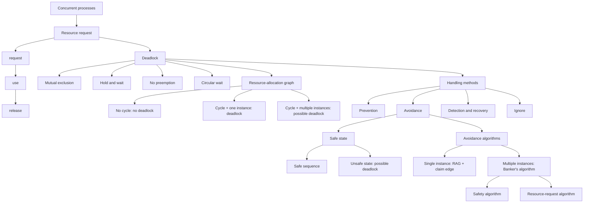

# Chapter 7: Deadlocks 정리본

## 개념도



## 1. Deadlock의 목표와 배경

Deadlock은 **동시에 실행되는 여러 프로세스 집합이 서로가 가진 자원을 기다리느라 더 이상 작업을 완료하지 못하는 상태**다. Chapter 7의 목표는 deadlock이 어떤 조건에서 생기는지 설명하고, 시스템이 deadlock에 빠지지 않도록 **prevention** 또는 **avoidance**하는 방법의 기본 관점을 잡는 것이다.

시험에서는 정의만 묻기보다, 작은 상황을 주고 "이 조건이 성립하는가", "그래프에 cycle이 있으면 반드시 deadlock인가", "어떤 prevention 방식이 어떤 조건을 깨는가"처럼 비교형으로 묻기 쉽다.

## 2. System Model

시스템은 여러 **resource type**으로 이루어진다.

- 자원 타입: `R1, R2, ..., Rm`
- 예시: CPU cycles, memory space, I/O devices
- 각 자원 타입 `Ri`는 `Wi`개의 **instance**를 가진다.

프로세스가 자원을 사용하는 흐름은 세 단계다.

1. **request**: 자원을 요청한다.
2. **use**: 할당받은 자원을 사용한다.
3. **release**: 사용을 마친 자원을 반납한다.

Deadlock은 이 흐름 중 **request 단계에서 대기 상태가 꼬일 때** 발생한다. 특히 이미 자원을 가진 프로세스가 추가 자원을 요청하고, 그 추가 자원을 다른 프로세스가 잡고 있으면 대기 관계가 생긴다.

## 3. Deadlock Characterization: 네 가지 필요 조건

Deadlock은 다음 네 조건이 **동시에 성립할 때** 발생할 수 있다. 하나라도 깨지면 deadlock은 성립하지 않는다.

### 3.1 Mutual Exclusion

**한 번에 하나의 프로세스만 자원을 사용할 수 있는 조건**이다.

프린터, mutex lock처럼 동시에 공유할 수 없는 자원은 mutual exclusion이 필요하다. 반대로 read-only file처럼 공유 가능한 자원에는 이 조건이 필요하지 않다.

### 3.2 Hold and Wait

**프로세스가 최소 하나의 자원을 가진 상태에서 다른 프로세스가 가진 추가 자원을 기다리는 조건**이다.

핵심은 "잡고 있으면서 기다린다"는 점이다. 아무 자원도 들고 있지 않은 채 기다리기만 하면 hold and wait 조건이 성립하지 않는다.

### 3.3 No Preemption

**프로세스가 가진 자원은 그 프로세스가 작업을 끝내고 자발적으로 반납할 때만 release될 수 있다는 조건**이다.

운영체제가 강제로 자원을 빼앗을 수 없다면, 이미 잘못 형성된 대기 관계를 중간에 끊기 어렵다.

### 3.4 Circular Wait

**대기 중인 프로세스들이 원형으로 서로의 자원을 기다리는 조건**이다.

예를 들어 `{P0, P1, ..., Pn}`에 대해 `P0`은 `P1`이 가진 자원을 기다리고, `P1`은 `P2`가 가진 자원을 기다리며, 마지막 `Pn`은 다시 `P0`이 가진 자원을 기다리면 circular wait가 성립한다.

## 4. Mutex Lock에서의 Deadlock

Deadlock은 시스템 콜이나 lock 사용에서도 발생할 수 있다. 대표적인 실수는 두 thread가 같은 mutex 두 개를 **서로 다른 순서**로 획득하는 경우다.

```c
/* thread one */
pthread_mutex_lock(&first_mutex);
pthread_mutex_lock(&second_mutex);
/* do some work */
pthread_mutex_unlock(&second_mutex);
pthread_mutex_unlock(&first_mutex);

/* thread two */
pthread_mutex_lock(&second_mutex);
pthread_mutex_lock(&first_mutex);
/* do some work */
pthread_mutex_unlock(&first_mutex);
pthread_mutex_unlock(&second_mutex);
```

문제 상황은 다음처럼 생긴다.

| 단계 | Thread 1 | Thread 2 |
|---|---|---|
| 1 | `first_mutex` 획득 |  |
| 2 |  | `second_mutex` 획득 |
| 3 | `second_mutex` 요청 후 대기 |  |
| 4 |  | `first_mutex` 요청 후 대기 |

이때 Thread 1은 Thread 2가 가진 `second_mutex`를 기다리고, Thread 2는 Thread 1이 가진 `first_mutex`를 기다린다. 두 thread 모두 이미 하나의 lock을 잡고 있으므로 **hold and wait**가 성립하고, lock을 강제로 빼앗지 못하면 **no preemption**도 성립한다. 서로의 lock을 기다리므로 **circular wait**가 완성된다.

## 5. Resource-Allocation Graph

Deadlock을 시각적으로 분석할 때 **Resource-Allocation Graph**를 사용한다. 그래프는 vertex 집합 `V`와 edge 집합 `E`로 구성된다.

### 5.1 Vertex 종류

- `P = {P1, P2, ..., Pn}`: 시스템의 프로세스 집합
- `R = {R1, R2, ..., Rm}`: 시스템의 자원 타입 집합

자원 타입이 여러 instance를 가지면 자원 노드 안에 여러 instance가 표시된다.

### 5.2 Edge 종류

| Edge | 의미 | 방향 |
|---|---|---|
| Request edge | 프로세스 `Pi`가 자원 `Rj`를 요청 중 | `Pi -> Rj` |
| Assignment edge | 자원 `Rj`의 instance가 프로세스 `Pi`에 할당됨 | `Rj -> Pi` |

방향을 반대로 외우면 그래프 해석이 완전히 달라진다. **프로세스에서 자원으로 가면 요청**, **자원에서 프로세스로 가면 할당**이다.

## 6. Resource-Allocation Graph의 기본 판정

그래프에서 cycle의 존재 여부는 deadlock 판정의 출발점이다.

| 그래프 상태 | 판정 |
|---|---|
| Cycle 없음 | **deadlock 없음** |
| Cycle 있음 + 각 resource type이 instance 1개 | **deadlock** |
| Cycle 있음 + 어떤 resource type이 여러 instance | **deadlock 가능성 있음**, 반드시 deadlock은 아님 |

시험 함정은 세 번째 줄이다. **cycle이 있다고 항상 deadlock은 아니다.** 자원 타입에 여러 instance가 있으면 cycle이 있어도 다른 instance가 release되면서 대기가 풀릴 수 있다.

### 그림 문제 해석 요령

1. 프로세스와 자원 타입을 나눈다.
2. `Pi -> Rj`는 요청, `Rj -> Pi`는 할당으로 읽는다.
3. 방향을 따라 cycle이 있는지 확인한다.
4. cycle이 있다면 cycle에 포함된 자원 타입의 instance 수를 확인한다.
5. instance가 모두 1개면 deadlock, 여러 instance가 섞이면 가능성으로만 판단한다.

## 7. Methods for Handling Deadlocks

Deadlock 처리 방법은 크게 네 가지 관점으로 나뉜다.

### 7.1 Deadlock이 절대 생기지 않게 보장

시스템이 deadlock state에 들어가지 않도록 만드는 방식이다.

- **Deadlock prevention**: deadlock의 네 필요 조건 중 하나를 구조적으로 깨뜨린다.
- **Deadlock avoidance**: 실행 중 자원 할당 상태를 검사하여 위험한 상태로 들어가지 않게 한다.

### 7.2 Deadlock을 허용한 뒤 복구

시스템이 deadlock state에 들어가는 것을 허용하고, 이후 **detection**으로 deadlock을 찾은 뒤 **recovery**를 수행한다.

### 7.3 문제를 무시

Deadlock이 실제로는 드물다고 보고, deadlock이 절대 발생하지 않는 것처럼 취급한다. UNIX를 포함한 많은 운영체제가 이 접근을 사용한다.

이 방식은 구현 비용이 낮지만, deadlock이 발생하면 사용자나 관리자가 개입해야 할 수 있다.

## 8. Deadlock Prevention

Deadlock prevention은 **request가 만들어지는 방식을 제한**해서 네 필요 조건 중 하나가 성립하지 못하게 한다.

### 8.1 Mutual Exclusion 깨기

공유 가능한 자원에는 mutual exclusion이 필요하지 않다. 예를 들어 read-only file은 여러 프로세스가 동시에 읽어도 된다.

하지만 프린터, mutex lock 같은 non-sharable resource는 본질적으로 mutual exclusion이 필요하다. 따라서 모든 자원에서 mutual exclusion을 제거하는 것은 현실적이지 않다.

### 8.2 Hold and Wait 깨기

프로세스가 자원을 요청할 때 **다른 자원을 들고 있지 않도록 보장**한다.

방법은 두 가지로 볼 수 있다.

- 프로세스가 실행을 시작하기 전에 필요한 모든 자원을 한 번에 요청하고 할당받게 한다.
- 프로세스가 아무 자원도 할당받지 않은 상태에서만 자원을 요청하게 한다.

단점도 중요하다.

- 필요한 자원을 미리 오래 잡을 수 있어 **resource utilization이 낮아진다**.
- 특정 프로세스가 필요한 모든 자원을 동시에 얻지 못해 **starvation이 가능하다**.

### 8.3 No Preemption 깨기

프로세스가 어떤 자원을 가진 상태에서 즉시 할당될 수 없는 다른 자원을 요청하면, 현재 들고 있던 자원을 모두 release하게 한다.

처리 흐름은 다음과 같다.

1. 프로세스가 자원을 가진 상태에서 추가 자원을 요청한다.
2. 추가 자원을 즉시 받을 수 없다.
3. 현재 들고 있던 자원을 모두 반납한다.
4. 반납된 자원은 그 프로세스가 기다리는 자원 목록에 추가된다.
5. 프로세스는 예전 자원과 새로 요청한 자원을 모두 다시 얻을 수 있을 때 재시작된다.

이 방식은 lock처럼 중간에 빼앗기 어려운 자원에는 적용이 까다롭다.

### 8.4 Circular Wait 깨기

모든 resource type에 **total ordering**을 부여하고, 각 프로세스가 자원을 **번호가 증가하는 순서로만** 요청하게 한다.

예를 들어 `R1 < R2 < R3`로 순서를 정했다면, `R2`를 잡은 프로세스가 나중에 `R1`을 요청할 수 없게 한다. 이렇게 하면 대기 관계가 한 방향으로만 생겨 원형 대기가 만들어지지 않는다.

## 9. Lock Ordering 예시

계좌 이체 코드에서 두 계좌의 lock을 잡아야 한다고 하자.

```c
void transaction(Account from, Account to, double amount)
{
    mutex lock1, lock2;
    lock1 = get_lock(from);
    lock2 = get_lock(to);
    acquire(lock1);
        acquire(lock2);
            withdraw(from, amount);
            deposit(to, amount);
        release(lock2);
    release(lock1);
}
```

Transaction 1이 A에서 B로 이체하고, Transaction 2가 B에서 A로 이체하면 다음 위험이 생긴다.

- Transaction 1: A lock을 먼저 잡고 B lock을 기다림
- Transaction 2: B lock을 먼저 잡고 A lock을 기다림

이 상황은 circular wait를 만들 수 있다. 해결하려면 계좌나 lock에 전역 순서를 부여하고, 모든 transaction이 항상 같은 순서로 lock을 획득해야 한다. 즉, `from/to`의 역할이 아니라 **정해진 lock ordering**이 기준이 되어야 한다.

## 10. Deadlock Avoidance

Deadlock avoidance는 prevention처럼 요청 방식을 무조건 제한하기보다, 시스템이 각 요청을 처리할 때 현재 상태를 검사해서 deadlock이 생길 수 있는 위험 상태로 들어가지 않게 한다.

가장 단순하고 유용한 모델은 각 프로세스가 실행 전에 **각 resource type별 최대 필요량(maximum number of resources)**을 선언한다고 가정한다.

Avoidance 알고리즘은 자원 할당 상태를 동적으로 검사하여 **circular-wait condition이 절대 생기지 않도록** 보장한다.

자원 할당 상태는 다음 정보로 정의된다.

- available resources: 현재 사용 가능한 자원 수
- allocated resources: 각 프로세스에 이미 할당된 자원 수
- maximum demands: 각 프로세스가 최대로 요구할 수 있는 자원 수

핵심 전제는 **추가적인 사전 정보(a priori information)**가 필요하다는 점이다. 즉, 프로세스가 앞으로 얼마나 많은 자원을 필요로 할 수 있는지 모르면 avoidance를 적용하기 어렵다.

## 11. Safe State

Safe state는 deadlock avoidance의 중심 개념이다. 어떤 프로세스가 현재 available resource를 요청했을 때, 시스템은 그 요청을 바로 승인해도 **safe state가 유지되는지** 판단해야 한다.

시스템이 safe state라는 것은 모든 프로세스에 대해 어떤 순서 `<P1, P2, ..., Pn>`가 존재해서, 각 `Pi`가 앞으로 더 요청할 수 있는 자원을 다음 두 자원으로 만족시킬 수 있다는 뜻이다.

- 현재 available resources
- `Pi`보다 앞선 순서의 모든 `Pj`가 끝난 뒤 반납할 resources

이 순서를 **safe sequence**라고 부른다. 직관적으로는 다음 흐름이다.

1. 어떤 프로세스 `Pi`의 남은 필요량을 지금 당장 만족할 수 없다.
2. `Pi`는 앞 순서의 프로세스들이 끝날 때까지 기다린다.
3. 앞 프로세스들이 종료되면 그들이 가진 자원을 반납한다.
4. 그 자원으로 `Pi`가 실행, 종료, 반납할 수 있다.
5. 이후 `Pi+1`도 같은 방식으로 진행된다.

시험에서는 safe sequence를 찾는 문제가 자주 나온다. 핵심은 **지금 당장 모든 프로세스를 만족시킬 필요는 없고, 완료 가능한 프로세스를 하나씩 골라 자원 반납을 누적하는 것**이다.

## 12. Safe, Unsafe, Deadlock의 관계

Safe/unsafe/deadlock은 같은 말이 아니다.

| 상태 | 의미 | deadlock 여부 |
|---|---|---|
| Safe state | 어떤 safe sequence가 존재함 | **deadlock 없음** |
| Unsafe state | safe sequence를 보장할 수 없음 | **deadlock 가능성 있음** |
| Deadlock state | 프로세스들이 서로의 자원을 기다리며 진행 불가 | **deadlock 발생** |

가장 중요한 함정은 **unsafe state가 곧 deadlock은 아니라는 점**이다. Unsafe state는 앞으로의 요청 순서에 따라 deadlock으로 갈 수 있는 위험 상태다. Avoidance의 목표는 시스템이 **unsafe state에 들어가지 않도록 보장**하는 것이다.

## 13. Avoidance Algorithms

Deadlock avoidance 알고리즘은 resource type의 instance 수에 따라 달라진다.

| 자원 타입별 instance 수 | 사용 알고리즘 |
|---|---|
| Single instance | Resource-allocation graph scheme |
| Multiple instances | Banker's algorithm |

Single instance에서는 그래프에 **claim edge**를 추가해 앞으로 요청할 수 있는 자원을 미리 표시하고, 요청을 승인했을 때 cycle이 생기는지 검사한다. Multiple instances에서는 그래프만으로 충분하지 않기 때문에 Banker's algorithm처럼 행렬 기반 검사를 사용한다.

## 14. Resource-Allocation Graph Scheme

이 방식은 각 resource type이 instance를 하나만 갖는 경우의 avoidance 방식이다.

### 14.1 Claim Edge

**Claim edge `Pi -> Rj`는 프로세스 `Pi`가 미래에 자원 `Rj`를 요청할 수 있음을 나타내는 점선 edge**다.

Claim edge는 다음처럼 상태가 바뀐다.

1. 프로세스가 실행 전에 사용할 가능성이 있는 자원을 미리 claim한다.
2. 실제로 요청하면 `claim edge`가 `request edge`로 바뀐다.
3. 요청이 승인되면 `request edge`가 `assignment edge`로 바뀐다.
4. 자원이 release되면 `assignment edge`가 다시 `claim edge`로 바뀐다.

이 방식도 maximum demand와 같은 **a priori claim**이 필요하다. 미리 claim하지 않은 자원을 임의로 요청할 수 있다면 avoidance 판단을 할 수 없다.

### 14.2 승인 조건

프로세스 `Pi`가 자원 `Rj`를 요청하면, 시스템은 `Pi -> Rj` request edge를 `Rj -> Pi` assignment edge로 바꾸는 상황을 가정한다.

요청은 **그 변환이 resource-allocation graph에 cycle을 만들지 않을 때만 승인**된다. Cycle이 생긴다면 지금 당장 deadlock이 아니더라도 unsafe state로 들어갈 수 있으므로 요청을 대기시킨다.

## 15. Banker's Algorithm

Banker's algorithm은 **각 resource type이 여러 instance를 갖는 경우**의 deadlock avoidance 알고리즘이다. 이름처럼 은행이 고객에게 대출을 승인할 때, 모든 고객이 언젠가 최대 요구량까지 빌려도 은행이 파산하지 않는지 확인하는 방식에 비유한다.

기본 전제는 다음과 같다.

- 각 프로세스는 시작 전에 각 resource type별 **maximum use**를 선언해야 한다.
- 프로세스가 자원을 요청하면 시스템은 바로 승인하지 않고 safe state 유지 여부를 검사한다.
- 자원이 충분하지 않거나 승인 후 unsafe state가 되면 프로세스는 기다려야 한다.
- 프로세스가 필요한 모든 자원을 얻으면 유한 시간 안에 실행을 끝내고 자원을 반환해야 한다.

Banker's algorithm은 요청 자체를 금지하는 prevention이 아니라, **요청을 승인했을 때 안전한지 시뮬레이션한 뒤 결정하는 avoidance**다.

## 16. Banker's Algorithm 자료구조

프로세스 수를 `n`, resource type 수를 `m`이라고 하자. Banker's algorithm은 다음 네 자료구조를 사용한다.

| 자료구조 | 크기 | 의미 |
|---|---|---|
| `Available` | `m` vector | `Available[j] = k`이면 resource type `Rj`의 사용 가능 instance가 `k`개 |
| `Max` | `n x m` matrix | `Max[i,j] = k`이면 `Pi`가 `Rj`를 최대 `k`개까지 요청 가능 |
| `Allocation` | `n x m` matrix | `Allocation[i,j] = k`이면 `Pi`가 현재 `Rj`를 `k`개 할당받음 |
| `Need` | `n x m` matrix | `Need[i,j] = k`이면 `Pi`가 완료까지 `Rj`를 최대 `k`개 더 필요로 함 |

`Need`는 따로 임의로 정하는 값이 아니라 다음 식으로 계산된다.

```text
Need[i,j] = Max[i,j] - Allocation[i,j]
```

문제 풀이에서는 `Need` 계산 실수가 가장 흔하다. `Max`에서 `Allocation`을 빼야 하며, `Available`에서 빼는 것이 아니다.

## 17. Safety Algorithm과 Resource-Request Algorithm

### 17.1 Safety Algorithm

Safety algorithm은 현재 상태가 safe state인지 검사한다.

1. `Work`와 `Finish`를 만든다.
   - `Work = Available`
   - 모든 프로세스에 대해 `Finish[i] = false`
2. 아직 끝나지 않은 프로세스 중 `Need[i] <= Work`를 만족하는 `Pi`를 찾는다.
3. 그런 `Pi`가 있으면 `Pi`가 실행을 끝내고 자원을 반납한다고 가정한다.
   - `Work = Work + Allocation[i]`
   - `Finish[i] = true`
   - 다시 2번으로 돌아간다.
4. 모든 `Finish[i] == true`가 되면 safe state다.

여기서 `Need[i] <= Work`는 모든 resource type에 대해 성분별로 비교한다는 뜻이다. 하나의 자원 타입이라도 부족하면 그 프로세스는 지금 완료 가능한 후보가 아니다.

### 17.2 Resource-Request Algorithm

프로세스 `Pi`의 요청 벡터를 `Request[i]`라고 하자. `Request[i][j] = k`이면 `Pi`가 resource type `Rj`를 `k`개 요청한다는 뜻이다.

요청 처리는 다음 순서로 진행된다.

1. `Request[i] <= Need[i]`인지 확인한다.
   - 아니면 maximum claim을 초과한 것이므로 error다.
2. `Request[i] <= Available`인지 확인한다.
   - 아니면 현재 자원이 부족하므로 `Pi`는 기다린다.
3. 일단 요청을 승인했다고 가정하고 상태를 임시 변경한다.

```text
Available = Available - Request[i]
Allocation[i] = Allocation[i] + Request[i]
Need[i] = Need[i] - Request[i]
```

4. 임시 상태에 safety algorithm을 실행한다.
   - safe이면 실제로 자원을 할당한다.
   - unsafe이면 `Pi`는 기다리고, 임시 변경 전 상태로 복구한다.

이 알고리즘의 핵심은 **자원이 현재 충분하더라도 바로 주지 않는다는 점**이다. 현재 충분함은 `Request <= Available`만 의미하고, deadlock avoidance에서는 추가로 safe state 유지 여부까지 확인해야 한다.

### 17.3 Banker 예제 해석

슬라이드 예제는 프로세스 5개 `P0`~`P4`, resource type 3개 `A`, `B`, `C`를 사용한다.

- 총 instance: `A=10`, `B=5`, `C=7`
- 시점 `T0`의 `Available = (3, 3, 2)`

| Process | Allocation A B C | Max A B C | Need A B C |
|---|---:|---:|---:|
| P0 | 0 1 0 | 7 5 3 | 7 4 3 |
| P1 | 2 0 0 | 3 2 2 | 1 2 2 |
| P2 | 3 0 2 | 9 0 2 | 6 0 0 |
| P3 | 2 1 1 | 2 2 2 | 0 1 1 |
| P4 | 0 0 2 | 4 3 3 | 4 3 1 |

이 상태는 safe state다. 한 safe sequence는 다음과 같다.

```text
<P1, P3, P4, P2, P0>
```

검산 흐름은 다음처럼 볼 수 있다.

| 순서 | 실행 가능 이유 | 실행 후 Work |
|---|---|---|
| 시작 | `Work = Available = (3,3,2)` | (3,3,2) |
| P1 | `Need(P1) = (1,2,2) <= (3,3,2)` | (5,3,2) |
| P3 | `Need(P3) = (0,1,1) <= (5,3,2)` | (7,4,3) |
| P4 | `Need(P4) = (4,3,1) <= (7,4,3)` | (7,4,5) |
| P2 | `Need(P2) = (6,0,0) <= (7,4,5)` | (10,4,7) |
| P0 | `Need(P0) = (7,4,3) <= (10,4,7)` | (10,5,7) |

모든 프로세스가 완료 가능하므로 이 상태는 safe state다.

## 18. 시험 포인트

- Deadlock은 네 조건이 **동시에** 성립할 때 발생 가능하다.
- `Pi -> Rj`는 request edge, `Rj -> Pi`는 assignment edge다.
- 그래프에 cycle이 없으면 deadlock은 없다.
- cycle이 있고 각 resource type instance가 하나면 deadlock이다.
- cycle이 있어도 resource type에 여러 instance가 있으면 deadlock은 가능성이지 확정이 아니다.
- Prevention은 네 필요 조건 중 하나를 깨는 방식이다.
- Hold and wait를 깨면 resource utilization이 낮아지고 starvation이 가능하다.
- Circular wait를 깨려면 resource type에 total ordering을 부여하고 증가 순서로 요청하게 한다.
- Lock ordering은 `from/to` 같은 호출 맥락이 아니라 모든 실행이 공유하는 전역 순서를 기준으로 해야 한다.
- Avoidance는 최대 요구량 같은 사전 정보를 필요로 한다.
- Safe state이면 deadlock은 없지만, unsafe state라고 해서 즉시 deadlock은 아니다.
- Avoidance의 목표는 시스템이 **unsafe state에 들어가지 않게 하는 것**이다.
- Single instance resource type에는 claim edge를 사용하는 resource-allocation graph scheme을 적용할 수 있다.
- Claim edge는 미래 요청 가능성을 나타내며, request/assignment/release 과정에서 edge 종류가 바뀐다.
- Banker's algorithm은 multiple instances에 사용하는 avoidance 알고리즘이다.
- `Need = Max - Allocation`이다. `Available`과 헷갈리면 안 된다.
- Safety algorithm은 `Need[i] <= Work`인 프로세스를 찾아 완료시킨 뒤 `Work`에 `Allocation[i]`를 더하는 과정을 반복한다.
- Resource-request algorithm은 `Request <= Need`, `Request <= Available`, 가상 할당 후 safe state 검사를 순서대로 수행한다.
- 자원이 현재 충분해도 요청 승인 후 unsafe state가 되면 할당하지 않고 기존 상태로 복구한다.
