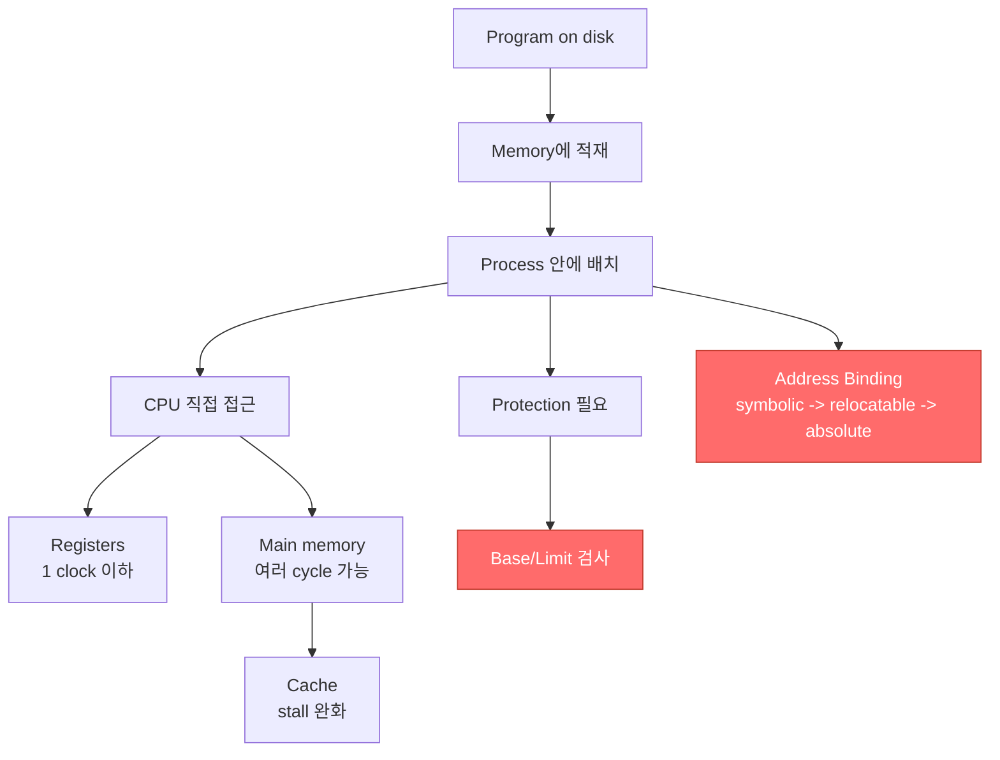
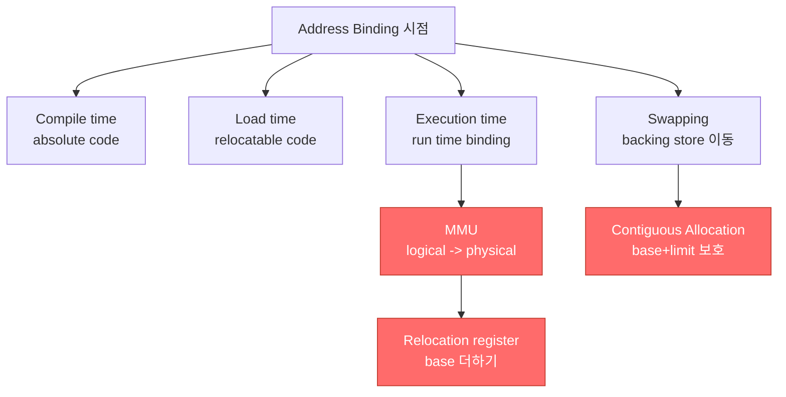

# Chapter 8: Memory Management 정리본

## 개념도

## 1. Chapter 8 범위와 목표

Chapter 8은 **memory hardware를 조직하는 방식**과 **memory-management techniques**를 다룬다. 전체 목차에는 background, swapping, contiguous memory allocation, segmentation, paging, page table 구조, Intel 32/64-bit architecture, ARM architecture가 포함된다.

이번 PDF 범위인 8.2~8.7은 세부 기법으로 들어가기 전의 배경이다. 핵심은 다음 세 가지다.

- 프로그램이 실행되려면 disk에서 memory로 올라와 process 안에 배치되어야 한다.
- CPU가 직접 접근할 수 있는 저장장치는 main memory와 registers뿐이다.
- user process의 memory access는 protection을 위해 hardware check를 거쳐야 한다.

## 2. Background: 실행과 메모리 접근

프로그램은 disk에 있는 상태만으로는 실행될 수 없다. 실행되려면 **memory로 brought into memory**되고, 그 안에서 **process의 주소 공간 안에 placed**되어야 한다.

CPU가 직접 접근할 수 있는 저장장치는 제한적이다.

| 저장장치 | CPU 직접 접근 | 특징 |
|---|---|---|
| Registers | 가능 | 한 CPU clock 또는 그 이하로 접근 가능 |
| Main memory | 가능 | 여러 cycle이 걸릴 수 있어 CPU stall 발생 가능 |
| Disk | 직접 접근 불가 | 실행 전에 memory로 적재되어야 함 |

이 구분이 중요한 이유는 성능 때문이다. register access는 매우 빠르지만, main memory access는 여러 cycle이 걸릴 수 있다. 그동안 CPU가 필요한 데이터를 기다리면 **stall**이 발생한다.

## 3. Cache의 위치와 의미

**Cache는 main memory와 CPU registers 사이에 위치**한다. 목적은 main memory 접근 지연을 줄이는 것이다.

시험에서는 cache를 별도의 실행 공간으로 착각하게 만들 수 있다. 이 범위에서 cache의 핵심은 다음 한 문장으로 정리하면 된다.

> CPU가 직접 접근하는 register와 main memory 사이에서 main memory latency로 인한 stall을 완화하는 계층이다.

## 4. Memory Unit이 실제로 보는 것

Memory unit은 고급 언어의 변수명이나 함수명을 보지 않는다. 실제로 보는 것은 다음과 같은 요청의 흐름이다.

- address + read request
- address + data + write request

즉, memory hardware 관점에서는 모든 접근이 **주소 기반 요청**으로 보인다. 따라서 protection도 "이 주소가 이 process에게 허용된 범위인가"를 검사하는 문제로 바뀐다.

## 5. Base and Limit Registers

**Base register와 limit register의 한 쌍은 user process가 사용할 수 있는 logical address space를 정의**한다. CPU는 user mode에서 생성되는 모든 memory access가 해당 user의 base와 limit 사이에 있는지 확인해야 한다.

| register | 역할 |
|---|---|
| Base | process에게 허용된 메모리 범위의 시작 기준 |
| Limit | process가 접근할 수 있는 범위의 크기 또는 경계 |

핵심은 **모든 user-mode memory access마다 check가 필요하다**는 점이다. 이 check가 없으면 한 process가 다른 process나 운영체제 영역을 잘못 건드릴 수 있어 correct operation을 보장하기 어렵다.

## 6. Hardware Address Protection 흐름

Hardware address protection의 기본 흐름은 다음과 같이 볼 수 있다.

1. CPU가 user mode에서 memory address를 생성한다.
2. hardware가 그 address를 base/limit 범위와 비교한다.
3. 허용 범위 안이면 memory access를 진행한다.
4. 허용 범위를 벗어나면 잘못된 접근으로 처리한다.

출제 포인트는 "운영체제가 매번 소프트웨어로 천천히 검사한다"가 아니라, **CPU와 memory 사이의 hardware check로 protection을 강제한다**는 점이다.

## 7. Address Binding의 필요성

disk 위의 프로그램들은 실행을 위해 memory로 들어올 준비가 된 **input queue**를 형성한다. 아무 지원이 없다면 프로그램은 항상 물리 주소 `0000`에 적재되어야 한다. 하지만 첫 번째 user process의 physical address가 항상 `0000`이어야 한다면 매우 불편하다.

이 문제를 해결하려면 프로그램 생애 주기마다 주소 표현을 다른 주소 공간으로 연결하는 **address binding**이 필요하다.

## 8. 프로그램 생애 주기별 주소 표현

주소는 프로그램의 단계에 따라 다르게 표현된다.

| 단계 | 주소 표현 | 예시 |
|---|---|---|
| Source code | Symbolic address | 변수명, label 같은 상징적 주소 |
| Compiled code | Relocatable address | "이 module 시작점에서 14 bytes 떨어진 곳" |
| Linker/loader 이후 | Absolute address | `74014` 같은 실제 주소 |

중요한 문장은 **each binding maps one address space to another**다. 즉, address binding은 주소를 단순히 숫자로 바꾸는 작업이 아니라, 한 주소 공간의 표현을 다른 주소 공간의 표현으로 mapping하는 과정이다.

## 9. 헷갈리기 쉬운 비교

| 구분 | 의미 | 함정 |
|---|---|---|
| Symbolic address | source code 수준의 이름 기반 주소 | CPU가 그대로 실행하지 않음 |
| Relocatable address | module 시작 기준 offset | 아직 absolute physical address가 아님 |
| Absolute address | linker 또는 loader가 결정한 실제 주소 | 예시처럼 `74014` 같은 형태 |
| Base/Limit protection | user memory access 범위 검사 | user mode의 모든 memory access가 대상 |

`relocatable address`는 "어디든 옮겨 적재할 수 있게 만든 중간 주소"라고 이해하면 된다. 따라서 "14 bytes from beginning of this module"은 실제 memory의 14번지가 아니라, **module 시작점 기준 offset**이다.

## 10. 시험 포인트

- Chapter 8의 큰 주제는 memory hardware 조직 방식과 paging/segmentation 같은 memory-management techniques다.
- 프로그램은 실행되기 전에 disk에서 memory로 올라와 process 안에 배치되어야 한다.
- CPU가 직접 접근할 수 있는 저장장치는 main memory와 registers뿐이다.
- register access는 한 CPU clock 또는 그 이하로 가능하다.
- main memory access는 여러 cycle이 걸릴 수 있어 stall을 유발한다.
- cache는 main memory와 CPU registers 사이에 위치한다.
- memory unit은 address와 read/write request의 stream만 본다.
- memory protection은 correct operation을 보장하기 위해 필요하다.
- base와 limit registers는 logical address space를 정의한다.
- CPU는 user mode에서 생성되는 모든 memory access가 base와 limit 사이에 있는지 확인해야 한다.
- disk 위의 실행 대기 프로그램들은 input queue를 형성한다.
- 지원이 없으면 프로그램은 주소 `0000`에 적재되어야 하므로 불편하다.
- source code address는 symbolic address다.
- compiled code address는 relocatable address다.
- "14 bytes from beginning of this module"은 relocatable address의 예시다.
- linker 또는 loader는 relocatable address를 absolute address로 bind한다.
- `74014`는 absolute address의 예시다.
- address binding은 one address space를 another address space로 mapping하는 과정이다.

## 11. 8.8~8.21 개념도

## 12. Address Binding의 세 시점 (Compile / Load / Execution time)

**binding 시점**은 프로그램의 instruction과 data가 메모리의 **어느 주소에 load될지 결정되는 시점**이다. address binding은 세 가지 서로 다른 단계에서 일어날 수 있다.

| binding 시점 | 생성 코드 | 핵심 조건 | 위치가 바뀌면 |
|---|---|---|---|
| Compile time | absolute code | 메모리 위치를 미리(a priori) 알 때 | 시작 위치가 바뀌면 **recompile** 필요 |
| Load time | relocatable code | compile time에 위치를 모를 때 | 시작 주소(base)만 다시 채우면 됨 |
| Execution time | run time까지 binding 지연 | process가 실행 중 한 memory segment에서 다른 segment로 **이동 가능**할 때 | 실행 중 이동을 통과시킬 수 있음 |

execution-time binding은 실행 중에도 process를 옮길 수 있어야 하므로 **address map용 hardware 지원**(예: base와 limit registers)이 반드시 필요하다. 출제 포인트는 "어느 시점에 absolute code가 만들어지는가", "어느 시점에 hardware 지원이 필요한가"의 구분이다.

## 13. Multistep Processing of a User Program

하나의 user program이 실행 가능한 image가 되기까지는 여러 단계를 거치고, 각 단계가 위의 binding 시점과 대응한다.

| 단계 | 입력/도구 | 산출물 | 대응 binding 시점 |
|---|---|---|---|
| Compile/Assemble | source program → compiler/assembler | object module | compile time |
| Link | object module + other object modules → linkage editor | load module | load time |
| Load | load module + system library → loader | in-memory binary image | load time |
| Execute | dynamically loaded system library → dynamic linking | 실행 중 image | execution time |

즉 compiler/assembler가 compile time, linkage editor와 loader가 load time, dynamic linking이 execution time을 담당한다. system library는 load 단계에서, dynamically loaded system library는 execution 단계에서 결합된다.

## 14. Logical Address vs Physical Address

logical address space가 별도의 **physical address space에 bind**된다는 개념이 proper memory management의 핵심이다.

| 구분 | 정의 | 다른 이름 |
|---|---|---|
| Logical address | CPU가 생성하는 주소 | virtual address |
| Physical address | memory unit이 보는 주소 | — |

- **compile-time / load-time** binding에서는 logical address와 physical address가 **같다**.
- **execution-time** binding에서는 logical(virtual) address와 physical address가 **다르다**.
- **Logical address space**: 프로그램이 생성하는 모든 logical address의 집합.
- **Physical address space**: 그 logical address space에 대응하는 모든 physical address의 집합.

함정 포인트: "logical과 physical이 항상 다르다"는 틀린 진술이다. 두 주소가 갈라지는 것은 **execution-time binding scheme에서만**이다.

## 15. MMU와 Dynamic Relocation

**MMU(Memory-Management Unit)**는 **run time에 virtual address를 physical address로 매핑**하는 hardware device다. 방법은 여러 가지가 있지만, 가장 단순한 방식은 **relocation register** 값을 user process가 생성한 모든 주소에 더해 memory로 보내는 것이다.

- base register를 이 맥락에서 **relocation register**라고 부른다.
- 예: MS-DOS on Intel 80x86은 4개의 relocation register를 사용했다.
- user program은 **logical address만** 다루고 real physical address는 **절대 직접 보지 못한다**.
- execution-time binding은 메모리 안의 위치를 reference할 때 일어나며, 이때 logical address가 physical address로 bind된다.

dynamic relocation 예시: CPU가 logical address `346`을 생성하고 relocation register가 `14000`이면, physical address는 `14000 + 346 = 14346`이 된다.

## 16. Dynamic Loading

dynamic loading은 **routine을 호출되기 전에는 load하지 않는** 기법이다.

- routine은 호출될 때까지 load되지 않는다 → 안 쓰는 routine은 메모리에 올라오지 않아 **memory-space utilization**이 좋아진다.
- 모든 routine은 disk에 **relocatable load format**으로 보관된다.
- 드물게 발생하는 case 처리에 **큰 코드**가 필요할 때 특히 유용하다 (자주 안 쓰는 코드를 미리 안 올려도 됨).
- 운영체제의 **특별한 지원이 필요 없다**. program design으로 구현하며, OS는 dynamic loading을 구현하는 library를 제공해 도울 수 있다.

## 17. Dynamic Linking과 Shared Libraries

library를 프로그램에 합치는 시점에 따라 linking이 갈린다.

| 구분 | 시점 | 특징 |
|---|---|---|
| Static linking | loader가 결합 | system library와 program code를 binary program image로 합침 |
| Dynamic linking | execution time까지 연기 | 실행할 때 연결, 메모리 절약 |

dynamic linking의 동작:

- **stub**: 적절한 memory-resident library routine을 찾는 작은 코드 조각.
- stub은 **자신을 routine의 주소로 교체(replace)**한 뒤 그 routine을 실행한다. (예: `printf` 호출 → stub → 실제 `printf` 함수 주소로 치환)
- OS는 그 routine이 process의 memory address에 있는지 확인하고, 없으면 address space에 추가한다 (이때 약간의 delay 발생).
- dynamic linking은 특히 library에 유용하며, 이런 system을 **shared libraries**라고 부른다 — 여러 program이 같은 library를 공유해 메모리를 절약한다.
- system library를 patch할 때를 고려하면 **versioning**이 필요할 수 있다. static linking은 library 버전이 바뀌면 재결합/재컴파일이 필요하지만, dynamic linking은 실행 시점에 맞는 library를 적용할 수 있다.

## 18. Swapping

**swapping**은 process를 일시적으로 memory 밖 **backing store**로 내보냈다가(swap out), 나중에 다시 memory로 가져와(swap in) 실행을 계속하는 기법이다.

- 모든 process의 **total physical memory space가 physical memory를 초과**할 수 있게 해준다 (모든 process를 RAM에 동시에 다 올리지 않아도 됨).
- **Backing store**: 모든 user의 memory image 복사본을 담을 만큼 큰 fast disk. 이 memory image들에 **direct access**를 제공해야 한다.
- **Roll out, roll in**: priority 기반 scheduling을 위한 swapping 변형. 낮은 우선순위 process를 swap out하고, 높은 우선순위 process를 load해 실행한다.
- swap time의 **major part는 transfer time**이며, total transfer time은 swap되는 memory 양에 **정비례**한다 (disk↔RAM 데이터 이동이 느리기 때문).
- **ready queue**: disk에 memory image가 있는, 실행 준비된(ready-to-run) process들의 큐. CPU만 받으면 바로 실행 가능하며, 이들은 RAM 또는 disk에 위치할 수 있다.

## 19. Context Switch Time과 Swapping 비용

CPU에 올릴 다음 process가 memory에 없으면 한 process를 swap out하고 target process를 swap in해야 하므로 **context switch time이 매우 커질 수 있다**.

계산 예시 (100MB process, hard disk transfer rate 50MB/sec):

- swap out time = 100MB ÷ 50MB/sec = **2000ms**.
- 같은 크기 process의 swap in을 더하면 → total context switch swapping 비용 = **4000ms (4초)**.

비용을 줄이려면 **실제로 사용 중인 memory만큼만** swap하면 된다. 이를 위해 process는 `request_memory()`와 `release_memory()` system call로 OS에 memory 사용량을 알린다.

swapping의 추가 제약:

- **Pending I/O**: I/O가 진행 중인 process를 swap out하면 그 I/O가 **엉뚱한 process**에 일어날 수 있어 swap out하면 안 된다.
- 대안: 항상 I/O를 **kernel space**로 전송한 뒤 I/O device로 보낸다 → **double buffering**이라 하며 overhead가 추가된다 (I/O → kernel → user → I/O).
- **standard swapping은 현대 OS에서 쓰이지 않는다.** 다만 free memory가 극도로 낮을 때만 swap하는 **modified version**은 흔하다 (UNIX, Linux, Windows). 평소엔 disabled, threshold 이상 할당되면 시작, 다시 threshold 아래로 내려가면 disable한다.

## 20. Swapping on Mobile Systems

mobile system은 **일반적으로 swapping을 지원하지 않는다.**

- 이유: flash memory 기반이라 ① 공간이 작고, ② write cycle 횟수가 제한적이며, ③ flash memory와 CPU 사이 throughput이 낮다.
- 대신 memory가 부족하면 다른 방법으로 free한다.
  - **iOS**: 앱에게 할당 memory를 자발적으로 반납하라고 **요청(asks)**한다. read-only data는 버렸다가 필요하면 flash에서 reload한다. free에 실패한 앱은 **강제 종료(termination)**될 수 있다.
  - **Android**: free memory가 낮으면 앱을 종료하되, 먼저 **application state**를 flash에 써서 빠른 restart를 지원한다.
- 두 OS 모두 (뒤에서 다룰) **paging**은 지원한다.

## 21. Contiguous Allocation

main memory는 **OS와 user process를 모두** 담아야 하는 제한된 자원이므로 효율적으로 할당해야 한다. **contiguous allocation**은 초기의 한 방법이다.

- main memory는 보통 두 개의 **partition**으로 나뉜다.
  - **resident OS**: 보통 **interrupt vector**와 함께 **low memory**에 둔다.
  - **user processes**: **high memory**에 둔다.
- 각 process는 메모리의 **single contiguous section**(하나의 연속된 구간)에 담긴다.

## 22. Contiguous Allocation의 보호 (relocation + limit register)

contiguous allocation에서는 **relocation register**로 user process들을 서로로부터, 그리고 변경되는 OS code·data로부터 **보호(protect)**한다.

| register | 담는 값 | 검사 규칙 |
|---|---|---|
| Base(relocation) register | 가장 작은 physical address 값 | 모든 logical address에 더해 physical address 생성 |
| Limit register | logical address의 range | 모든 logical address가 limit register보다 **작아야** 함 |

- MMU가 logical address를 **dynamically** 매핑한다.
- 이 구조 덕분에 kernel code가 **transient**(필요할 때만 적재)할 수 있고, kernel 크기를 바꾸는 것도 가능하다.
- 예: base = 100, limit = 60이면 process P의 logical address 유효 범위는 0~60이고, 실제 physical address는 base를 더해 100~160 구간이 된다.

## 23. 시험 포인트 (8.8~8.21)

- address binding은 compile time, load time, execution time 세 시점에서 일어날 수 있다.
- compile time binding은 absolute code를 만들며, 시작 위치가 바뀌면 recompile해야 한다.
- load time binding은 relocatable code를 만든다.
- execution time binding은 실행 중 process 이동이 가능할 때 쓰며 address map용 hardware 지원이 필요하다.
- multistep processing: source → (compiler) object module → (linkage editor) load module → (loader) in-memory image, dynamic linking은 execution time.
- logical address는 CPU가 생성하고 virtual address라고도 한다.
- physical address는 memory unit이 본다.
- compile-time과 load-time에서는 logical과 physical address가 같다.
- execution-time에서만 logical(virtual)과 physical address가 다르다.
- MMU는 run time에 virtual을 physical로 매핑하는 hardware다.
- 가장 단순한 MMU 방식은 relocation register 값을 모든 주소에 더하는 것이다.
- base register를 이 맥락에서 relocation register라고 부른다.
- user program은 logical address만 다루고 real physical address는 보지 못한다.
- relocation register 14000 + logical 346 = physical 14346.
- dynamic loading은 routine을 호출 전에는 load하지 않아 memory utilization을 높이며, OS의 특별한 지원이 필요 없다.
- static linking은 loader가 library를 binary image에 합치고, dynamic linking은 execution time까지 연기한다.
- stub은 library routine을 찾아 자신을 그 routine의 주소로 교체한다.
- shared libraries는 여러 program이 library를 공유해 메모리를 절약한다.
- swapping은 process를 backing store로 내보냈다 다시 가져오는 기법이며, total physical memory space가 physical memory를 초과하게 해준다.
- backing store는 모든 user의 memory image를 담을 fast disk이며 direct access를 제공해야 한다.
- roll out/roll in은 priority 기반 scheduling용 swapping 변형이다.
- swap time의 major part는 transfer time이고 swap되는 memory 양에 정비례한다.
- 100MB를 50MB/sec로 swap하면 swap out 2000ms, swap in 포함 total 4000ms(4초)다.
- request_memory()/release_memory()로 OS에 memory 사용량을 알려 swap 비용을 줄인다.
- pending I/O가 있으면 swap out하면 안 되며, double buffering으로 우회할 수 있다.
- standard swapping은 현대 OS에서 안 쓰이고, free memory가 매우 낮을 때만 swap하는 modified version이 흔하다.
- mobile system은 flash memory 한계로 swapping을 보통 지원하지 않고, iOS는 앱에 memory 반납을 요청, Android는 application state를 flash에 저장 후 종료한다.
- 두 mobile OS 모두 paging은 지원한다.
- contiguous allocation은 main memory를 resident OS(low memory + interrupt vector)와 user process(high memory) 두 partition으로 나누고, 각 process를 single contiguous section에 담는다.
- base register는 가장 작은 physical address를, limit register는 logical address의 range를 담으며, 모든 logical address는 limit register보다 작아야 한다.
- relocation register는 user process를 서로와 OS로부터 보호하고, MMU가 logical address를 dynamically 매핑한다.
